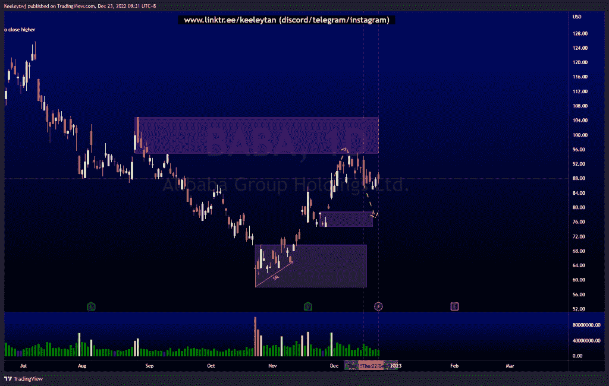
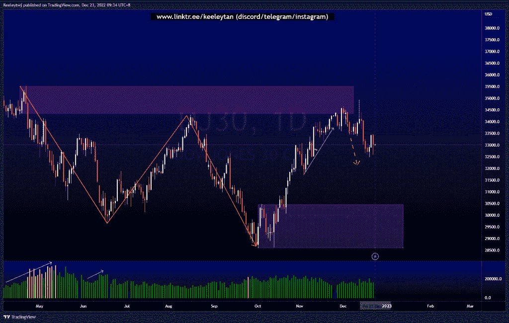
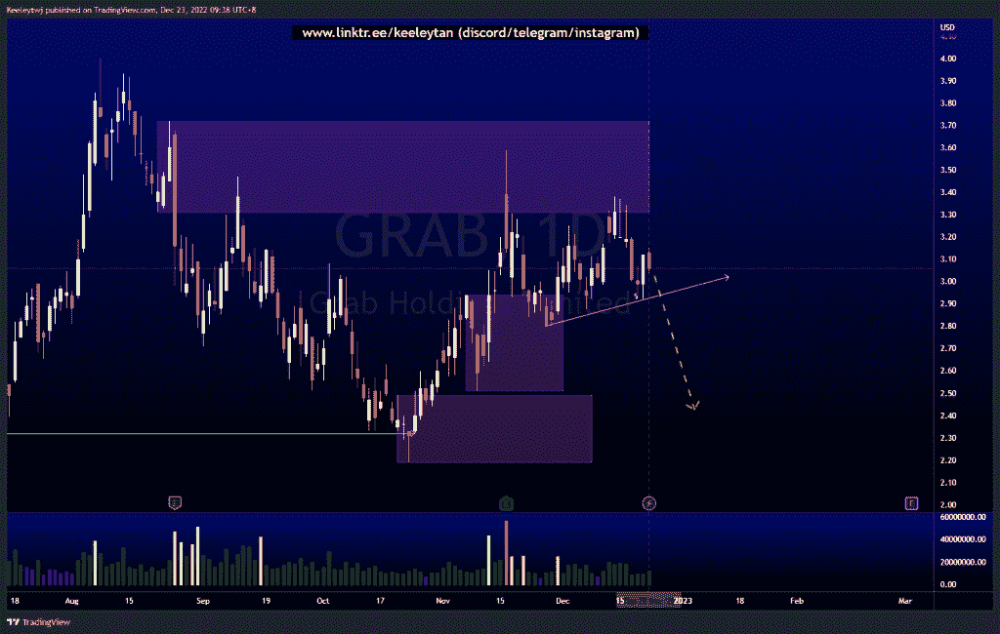

# 每周股票技术分析+基本面头条新闻#巴巴# DJ30 #抢

> 原文：<https://medium.com/coinmonks/weekly-stocks-technical-analysis-fundamental-headline-news-baba-dj30-grab-e436fc239fa1?source=collection_archive---------73----------------------->

在这里了解更多关于我的信息(YouTube/insta gram/Telegram):[https://www.linktr.ee/keeleytan](https://www.linktr.ee/keeleytan)

如果你觉得我的帖子有帮助，如果你能在这个帖子上给我一个赞，并关注我以后的类似帖子，我将不胜感激。如果您有任何意见/反馈，请随时使用上面的谷歌表单链接。

不和谐的免费信号服务正式启动。如果你感兴趣的话，去我的不和谐看看吧！

增加了一行新的标题新闻，可能是重要的，是从电视本身提取的。

#巴巴

正如前几周分析的那样，价格已经缓解了 104.85 的看跌点。价格向下突破了次要结构，现在在这个价格范围内盘整。我预计价格可能会下跌至 78.85 的看涨点，以缓解接下来的压力。

一些头条新闻:
中国可能会经历“艰难的几个月”在 COVID 激增的情况下——中国褐皮书首席执行官
阿里巴巴，JD.com，其他股票走高，因为中国可能会减少对海外游客的检疫措施
市场传言:中国科技股上涨，因为据报道中国希望取消对外国游客的检疫要求

[https://www . trading view . com/chart/BABA/9by 528 ol-BABA-Analysis/](https://www.tradingview.com/chart/BABA/9bY528ol-BABA-Analysis/)

#DJ30

到目前为止，价格表现良好，缓解了 34343.2 的看跌点并走低，消除了过去几周建立的卖方流动性。价格也打破了向下的小结构，外部流动性已经采取。我预计价格将下跌至 30455.6 的看涨点。

一些头条新闻:
华尔街利率下跌，衰退担忧，芯片制造商前景黯淡
美国期货在疲软的交易后持平

[https://www . trading view . com/chart/DJ30/Etna jeo 5-DJ30-Analysis/](https://www.tradingview.com/chart/DJ30/EtNAJEO5-DJ30-Analysis/)

#抓取

过去几周，价格一直在这里盘整。价格目前正在建立卖方流动性，同时攻击高点。我预计价格将准备下跌至 2.49 的看涨点。

一些头条新闻:
市场传言:Grab Holdings 冻结大部分招聘以削减成本

[https://www . trading view . com/chart/GRAB/nlclryFx-GRAB-Analysis/](https://www.tradingview.com/chart/GRAB/nlclryFx-GRAB-Analysis/)

如果你持有这些公司中的任何一家，就可以点赞、分享和评论！

让我知道，如果你有任何你想让我分析的行情。

> 从顶级交易者那里复制交易机器人。免费试用。

一定要在其他社交平台上看看我，我在交易、分析和心理学上发布内容。在这里看看我:[https://www.linktr.ee/keeleytan](https://www.linktr.ee/keeleytan)

*原载于 2022 年 12 月 23 日*[*【http://2minutesliteracy.wordpress.com】*](https://2minutesliteracy.wordpress.com/2022/12/23/weekly-stocks-technical-analysis-fundamental-headline-news-baba-dj30-grab/)*。*

> 加入 Coinmonks [电报频道](https://t.me/coincodecap)和 [Youtube 频道](https://www.youtube.com/c/coinmonks/videos)了解加密交易和投资

# 另外，阅读

*   [block fi vs Celsius](/coinmonks/blockfi-vs-celsius-vs-hodlnaut-8a1cc8c26630)|[Hodlnaut 审核](/coinmonks/hodlnaut-review-best-way-to-hodl-is-to-earn-interest-on-your-bitcoin-6658a8c19edf) | [KuCoin 审核](https://coincodecap.com/kucoin-review)
*   [Bitsgap 审查](/coinmonks/bitsgap-review-a-crypto-trading-bot-that-makes-easy-money-a5d88a336df2) | [Quadency 审查](/coinmonks/quadency-review-a-crypto-trading-automation-platform-3068eaa374e1) | [Bitbns 审查](/coinmonks/bitbns-review-38256a07e161)
*   [加密复制交易平台](/coinmonks/top-10-crypto-copy-trading-platforms-for-beginners-d0c37c7d698c) | [Coinmama 评论](/coinmonks/coinmama-review-ace5641bde6e)
*   [印度加密交易所](/coinmonks/bitcoin-exchange-in-india-7f1fe79715c9) | [比特币储蓄账户](/coinmonks/bitcoin-savings-account-e65b13f92451)
*   [OKEx vs KuCoin](https://coincodecap.com/okex-kucoin) | [摄氏替代品](https://coincodecap.com/celsius-alternatives) | [如何购买 VeChain](https://coincodecap.com/buy-vechain)