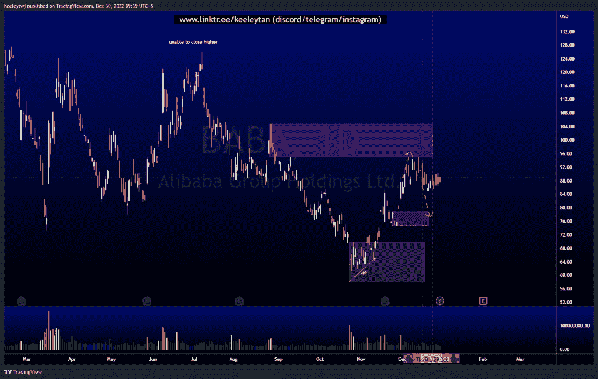
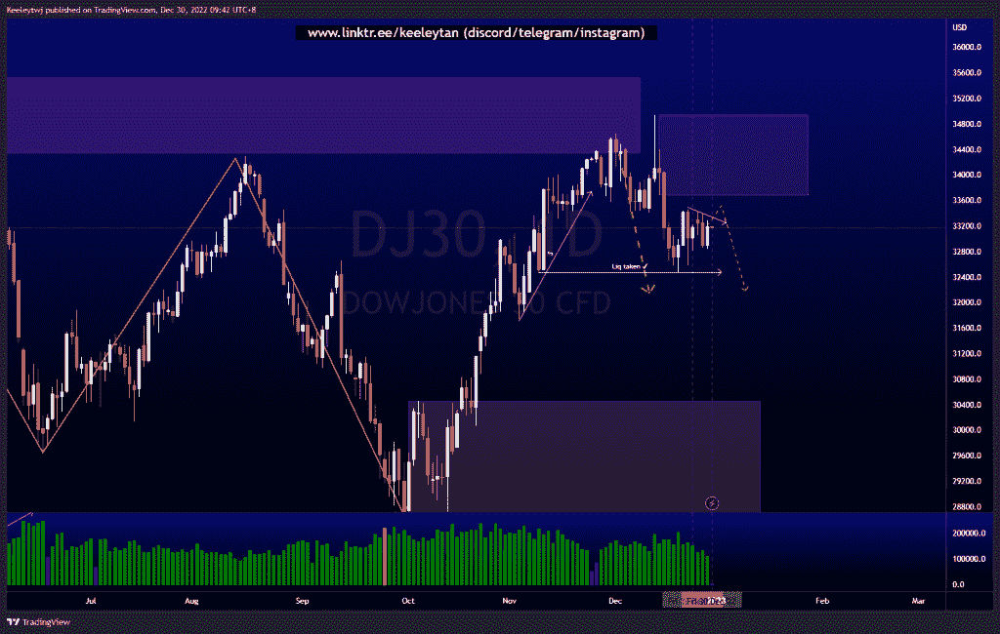
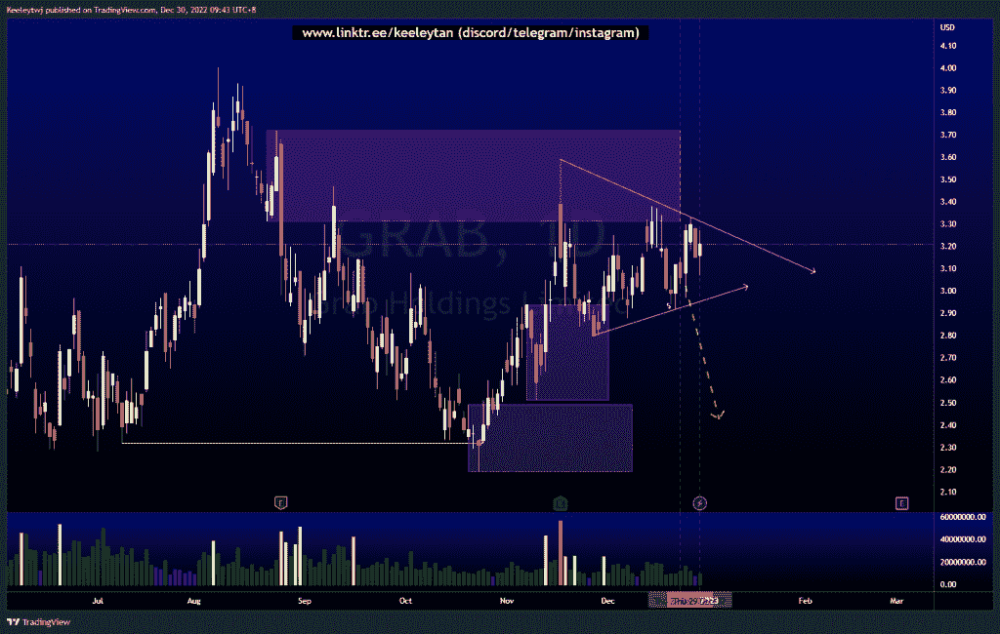

# 每周股票技术分析+基本面头条新闻#抢#巴巴#DJ30

> 原文：<https://medium.com/coinmonks/weekly-stocks-technical-analysis-fundamental-headline-news-grab-baba-dj30-41476b3b31ac?source=collection_archive---------48----------------------->

在这里了解更多关于我的信息(YouTube/insta gram/Telegram):[https://www.linktr.ee/keeleytan](https://www.linktr.ee/keeleytan)

如果你觉得我的帖子有帮助，如果你能在这个帖子上给我一个赞，并关注我以后的类似帖子，我将不胜感激。如果您有任何意见/反馈，请随时使用上面的谷歌表单链接。

> 交易新手？在[最佳加密交易](/coinmonks/crypto-exchange-dd2f9d6f3769)上尝试[加密交易机器人](/coinmonks/crypto-trading-bot-c2ffce8acb2a)或[复制交易](/coinmonks/top-10-crypto-copy-trading-platforms-for-beginners-d0c37c7d698c)

不和谐的免费信号服务正式启动。如果你感兴趣的话，去我的不和谐看看吧！

增加了一行新的标题新闻，可能是重要的，是从电视本身提取的。

#巴巴

过去几周这里的价格一直保持稳定。价格不断攻击高点，同时建立卖方流动性。我最初的预期保持不变，预计价格将消除卖方流动性，并将价格推低，有可能进入 78.85 的看涨点。

头条新闻:
阿里巴巴集团 Appints 新 CTO 首席执行官临时接管云业务
阿里巴巴、微博在与 COVID 相关的动荡中引领中国科技损失

[https://www . trading view . com/chart/BABA/azaVyWKP-BABA-Analysis/](https://www.tradingview.com/chart/BABA/azaVyWKP-BABA-Analysis/)

#DJ30

过去一周，价格在 32474.6 点的低点盘整，建立了买方流动性。我预计价格将反弹，并消除买方流动性，可能会在下跌前缓解 34939.6 的熊市。

[https://www . trading view . com/chart/DJ30/r4rc 636s-DJ30-Analysis/](https://www.tradingview.com/chart/DJ30/r4Rc636S-DJ30-Analysis/)

#抓取

普莱斯一直在建立卖方和买方的流动性，目前还不清楚普莱斯将首先把流动性带到哪里。然而，在第一次吸引买家/卖家的流动性攫取之后，价格很可能会消除相反的流动性。

头条新闻:
市场传言:Grab Holdings 冻结大部分招聘以削减成本

[https://www . trading view . com/chart/GRAB/389 jg9h 0-GRAB-Analysis/](https://www.tradingview.com/chart/GRAB/389Jg9h0-GRAB-Analysis/)

如果你持有这些公司中的任何一家，就可以点赞、分享和评论！

让我知道，如果你有任何你想让我分析的行情。

一定要在其他社交平台上看看我，我在交易、分析和心理学上发布内容。在这里看看我:[https://www.linktr.ee/keeleytan](https://www.linktr.ee/keeleytan)

*原载于 2022 年 12 月 30 日*[*【http://2minutesliteracy.wordpress.com】*](https://2minutesliteracy.wordpress.com/2022/12/30/weekly-stocks-technical-analysis-fundamental-headline-news-grab-baba-dj30/)*。*

> 加入 Coinmonks [电报频道](https://t.me/coincodecap)和 [Youtube 频道](https://www.youtube.com/c/coinmonks/videos)了解加密交易和投资

# 另外，阅读

*   [有哪些交易信号？](https://coincodecap.com/trading-signal) | [Bitstamp vs 比特币基地](https://coincodecap.com/bitstamp-coinbase) | [买索拉纳](https://coincodecap.com/buy-solana)
*   [密码交易机器人](/coinmonks/crypto-trading-bot-c2ffce8acb2a) | [维护审查](https://coincodecap.com/uphold-review)
*   [如何给 MetaMask 钱包添加 Arbitrum？](https://coincodecap.com/how-to-add-arbitrum-to-metamask-wallet)
*   [KuCoin vs 北海巨妖 vs BitYard](https://coincodecap.com/kucoin-vs-kraken-vs-bityard)
*   [加密交易的最佳 VPN](https://coincodecap.com/best-vpns-for-crypto-trading)