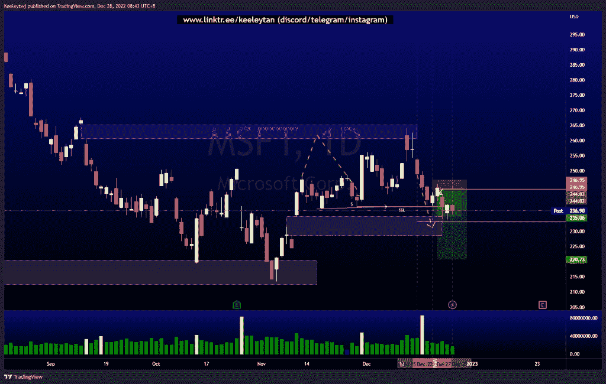
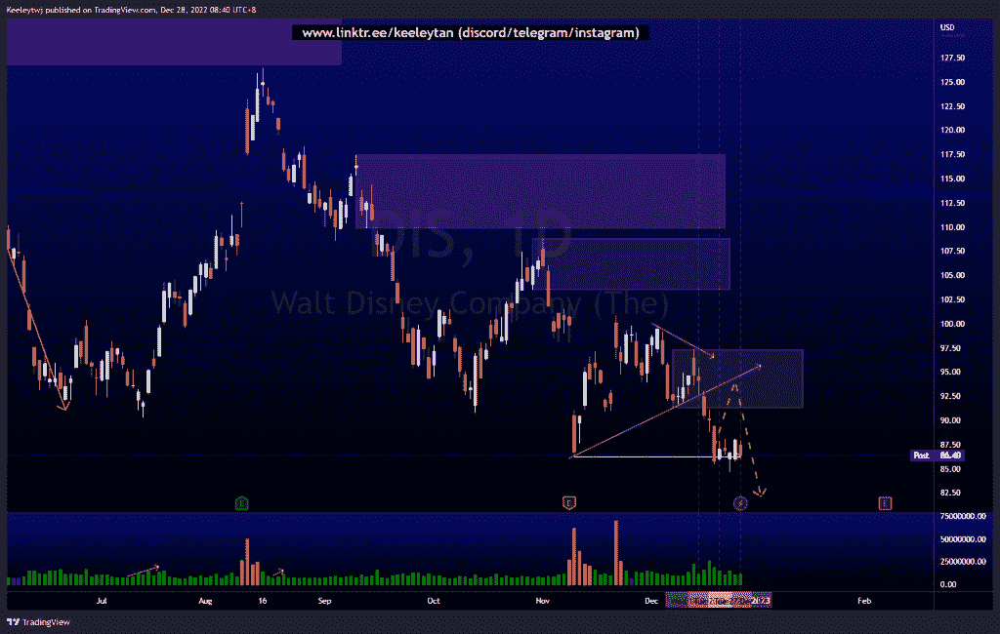
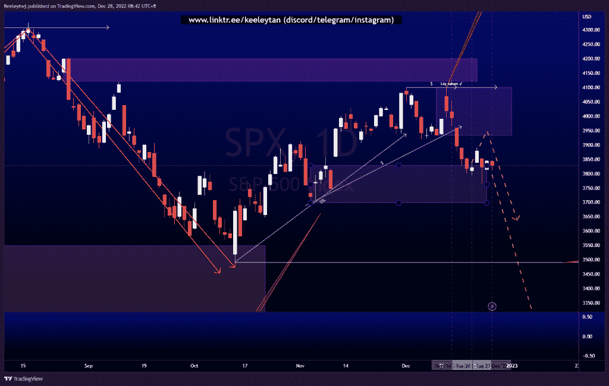

# 每周股票技术分析+基本面头条新闻#MSFT #SPX #DIS

> 原文：<https://medium.com/coinmonks/weekly-stocks-technical-analysis-fundamental-headline-news-msft-spx-dis-7f32303c494d?source=collection_archive---------63----------------------->

在这里了解更多关于我的信息(YouTube/insta gram/Telegram):[https://www.linktr.ee/keeleytan](https://www.linktr.ee/keeleytan)

如果你觉得我的帖子有帮助，如果你能在这个帖子上给我一个赞，并关注我以后的类似帖子，我将不胜感激。如果您有任何意见/反馈，请随时使用上面的谷歌表单链接。

> 不知道什么时候买卖，试试[复制交易](http://coincodecap.com/go/bityard)。

不和谐的免费信号服务正式启动。如果你感兴趣的话，去我的不和谐看看吧！

增加了一行新的标题新闻，可能是重要的，是从电视本身提取的。

#MSFT

价格完全按照我上周的分析。根据我给出的免费信号，价格正在上涨。利润目标 1 上周收于 3.66%，剩余头寸留待运行。价格目前正在填补 235.00 的公允价值缺口，我们应该看到积极的买家捍卫他们的立场。如果 233.87 的低点被打破，我们应该看到价格向 220.73 下跌。

头条新闻:
第三动视暴雪工作室向工会施压

[https://www . trading view . com/chart/MSFT/zrgz 8 itz-MSFT-Analysis/](https://www.tradingview.com/chart/MSFT/ZrgZ8itZ-MSFT-Analysis/)

#DIS

在 86.28 处获得流动性后，价格巩固。价格也打破了市场结构，在较低的时间框架上行，同时建立买方流动性。我的预期不变，预计价格可能会反弹至 97.39 的熊市点。

头条新闻:
《阿凡达》续集席卷全球票房近 8.9 亿美元

[https://www . trading view . com/chart/DIS/ZKaIwTCR-DIS-Analysis/](https://www.tradingview.com/chart/DIS/ZKaIwTCR-DIS-Analysis/)

#SPX

上周价格在 3828.10 的看涨点盘整，显示出拒绝下行的迹象。价格建立了大量的买方流动性和相等的高点，公允价值差距为 3850.09。我预计价格会反弹，并消除这些流动性，可能会在下跌前缓解 3933.04 的熊市。

头条新闻:富国银行称，股市年底不太可能出现“大”反弹

[https://www . trading view . com/chart/SPX/i3up 2 B2 u-SPX-Analysis/](https://www.tradingview.com/chart/SPX/i3uP2B2u-SPX-Analysis/)

如果你持有这些公司中的任何一家，就可以点赞、分享和评论！

让我知道，如果你有任何你想让我分析的行情。

一定要在其他社交平台上看看我，我在交易、分析和心理学上发布内容。在这里看看我:[https://www.linktr.ee/keeleytan](https://www.linktr.ee/keeleytan)

*原载于 2022 年 12 月 28 日*[*【http://2minutesliteracy.wordpress.com】*](https://2minutesliteracy.wordpress.com/2022/12/28/weekly-stocks-technical-analysis-fundamental-headline-news-msft-spx-dis/)*。*

> 加入 Coinmonks [电报频道](https://t.me/coincodecap)和 [Youtube 频道](https://www.youtube.com/c/coinmonks/videos)了解加密交易和投资

# 另外，阅读

*   [如何在 FTX 交易所交易期货](https://coincodecap.com/ftx-futures-trading)
*   [OKEx vs KuCoin](https://coincodecap.com/okex-kucoin) | [摄氏替代品](https://coincodecap.com/celsius-alternatives) | [如何购买 VeChain](https://coincodecap.com/buy-vechain)
*   [ProfitFarmers 回顾](https://coincodecap.com/profitfarmers-review) | [如何使用 Cornix Trading Bot](https://coincodecap.com/cornix-trading-bot)
*   [如何匿名购买比特币](https://coincodecap.com/buy-bitcoin-anonymously) | [比特币现金钱包](https://coincodecap.com/bitcoin-cash-wallets)
*   [瓦济里克斯 NFT 评论](https://coincodecap.com/wazirx-nft-review)|[Bitsgap vs Pionex](https://coincodecap.com/bitsgap-vs-pionex)|[坦吉姆评论](https://coincodecap.com/tangem-wallet-review)