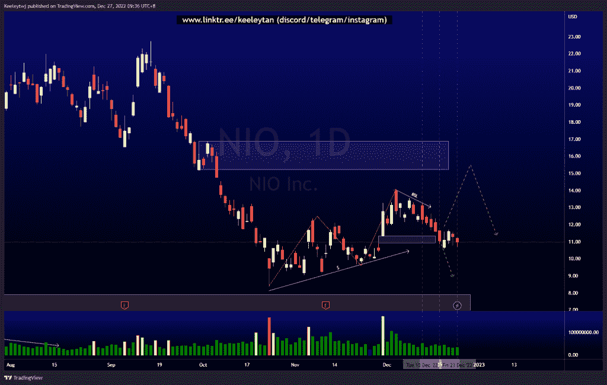
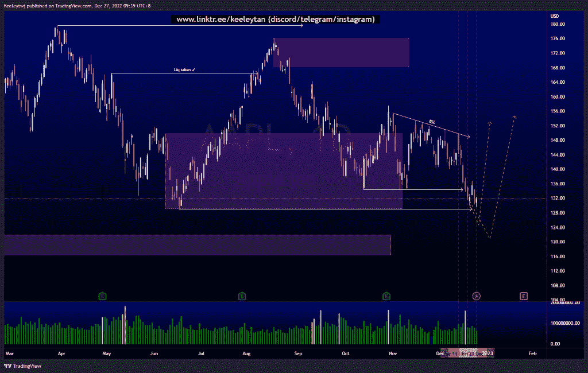
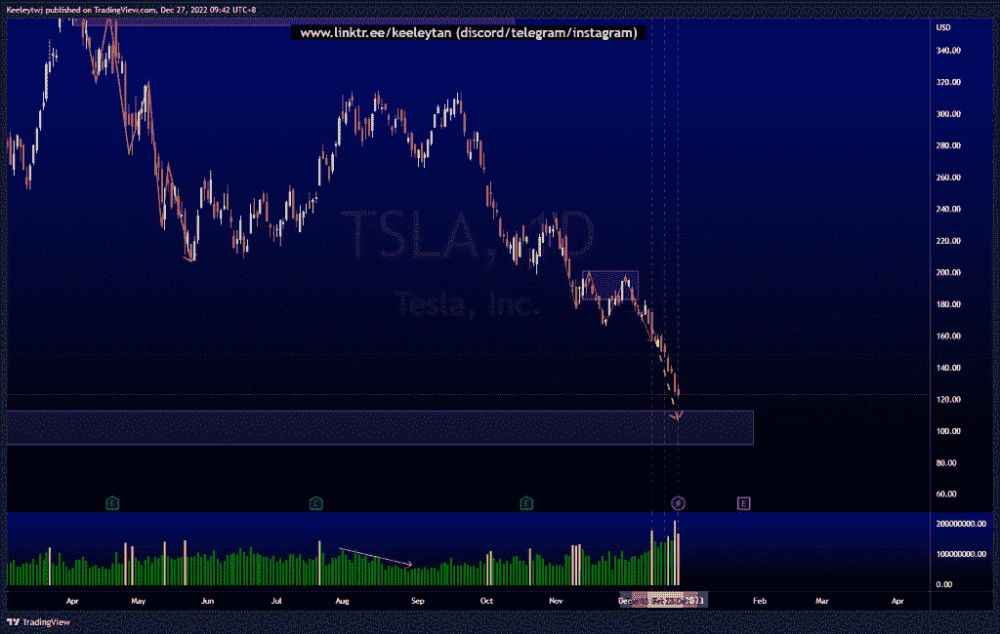

# 每周股票技术分析+基本面头条新闻#NIO #AAPL #TSLA

> 原文：<https://medium.com/coinmonks/weekly-stocks-technical-analysis-fundamental-headline-news-nio-aapl-tsla-2ea1c29290e1?source=collection_archive---------52----------------------->

在这里了解更多关于我的信息(YouTube/insta gram/Telegram):[https://www.linktr.ee/keeleytan](https://www.linktr.ee/keeleytan)

如果你觉得我的帖子有帮助，如果你能在这个帖子上给我一个赞，并关注我以后的类似帖子，我将不胜感激。如果您有任何意见/反馈，请随时使用上面的谷歌表单链接。

> 从顶级交易者那里复制交易机器人。免费试用。

不和谐的免费信号服务正式启动。如果你感兴趣的话，去我的不和谐看看吧！

增加了一行新的标题新闻，可能是重要的，是从电视本身提取的。

#NIO

根据上周的分析，价格填补了 11.34 的公允价值缺口。价格已经在这里盘整了几天，积累了订单。我现在正在考虑两种情况，要么价格从 10 月到 11 月第一次提取卖方流动性，要么提取最近建立的买方流动性。

[https://www . trading view . com/chart/NIO/xrdsaf 7 x-NIO-Analysis/](https://www.tradingview.com/chart/NIO/xRdsAF7x-NIO-Analysis/)

#AAPL

根据上周的分析，价格表现良好。在看跌订单流之后，我预计价格将走出 129.04 的低点，并可能在价格反弹之前进入 121.94 的看涨点，以消除买方流动性。

头条新闻:
苹果日本遭遇 9800 万美元欠税——日经新闻
市场传言:澳大利亚苹果工人举行圣诞罢工

[https://www . trading view . com/chart/AAPL/u 9d 0 gflx-AAPL-分析/](https://www.tradingview.com/chart/AAPL/U9D0gfLX-AAPL-Analysis/)

#TSLA

价格如上周分析的那样，随着看跌订单流，从当前价格走低。此次下跌的潜在目标是缓解 112.60 的看涨 POI，我们将看到价格对该区域的反应。

头条新闻:
特斯拉在上海停产，作为年终休假的一部分

[https://www . trading view . com/chart/TSLA/5 GS 7 dixz-TSLA-分析/](https://www.tradingview.com/chart/TSLA/5gs7dIXZ-TSLA-Analysis/)

如果你持有这些公司中的任何一家，就可以点赞、分享和评论！

让我知道，如果你有任何你想让我分析的行情。

一定要在其他社交平台上看看我，我在交易、分析和心理学上发布内容。看看我这里:[https://www.linktr.ee/keeleytan](https://www.linktr.ee/keeleytan)

*原载于 2022 年 12 月 27 日*[*【http://2minutesliteracy.wordpress.com】*](https://2minutesliteracy.wordpress.com/2022/12/27/weekly-stocks-technical-analysis-fundamental-headline-news-nio-aapl-tsla/)*。*

> 加入 Coinmonks [电报频道](https://t.me/coincodecap)和 [Youtube 频道](https://www.youtube.com/c/coinmonks/videos)了解加密交易和投资

# 另外，阅读

*   [加拿大最佳加密交易机器人](https://coincodecap.com/5-best-crypto-trading-bots-in-canada) | [库币评论](https://coincodecap.com/kucoin-review)
*   [火币加密交易信号](https://coincodecap.com/huobi-crypto-trading-signals) | [HitBTC 审核](/coinmonks/hitbtc-review-c5143c5d53c2)
*   [TraderWagon 回顾](https://coincodecap.com/traderwagon-review) | [北海巨妖 vs 双子星 vs BitYard](https://coincodecap.com/kraken-vs-gemini-vs-bityard)
*   [如何在 FTX 交易所交易期货](https://coincodecap.com/ftx-futures-trading)
*   [OKEx vs KuCoin](https://coincodecap.com/okex-kucoin) | [摄氏替代品](https://coincodecap.com/celsius-alternatives) | [如何购买 VeChain](https://coincodecap.com/buy-vechain)