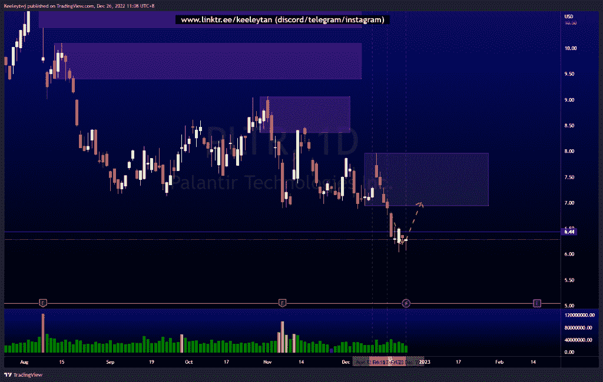
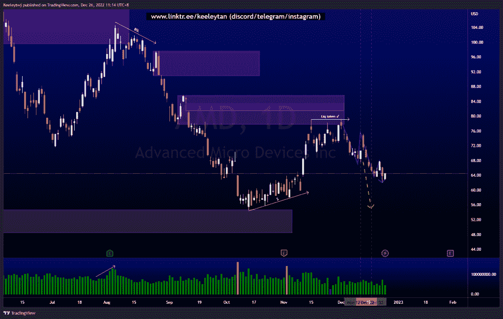
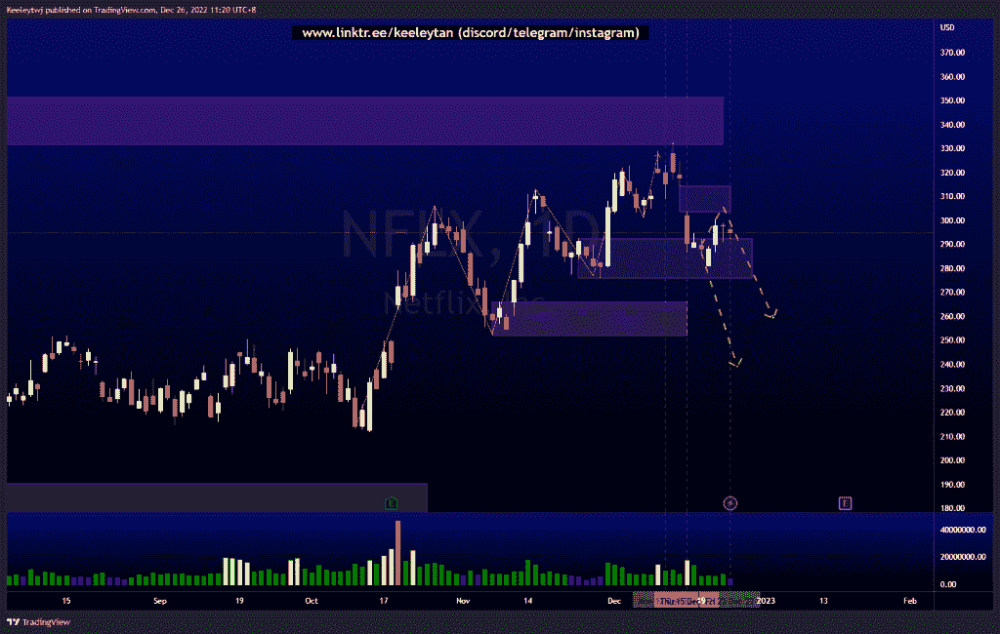

# 每周股票技术分析+基本面头条新闻#PLTR #AMD #NFLX

> 原文：<https://medium.com/coinmonks/weekly-stocks-technical-analysis-fundamental-headline-news-pltr-amd-nflx-e9bfe76d3535?source=collection_archive---------45----------------------->

在这里了解更多关于我的信息(YouTube/insta gram/Telegram):[https://www.linktr.ee/keeleytan](https://www.linktr.ee/keeleytan)

如果你觉得我的帖子有帮助，如果你能在这个帖子上给我一个赞，并关注我以后的类似帖子，我将不胜感激。如果您有任何意见/反馈，请随时使用上面的谷歌表单链接。

> 从顶级交易者那里复制交易机器人。免费试用。

不和谐的免费信号服务正式启动。如果你感兴趣的话，去我的不和谐看看吧！

增加了一行新的标题新闻，可能是重要的，是从电视本身提取的。

#PLTR

根据我的分析，价格表现良好，创下 6.44 的历史新低。价格现在已经吸收了外部流动性，并显示出拒绝下跌的迹象。我预计接下来将在 7.97 出现看涨回撤至看跌点。

头条新闻:
英国国防部授予 Palantir 7500 万英镑企业协议
市场传言:Palantir 技术公司与英国军方达成 9140 万美元协议

[https://www . trading view . com/chart/PLTR/w 23 ldn 5 z-PLTR-分析/](https://www.tradingview.com/chart/PLTR/w23lDN5z-PLTR-Analysis/)

#AMD

根据上周的分析，价格表现良好。价格目前处于较低的下降趋势，我预计价格将随着订单流继续走低，消除之前在 2022 年 10 月建立的卖方流动性。

头条新闻:
AMD、美光、英伟达跻身瑞银 2023 年顶级芯片股
台湾半导体股价上涨，据报道，该公司考虑在德国建立其首个欧洲工厂

[https://www . trading view . com/chart/AMD/V8 S1 zvcl-AMD-Analysis/](https://www.tradingview.com/chart/AMD/V8s1ZvCL-AMD-Analysis/)

#NFLX

价格似乎按照我的第二个预期运行，即在下跌前填补 303.39 的公允价值缺口。当然，价格仍可能下跌，但不会填补由此产生的缺口。价格目前也在 292.47 缓解看涨 POI，基本上被困在这个盘整范围内，直到价格决定何去何从。

头条新闻:
网飞公司——公司董事会薪酬委员会已确定公司指定高管的 2023 年薪酬
网飞计划在新泽西前陆军基地投资超过 9 亿美元的生产设施
网飞计划在新泽西生产中心投资 8 . 5 亿美元

[https://www . trading view . com/chart/NFLX/j 5 q 0 bpbi-NFLX-分析/](https://www.tradingview.com/chart/NFLX/J5Q0BPBI-NFLX-Analysis/)

如果你持有这些公司中的任何一家，就可以点赞、分享和评论！

让我知道，如果你有任何你想让我分析的行情。

一定要在其他社交平台上看看我，我在交易、分析和心理学上发布内容。在这里看看我:[https://www.linktr.ee/keeleytan](https://www.linktr.ee/keeleytan)

*原载于 2022 年 12 月 26 日*[*【http://2minutesliteracy.wordpress.com】*](https://2minutesliteracy.wordpress.com/2022/12/26/weekly-stocks-technical-analysis-fundamental-headline-news-pltr-amd-nflx/)*。*

> 加入 Coinmonks [电报频道](https://t.me/coincodecap)和 [Youtube 频道](https://www.youtube.com/c/coinmonks/videos)了解加密交易和投资

# 另外，阅读

*   [block fi vs Celsius](/coinmonks/blockfi-vs-celsius-vs-hodlnaut-8a1cc8c26630)|[Hodlnaut 审核](/coinmonks/hodlnaut-review-best-way-to-hodl-is-to-earn-interest-on-your-bitcoin-6658a8c19edf) | [KuCoin 审核](https://coincodecap.com/kucoin-review)
*   [Bitsgap 审查](/coinmonks/bitsgap-review-a-crypto-trading-bot-that-makes-easy-money-a5d88a336df2) | [Quadency 审查](/coinmonks/quadency-review-a-crypto-trading-automation-platform-3068eaa374e1) | [Bitbns 审查](/coinmonks/bitbns-review-38256a07e161)
*   [加密复制交易平台](/coinmonks/top-10-crypto-copy-trading-platforms-for-beginners-d0c37c7d698c) | [Coinmama 评论](/coinmonks/coinmama-review-ace5641bde6e)
*   [印度加密交易所](/coinmonks/bitcoin-exchange-in-india-7f1fe79715c9) | [比特币储蓄账户](/coinmonks/bitcoin-savings-account-e65b13f92451)
*   [OKEx vs KuCoin](https://coincodecap.com/okex-kucoin) | [摄氏替代品](https://coincodecap.com/celsius-alternatives) | [如何购买 VeChain](https://coincodecap.com/buy-vechain)