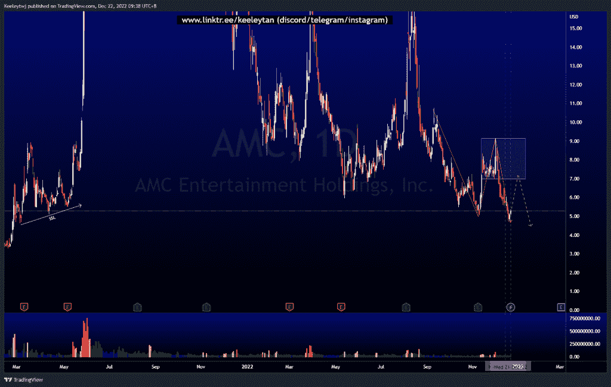
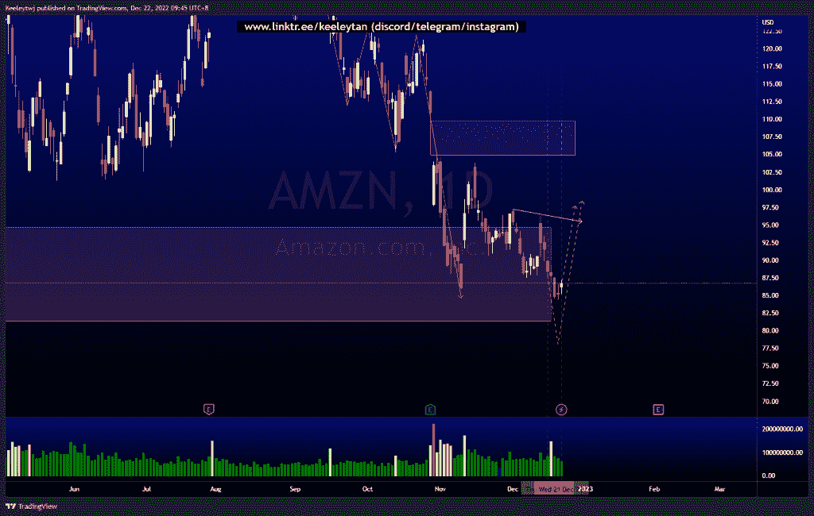
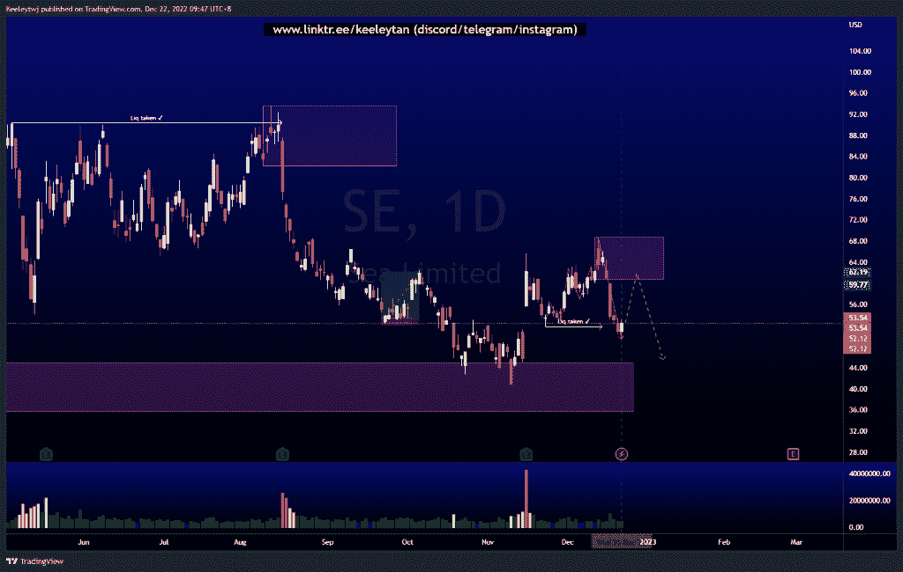

# 每周股票技术分析+基本面头条新闻#SE #AMC #AMZN

> 原文：<https://medium.com/coinmonks/weekly-stocks-technical-analysis-fundamental-headline-news-se-amc-amzn-9af11a4cec1b?source=collection_archive---------33----------------------->

在这里了解更多关于我的信息(YouTube/insta gram/Telegram):[https://www.linktr.ee/keeleytan](https://www.linktr.ee/keeleytan)

如果你觉得我的帖子有帮助，如果你能在这个帖子上给我一个赞，并关注我以后的类似帖子，我将不胜感激。如果您有任何意见/反馈，请随时使用上面的谷歌表单链接。

不和谐的免费信号服务正式启动。如果你感兴趣的话，去我的不和谐看看吧！

增加了一行新的标题新闻，可能是重要的，是从电视本身提取的。

#AMC

在我之前的分析中，价格已经剔除了几个月前在 2021 年 4 月建立的流动性。价格最近采取了外部流动性，我预计价格将在下一个 9.15 回撤至熊市点。

一些头条新闻:

AMC 娱乐结束收购 Cineworld 资产的谈判

[https://www . trading view . com/chart/AMC/j 5 F8 stcj-AMC-Analysis/](https://www.tradingview.com/chart/AMC/j5f8stCJ-AMC-Analysis/)

#AMZN

根据我之前的分析，此次下调已经达到目标。从这里开始，我预计在较低的时间框架内会出现短暂的盘整，可能会增加买方流动性。如果价格不这样做，它将采取 81.30 的低点。

一些头条新闻:

政府签署仓库保护法案后，亚马逊成为纽约受新劳动法规约束的公司之一

[https://www . trading view . com/chart/AMZN/n9zummTy-AMZN-Analysis/](https://www.tradingview.com/chart/AMZN/n9zummTy-AMZN-Analysis/)

#SE

根据前几周的分析，价格表现良好。价格目前已经采取了许多次要的市场结构下行，并采取了 51.76 的流动性。我预计下一步将在 68.77 出现看涨回撤至看跌点。

[https://www.tradingview.com/chart/SE/uHy0LJ3q-SE-Analysis/](https://www.tradingview.com/chart/SE/uHy0LJ3q-SE-Analysis/)

如果你持有这些公司中的任何一家，就可以点赞、分享和评论！

让我知道，如果你有任何你想让我分析的行情。

一定要在其他社交平台上看看我，我在交易、分析和心理学上发布内容。看看我这里:[https://www.linktr.ee/keeleytan](https://www.linktr.ee/keeleytan)

*原载于 2022 年 12 月 22 日 http://2minutesliteracy.wordpress.com***。**

> *交易新手？试试[加密交易机器人](/coinmonks/crypto-trading-bot-c2ffce8acb2a)或者[复制交易](/coinmonks/top-10-crypto-copy-trading-platforms-for-beginners-d0c37c7d698c)*
> 
> *多样化的密码持有，了解[币安替代品](https://coincodecap.com/binance-alternatives)*
> 
> *加入 Coinmonks [电报频道](https://t.me/coincodecap)和 [Youtube 频道](https://www.youtube.com/c/coinmonks/videos)获取每日[加密新闻](http://coincodecap.com/)*

# *另外，阅读*

*   *[复制交易](/coinmonks/top-10-crypto-copy-trading-platforms-for-beginners-d0c37c7d698c) | [加密税务软件](/coinmonks/crypto-tax-software-ed4b4810e338)*
*   *[网格交易](https://coincodecap.com/grid-trading) | [加密硬件钱包](/coinmonks/the-best-cryptocurrency-hardware-wallets-of-2020-e28b1c124069)*
*   *[密码电报信号](/coinmonks/top-3-telegram-channels-for-crypto-traders-in-2021-8385f4411ff4) | [密码交易机器人](/coinmonks/crypto-trading-bot-c2ffce8acb2a)*
*   *[最佳加密交易所](/coinmonks/crypto-exchange-dd2f9d6f3769) | [印度最佳加密交易所](/coinmonks/bitcoin-exchange-in-india-7f1fe79715c9)*
*   *开发人员的最佳加密 API*
*   *最佳[密码借贷平台](/coinmonks/top-5-crypto-lending-platforms-in-2020-that-you-need-to-know-a1b675cec3fa)*
*   *[免费加密信号](/coinmonks/free-crypto-signals-48b25e61a8da) | [加密交易机器人](/coinmonks/crypto-trading-bot-c2ffce8acb2a)*
*   *[杠杆代币的终极指南](/coinmonks/leveraged-token-3f5257808b22)*