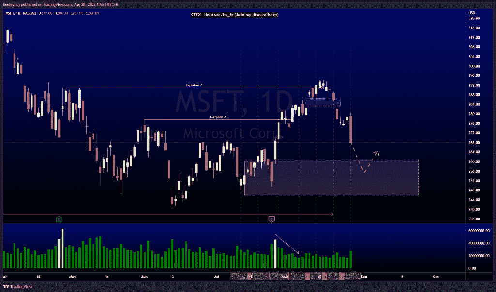
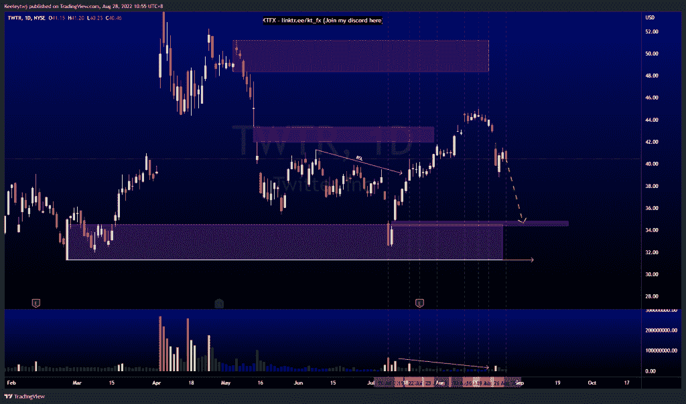
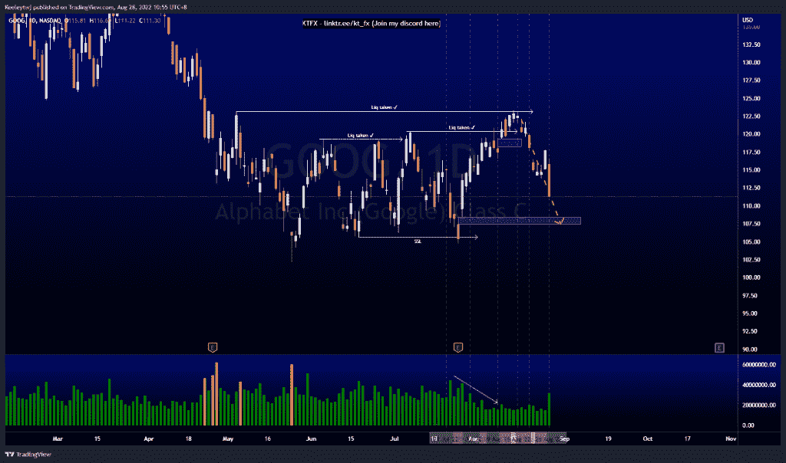

# 每周股票技术分析#谷歌#TWTR #MSFT

> 原文：<https://medium.com/coinmonks/weekly-stocks-technical-analysis-goog-twtr-msft-b02e9dffcdfe?source=collection_archive---------34----------------------->

在这里找到更多关于我的信息(YouTube/Discord/Telegram):[https://www.linktr.ee/keeleytan](https://www.linktr.ee/keeleytan)

如果你觉得我的帖子有帮助，如果你能在这个帖子上给我一个赞，并关注我以后的类似帖子，我将不胜感激。

如果你同意，请在评论中告诉我你的想法。

#MSFT

价格的走势与上周的分析完全一致。价格下跌 6.16%，正朝着 260.84 的看涨点前进。本周我的期望没有变化。一旦看涨的 POI 得到缓解，我们应该会看到对上涨的反应。

#TWTR

上周的价格没有达到我的预期。在价格下跌之前，我预计价格将在 48.34 缓解看跌情绪。从这里开始，我预计价格将继续下跌，以填补 34.80 的公允价值缺口。

#GOOG

价格完全按照上周的分析运行。价格在 123.14 处获得流动性，无法收于上方。随后打破了市场结构下行。现在，价格正朝着预期的 108.42 的公允价值差距前进。

我在考虑尝试在 discord 上提供免费信号服务。如果你有兴趣，请给我发邮件，让我在那里扮演一个角色！

如果你持有这些公司中的任何一家，就可以点赞、分享和评论！

让我知道，如果你有任何你想让我分析的行情。

一定要在其他社交平台上看看我，我在交易、分析和心理学上发布内容。看看我这里:【https://www.linktr.ee/keeleytan】T2

*原载于 2022 年 8 月 29 日 http://2minutesliteracy.wordpress.com***。**

> *交易新手？尝试[加密交易机器人](/coinmonks/crypto-trading-bot-c2ffce8acb2a)或[复制交易](/coinmonks/top-10-crypto-copy-trading-platforms-for-beginners-d0c37c7d698c)*