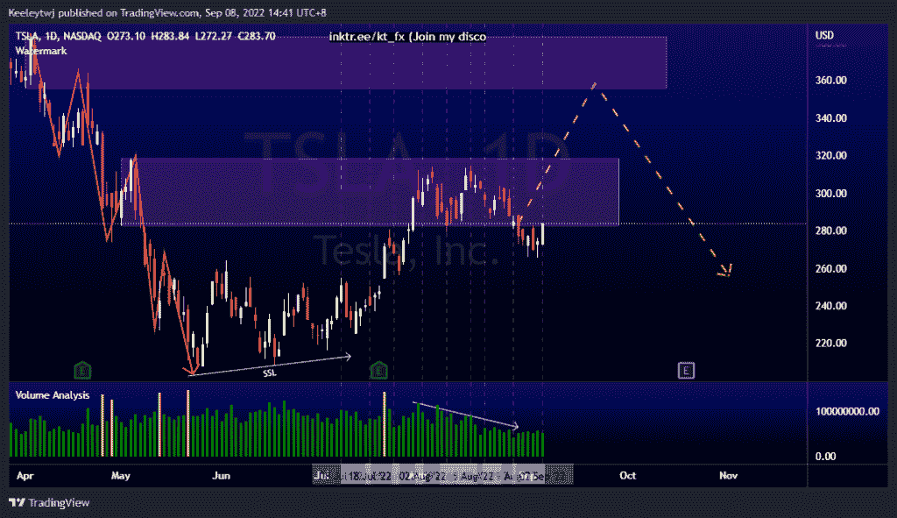
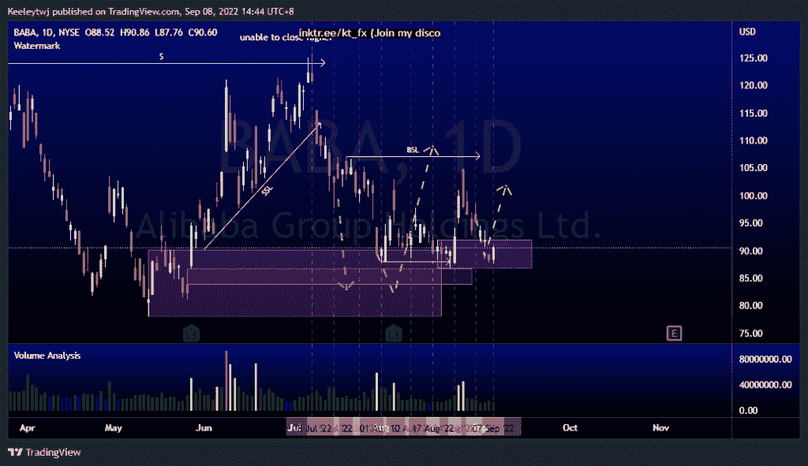
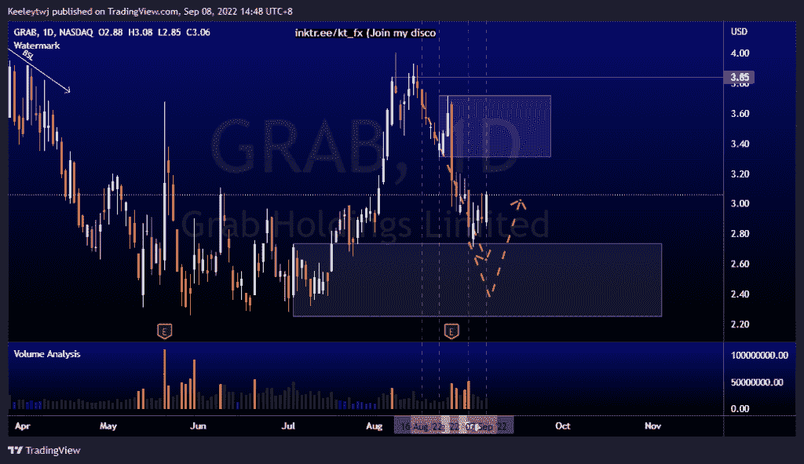

# 每周股票技术分析#抢#巴巴#TSLA

> 原文：<https://medium.com/coinmonks/weekly-stocks-technical-analysis-grab-baba-tsla-a580e872287a?source=collection_archive---------36----------------------->

附注:我现在在海外，如果可以的话，我会尽量回复所有的问题！

在这里找到更多关于我的信息(YouTube/Discord/Telegram):[https://www.linktr.ee/keeleytan](https://www.linktr.ee/keeleytan)

如果你觉得我的帖子有帮助，如果你能在这个帖子上给我一个赞，并关注我以后的类似帖子，我将不胜感激。

如果你同意，请在评论中告诉我你的想法。我在考虑尝试在 discord 上提供免费信号服务。如果你有兴趣，加入我们吧！

#TSLA

我上周的分析没有变化。价格在 282.68 减轻了看跌点，交易量下降。我预计价格在走低前会反弹至看跌点 355.55。

#巴巴

价格与上周的分析完全一致。价格目前正在缓解 91.93 的看涨点。我预计对这一看涨点的反应，这一反弹的可能目标是 107.16 的高点。

#抓取

价格完全按照 2022 年 8 月 16 日以来的分析运行。价格目前正在缓解 2.74 的看涨 POI，并反弹了 12%的涨幅。这种向上移动的潜在目标是在 3.31 减轻看跌点。

如果你持有这些公司中的任何一家，就可以点赞、分享和评论！

让我知道，如果你有任何你想让我分析的行情。

一定要在其他社交平台上看看我，我在交易、分析和心理学上发布内容。看看我这里:【https://www.linktr.ee/keeleytan】T2

*原载于 2022 年 9 月 8 日 http://2minutesliteracy.wordpress.com***。**

> *交易新手？尝试[加密交易机器人](/coinmonks/crypto-trading-bot-c2ffce8acb2a)或[复制交易](/coinmonks/top-10-crypto-copy-trading-platforms-for-beginners-d0c37c7d698c)*