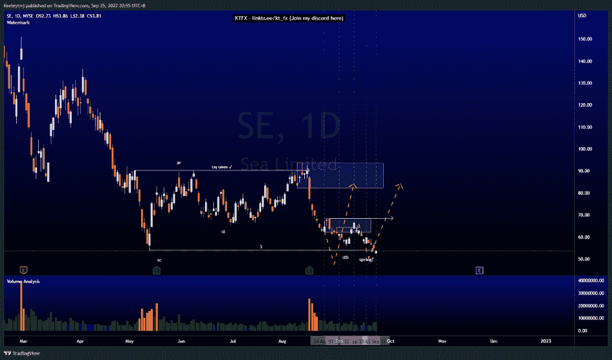
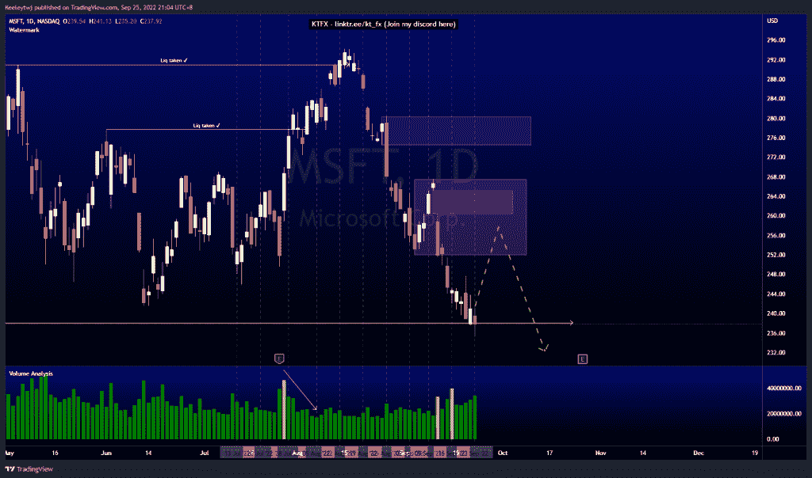
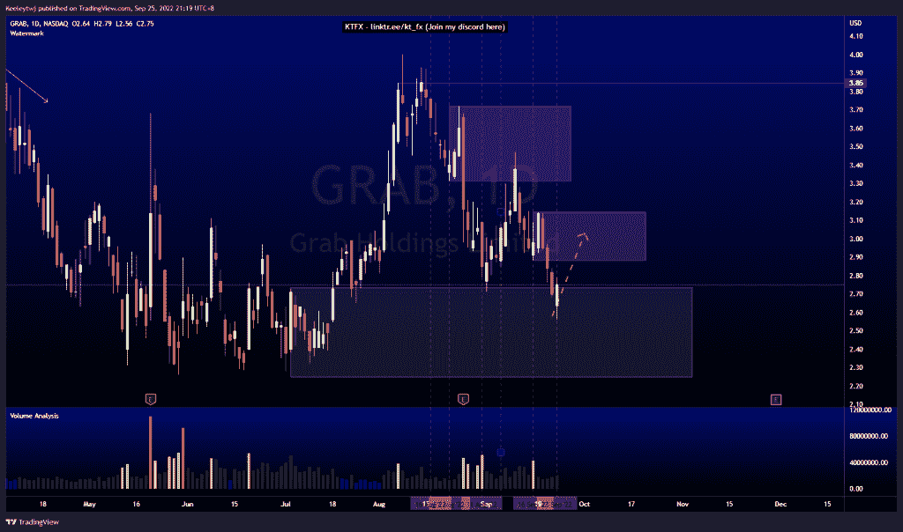

# 每周股票技术分析#抓取#MSFT #SE

> 原文：<https://medium.com/coinmonks/weekly-stocks-technical-analysis-grab-msft-se-521e10447007?source=collection_archive---------55----------------------->

在这里找到更多关于我的信息(YouTube/Discord/Telegram):[https://www.linktr.ee/keeleytan](https://www.linktr.ee/keeleytan)

如果你觉得我的帖子有帮助，如果你能在这个帖子上给我一个赞，并关注我以后的类似帖子，我将不胜感激。

如果你同意，请在评论中告诉我你的想法。我在考虑尝试在 discord 上提供免费信号服务。如果你有兴趣，加入我们吧！

#SE

根据上周的分析，价格上涨了。现在，价格从 54.06 的低点回升。如果价格按照威科夫累积图运行，一旦我们确认了较低的时间框架，这将是一个上涨的弹簧的形成。

#MSFT

在我上次的分析中，价格并没有像预期的那样发挥作用。价格跌至 238.07 英镑的低点。我的预期保持不变，我预计将在 251.94 处出现看涨回撤，并可能在 260.40 处填补公允价值缺口。

#抓取

自从我上次分析后，价格如预期般上涨。价格目前正在缓解 2.74 的看涨点。我预计从这个区域会有一个看涨的回撤，可能会进入看跌的 2.88 点。

如果你持有这些公司中的任何一家，就可以点赞、分享和评论！

让我知道，如果你有任何你想让我分析的行情。

一定要在其他社交平台上看看我，我在交易、分析和心理学上发布内容。看看我这里:【https://www.linktr.ee/keeleytan】T2

*原载于 2022 年 9 月 26 日 http://2minutesliteracy.wordpress.com***。**

> *交易新手？尝试[加密交易机器人](/coinmonks/crypto-trading-bot-c2ffce8acb2a)或[复制交易](/coinmonks/top-10-crypto-copy-trading-platforms-for-beginners-d0c37c7d698c)*