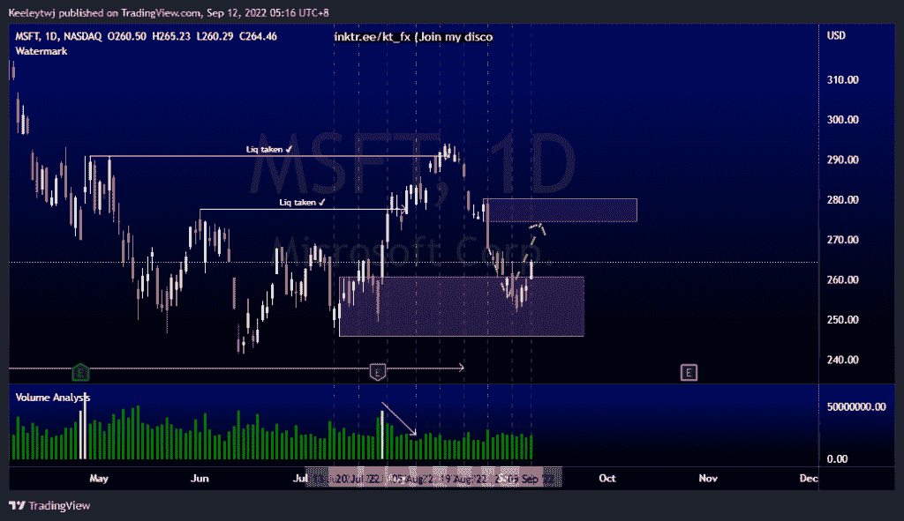
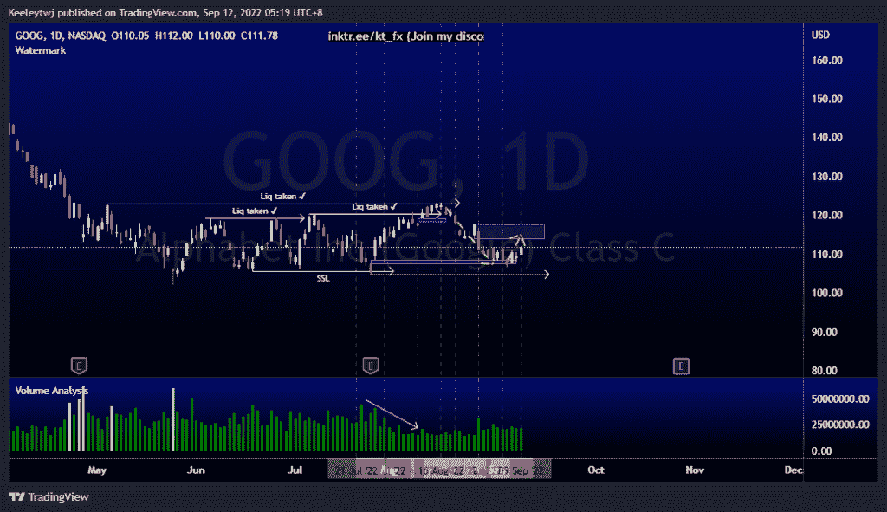
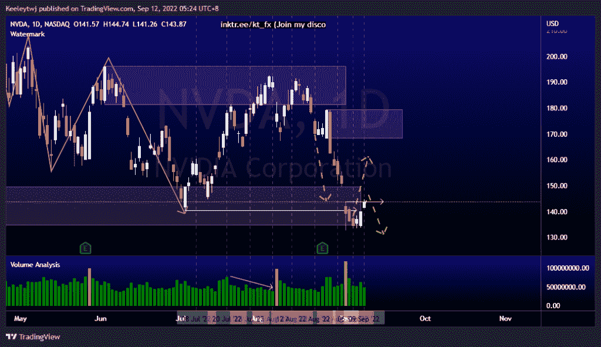

# 每周股票技术分析# MSFT # NVDA #谷歌

> 原文：<https://medium.com/coinmonks/weekly-stocks-technical-analysis-msft-nvda-goog-7fa990e48990?source=collection_archive---------20----------------------->

附注:我现在在海外，如果可以的话，我会尽量回复所有的问题！

在这里找到更多关于我的信息(YouTube/Discord/Telegram):[https://www.linktr.ee/keeleytan](https://www.linktr.ee/keeleytan)

如果你觉得我的帖子有帮助，如果你能在这个帖子上给我一个赞，并关注我以后的类似帖子，我将不胜感激。

如果你同意，请在评论中告诉我你的想法。我在考虑尝试在 discord 上提供免费信号服务。如果你有兴趣，加入我们吧！

#MSFT

价格的走势与上周的分析完全一致。价格在缓解后反弹至 260.84 的看涨点，我预计价格将向 274.52 的看跌点前进。

#GOOG

价格的走势与上周的分析完全一致。价格填补了 108.42 的公允价值缺口，并从那里向上移动。我预计价格将朝着 113.78 的熊市方向前进。从那里，我们将不得不看到价格如何表现。

#NVDA

价格的走势与上周的分析完全一致。此次上涨的潜在目标是缓解 168.33 的看跌点。然而，价格也有可能继续下跌，因为它刚刚填补了 143.80 的公允价值缺口。

如果你持有这些公司中的任何一家，就可以点赞、分享和评论！

让我知道，如果你有任何你想让我分析的行情。

一定要在其他社交平台上看看我，我在交易、分析和心理学上发布内容。看看我这里:【https://www.linktr.ee/keeleytan】T2

*原载于 2022 年 9 月 11 日***。**

> *交易新手？尝试[加密交易机器人](/coinmonks/crypto-trading-bot-c2ffce8acb2a)或[复制交易](/coinmonks/top-10-crypto-copy-trading-platforms-for-beginners-d0c37c7d698c)*