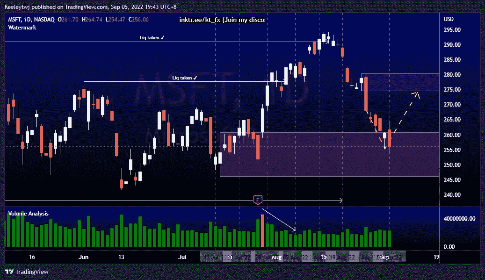
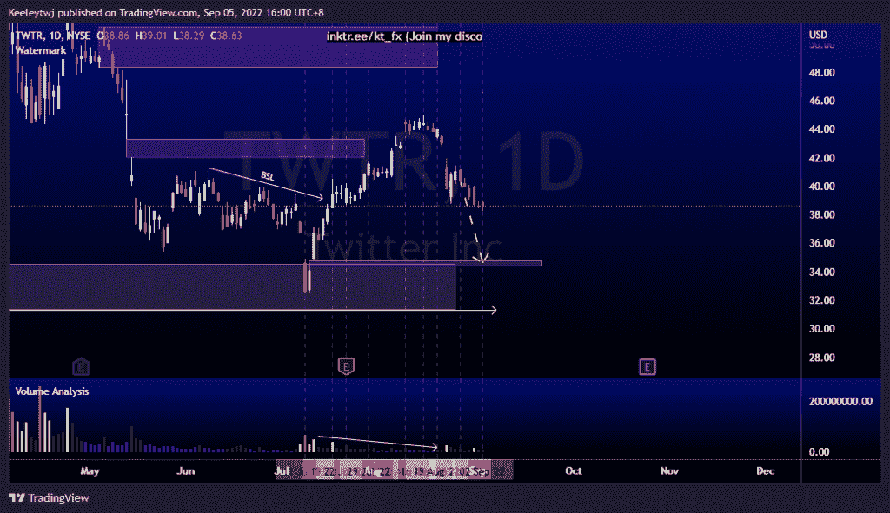
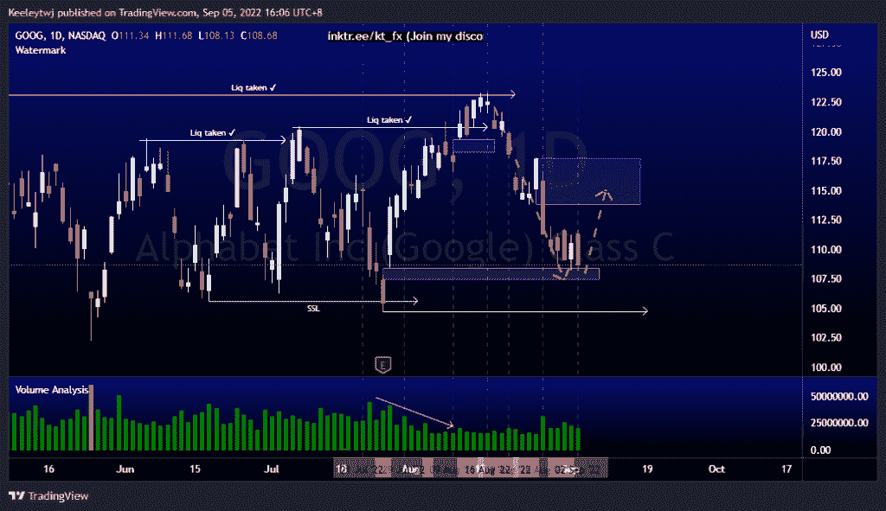

# 每周股票技术分析# MSFT # TWTR #谷歌

> 原文：<https://medium.com/coinmonks/weekly-stocks-technical-analysis-msft-twtr-goog-24a92a938163?source=collection_archive---------39----------------------->

在这里找到更多关于我的信息(YouTube/Discord/Telegram):[https://www.linktr.ee/keeleytan](https://www.linktr.ee/keeleytan)

如果你觉得我的帖子有帮助，如果你能在这个帖子上给我一个赞，并关注我以后的类似帖子，我将不胜感激。

如果你同意，请在评论中告诉我你的想法。我在考虑尝试在 discord 上提供免费信号服务。如果你有兴趣，加入我们吧！

#MSFT

价格的走势与上周的分析完全一致。价格目前缓解了 260.84 的看涨点。我预计价格将从这里反弹至 274.52 的熊市点。

#TWTR

上周价格如预期的那样上涨。价格正朝着 34.80 的公允价值差距前进。这一周，我的期望没有变化。我们应该看到价格继续朝着 34.80 下跌。

#GOOG

价格的走势与过去几周的分析完全一致。价格已经填补了 108.42 的公允价值缺口。从这里开始，我预计价格会在走低前回撤至 113.78。或者，我们也可以看到价格直线下降，以 104.76 的低点。

如果你持有这些公司中的任何一家，就可以点赞、分享和评论！

让我知道，如果你有任何你想让我分析的行情。

一定要在其他社交平台上看看我，我在交易、分析和心理学上发布内容。看看我这里:【https://www.linktr.ee/keeleytan】T2

*原载于 2022 年 9 月 5 日 http://2minutesliteracy.wordpress.com***。**

> *交易新手？尝试[加密交易机器人](/coinmonks/crypto-trading-bot-c2ffce8acb2a)或[复制交易](/coinmonks/top-10-crypto-copy-trading-platforms-for-beginners-d0c37c7d698c)*