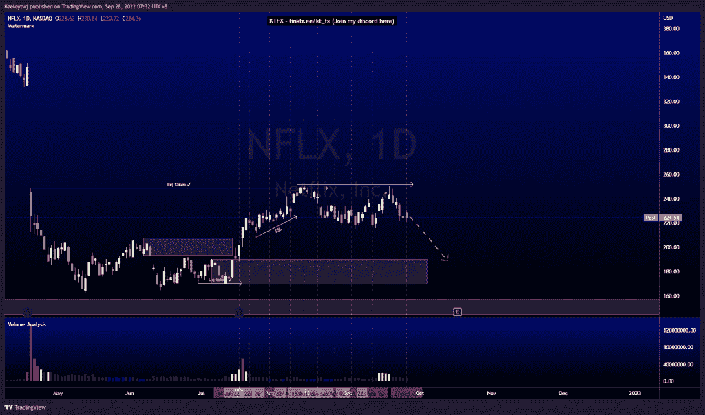
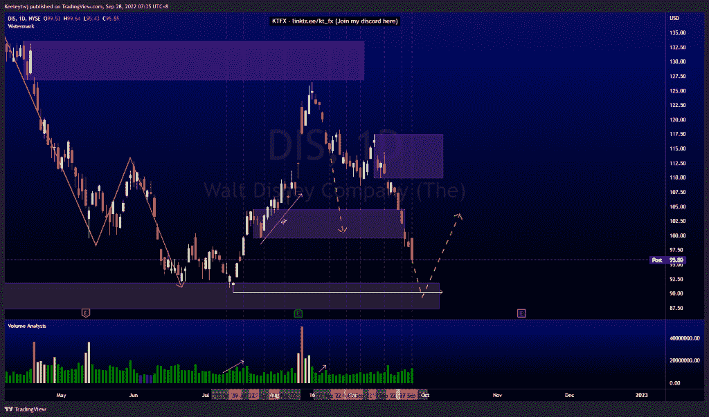
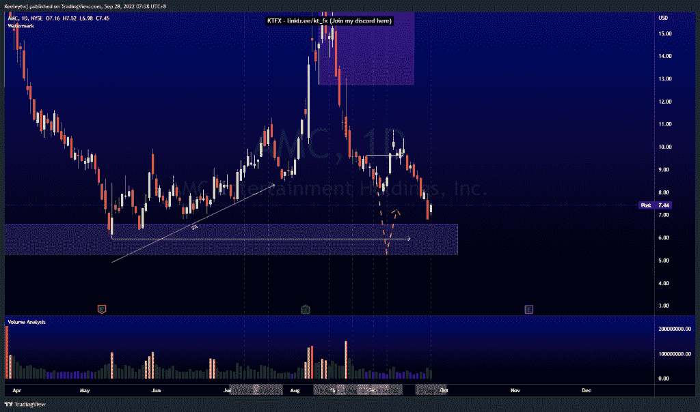

# 每周股票技术分析#NFLX #DIS #AMC

> 原文：<https://medium.com/coinmonks/weekly-stocks-technical-analysis-nflx-dis-amc-46bfe81fc34?source=collection_archive---------43----------------------->

在这里找到更多关于我的信息(YouTube/Discord/Telegram):[https://www.linktr.ee/keeleytan](https://www.linktr.ee/keeleytan)

如果你觉得我的帖子有帮助，如果你能在这个帖子上给我一个赞，并关注我以后的类似帖子，我将不胜感激。

如果你同意，请在评论中告诉我你的想法。我在考虑尝试在 discord 上提供免费信号服务。如果你有兴趣，加入我们吧！

#NFLX

自从我上次分析后，价格稳定了。价格几乎达到 251.62 的高点，但在流动性被取走之前，价格下跌。现在，价格已经打破了向下的小市场结构。我预计价格将下跌至看涨点 190.21。

#DIS

价格并没有像上周分析的那样发挥作用。我预计价格会在下跌前反弹至 109.88 的熊市点。价格没有丝毫降低。看涨的 POI 在 104.57 立即失效。目前，这次下跌的目标应该是在 91.80 进一步缓解看涨 POI，在我们看到任何看涨回撤之前，可能是在 90.23 的低点。

#AMC

对于我的最后一次分析，我预计价格会下跌，而不会达到 9.64 的高点。根据我上次的分析，价格在下跌前向上突破了市场结构。现在，根据我上次的分析，价格正在下跌，目标是 6.59 的看涨点。我的预期不变，这次下跌的潜在目标是 5.96 的低点。

如果你持有这些公司中的任何一家，就可以点赞、分享和评论！

让我知道，如果你有任何你想让我分析的行情。

一定要在其他社交平台上看看我，我在交易、分析和心理学上发布内容。看看我这里:【https://www.linktr.ee/keeleytan】T2

*原载于 2022 年 9 月 27 日 http://2minutesliteracy.wordpress.com***。**

> *交易新手？尝试[加密交易机器人](/coinmonks/crypto-trading-bot-c2ffce8acb2a)或[复制交易](/coinmonks/top-10-crypto-copy-trading-platforms-for-beginners-d0c37c7d698c)*