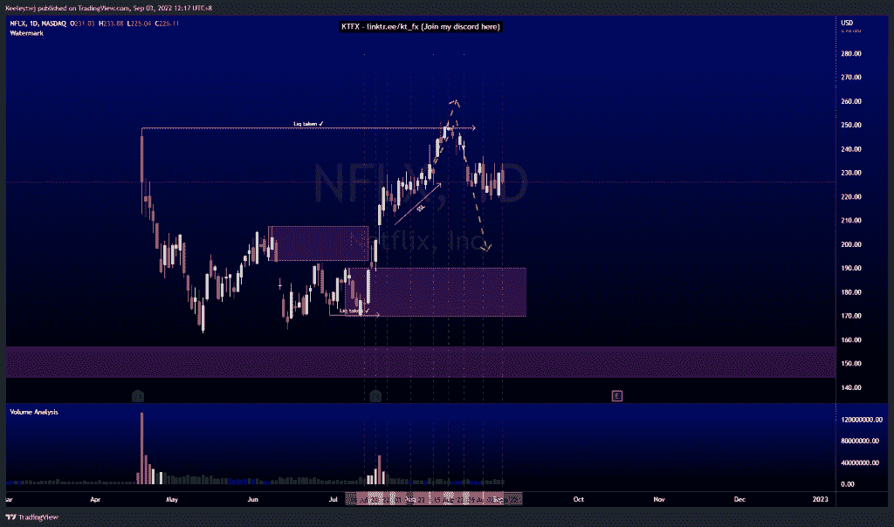

# 每周股票技术分析#NFLX #PLTR #AMD

> 原文：<https://medium.com/coinmonks/weekly-stocks-technical-analysis-nflx-pltr-amd-cbd4a5ceb1c3?source=collection_archive---------41----------------------->

在这里找到更多关于我的信息(YouTube/Discord/Telegram):[https://www.linktr.ee/keeleytan](https://www.linktr.ee/keeleytan)

如果你觉得我的帖子有帮助，如果你能在这个帖子上给我一个赞，并关注我以后的类似帖子，我将不胜感激。

如果你同意，请在评论中告诉我你的想法。我在考虑尝试在 discord 上提供免费信号服务。如果你有兴趣，加入我们吧！

#PLTR

从我上次的分析来看没有变化。根据上周的分析，价格表现良好。价格将卖方流动性和破碎的市场结构带向下行。我预计价格将继续下跌，直到我们看到上涨势头的改变。

#AMD

价格的走势与上周的分析完全一致。价格现在缓解了 80.47 的看涨点。我们可以看到第一次接触时成交量增加，并形成一个 doji。我们应该会看到一个看涨的回撤，可能会到达 90.90 的看跌点。

#NFLX

本周价格巩固。目前，价格吸收了一些卖方流动性，但无法推高。与上周类似，我预计价格将在 248.70 的流动性和未能收盘后下跌。

如果你持有这些公司中的任何一家，就可以点赞、分享和评论！

让我知道，如果你有任何你想让我分析的行情。

一定要在其他社交平台上看看我，我在交易、分析和心理学上发布内容。看看我这里:【https://www.linktr.ee/keeleytan】T2

*原载于 2022 年 9 月 5 日 http://2minutesliteracy.wordpress.com***。**

> *交易新手？尝试[加密交易机器人](/coinmonks/crypto-trading-bot-c2ffce8acb2a)或[复制交易](/coinmonks/top-10-crypto-copy-trading-platforms-for-beginners-d0c37c7d698c)*