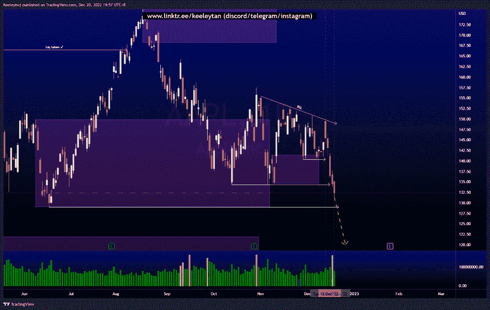

# 每周股票技术分析#NIO #AAPL #TSLA

> 原文：<https://medium.com/coinmonks/weekly-stocks-technical-analysis-nio-aapl-tsla-a4857236bdc5?source=collection_archive---------63----------------------->

在这里了解更多关于我的信息(YouTube/insta gram/Telegram):[https://www.linktr.ee/keeleytan](https://www.linktr.ee/keeleytan)

如果你觉得我的帖子有帮助，如果你能在这个帖子上给我一个赞，并关注我以后的类似帖子，我将不胜感激。如果您有任何意见/反馈，请随时使用上面的谷歌表单链接。

不和谐的免费信号服务正式启动。如果你感兴趣的话，去我的不和谐看看吧！

#NIO

价格向下突破市场结构，填补了 11.34 的公允价值缺口。价格似乎没有做出任何改变，我预计价格将收回几周前建立的卖方流动性，并可能缓解 7.90 的看涨点。

[https://www . trading view . com/chart/NIO/0 uhdt 1 ZZ-NIO-Analysis/](https://www.tradingview.com/chart/NIO/0uHdT1zz-NIO-Analysis/)

#AAPL

在创造了买方流动性后，价格打破了多重市场结构向下。按照订单流程，这一下跌的下一个逻辑目标是在 129.04 的低点。在 134.37 的同等低点之后，价格也可能从这里反转。

[https://www . trading view . com/chart/AAPL/JRNkJPAC-AAPL-Analysis/](https://www.tradingview.com/chart/AAPL/JRNkJPAC-AAPL-Analysis/)

#TSLA

价格呈下降趋势。价格根据上周的分析而定。我的预期不变，预计价格将走低，以填补 144.34 的公允价值缺口。

[https://www . trading view . com/chart/TSLA/WiDESQCW-TSLA-Analysis/](https://www.tradingview.com/chart/TSLA/WiDESQCW-TSLA-Analysis/)

如果你持有这些公司中的任何一家，就可以点赞、分享和评论！

让我知道，如果你有任何你想让我分析的行情。

一定要在其他社交平台上看看我，我在交易、分析和心理学上发布内容。看看我这里:[https://www.linktr.ee/keeleytan](https://www.linktr.ee/keeleytan)

*原载于 2022 年 12 月 20 日 http://2minutesliteracy.wordpress.com***。**

> **交易新手？试试* [*密码交易机器人*](/coinmonks/crypto-trading-bot-c2ffce8acb2a) *或* [*复制交易*](/coinmonks/top-10-crypto-copy-trading-platforms-for-beginners-d0c37c7d698c)*
> 
> **分散密码持有量，了解一下* [*币安的替代品*](https://coincodecap.com/binance-alternatives)*
> 
> **加入 Coinmonks* [*电报频道*](https://t.me/coincodecap) *和* [*Youtube 频道*](https://www.youtube.com/c/coinmonks/videos) *获取每日* [*加密新闻*](http://coincodecap.com/)*

# *另外，阅读*

*   *[复制交易](/coinmonks/top-10-crypto-copy-trading-platforms-for-beginners-d0c37c7d698c) | [加密税务软件](/coinmonks/crypto-tax-software-ed4b4810e338)*
*   *[网格交易](https://coincodecap.com/grid-trading) | [加密硬件钱包](/coinmonks/the-best-cryptocurrency-hardware-wallets-of-2020-e28b1c124069)*
*   *[密码电报信号](/coinmonks/top-3-telegram-channels-for-crypto-traders-in-2021-8385f4411ff4) | [密码交易机器人](/coinmonks/crypto-trading-bot-c2ffce8acb2a)*
*   *[最佳加密交易所](/coinmonks/crypto-exchange-dd2f9d6f3769) | [印度最佳加密交易所](/coinmonks/bitcoin-exchange-in-india-7f1fe79715c9)*
*   *[开发人员的最佳加密 API](/coinmonks/best-crypto-apis-for-developers-5efe3a597a9f)*
*   *最佳[密码借贷平台](/coinmonks/top-5-crypto-lending-platforms-in-2020-that-you-need-to-know-a1b675cec3fa)*
*   *[免费加密信号](/coinmonks/free-crypto-signals-48b25e61a8da) | [加密交易机器人](/coinmonks/crypto-trading-bot-c2ffce8acb2a)*
*   *[杠杆代币的终极指南](/coinmonks/leveraged-token-3f5257808b22)*