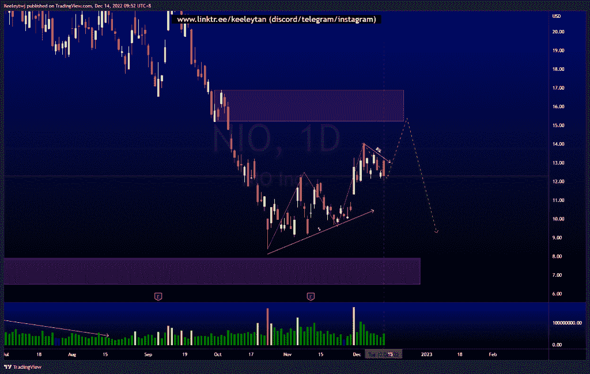
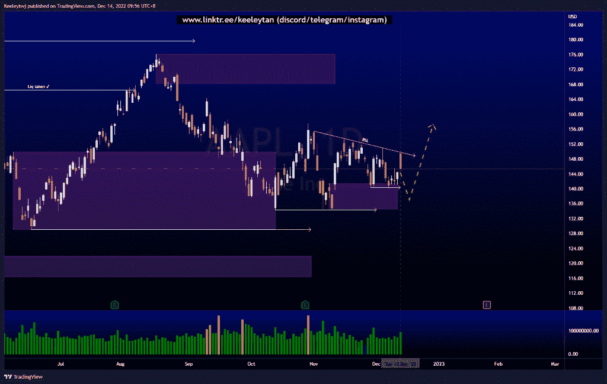
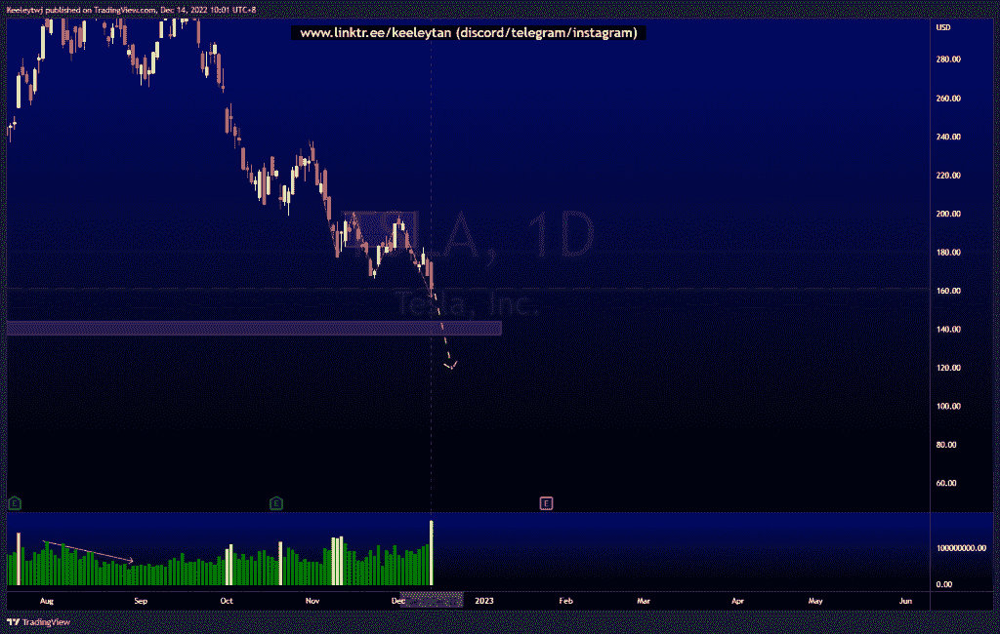

# 每周股票技术分析#NIO #AAPL#TSLA

> 原文：<https://medium.com/coinmonks/weekly-stocks-technical-analysis-nio-aapl-tsla-cd748ad7bebb?source=collection_archive---------24----------------------->

在这里找到更多关于我的信息(YouTube/Discord/Telegram):[https://www.linktr.ee/keeleytan](https://www.linktr.ee/keeleytan)

如果你觉得我的帖子有帮助，如果你能在这个帖子上给我一个赞，并关注我以后的类似帖子，我将不胜感激。

如果你同意，请在评论中告诉我你的想法。我在考虑尝试在 discord 上提供免费信号服务。如果你有兴趣，加入我们吧！

#NIO

价格正在建立短期买方流动性。价格也处于短期上升趋势。我预计价格将继续走高，至少会在下跌以获得卖方流动性之前缓解 16.88 的看跌点，并缓解 7.90 的看涨点。

[https://www . trading view . com/chart/NIO/4p 5 xfh 0x-NIO-Analysis/](https://www.tradingview.com/chart/NIO/4P5XhF0x-NIO-Analysis/)

#AAPL

价格建立了买方流动性，同时尊重 141.43 的看涨点，这在 149.87 的主要看涨点内。价格也在 140.35 的低点，但无法打破市场结构向上。我预计在价格反弹之前，价格将进一步缓解 149.87 的看涨点，并消除买方流动性。

[https://www . trading view . com/chart/AAPL/roLhzUPd-AAPL-Analysis/](https://www.tradingview.com/chart/AAPL/roLhzUPd-AAPL-Analysis/)

#TSLA

根据更高时间段的订单流分析，价格表现良好。此次下跌的下一个潜在目标是填补 144.34 的公允价值缺口。在第四季度 20 日创造的价格上，存在大量卖方流动性。

[https://www . trading view . com/chart/TSLA/bvpetko 4-TSLA-Analysis/](https://www.tradingview.com/chart/TSLA/bvPEtkO4-TSLA-Analysis/)

如果你持有这些公司中的任何一家，就可以点赞、分享和评论！

让我知道，如果你有任何你想让我分析的行情。

一定要在其他社交平台上看看我，我在交易、分析和心理学上发布内容。看看我这里:[https://www.linktr.ee/keeleytan](https://www.linktr.ee/keeleytan)

*原载于 2022 年 12 月 14 日 http://2minutesliteracy.wordpress.com***。**

> *交易新手？试试[加密交易机器人](/coinmonks/crypto-trading-bot-c2ffce8acb2a)或者[复制交易](/coinmonks/top-10-crypto-copy-trading-platforms-for-beginners-d0c37c7d698c)*