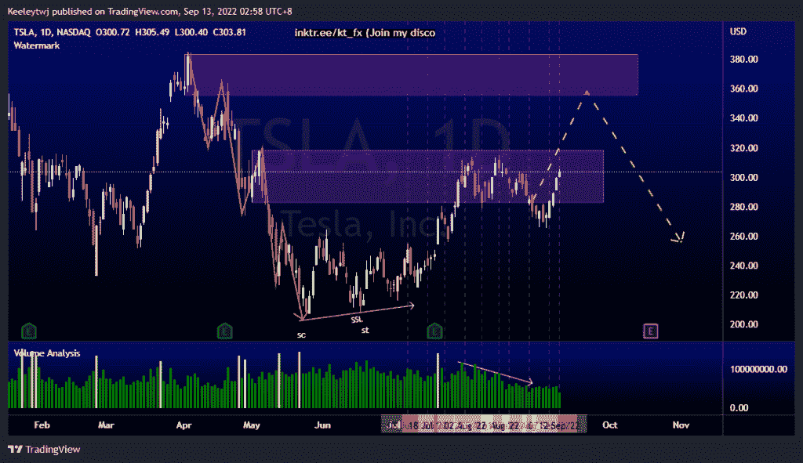

# 每周股票技术分析#NIO #BABA #TSLA

> 原文：<https://medium.com/coinmonks/weekly-stocks-technical-analysis-nio-baba-tsla-9ed2592d57c4?source=collection_archive---------34----------------------->

附注:我现在在海外，如果可以的话，我会尽量回复所有的问题！

在这里找到更多关于我的信息(YouTube/Discord/Telegram):[https://www.linktr.ee/keeleytan](https://www.linktr.ee/keeleytan)

如果你觉得我的帖子有帮助，如果你能在这个帖子上给我一个赞，并关注我以后的类似帖子，我将不胜感激。

如果你同意，请在评论中告诉我你的想法。我在考虑尝试在 discord 上提供免费信号服务。如果你有兴趣，加入我们吧！

#TSLA

根据上周的分析，价格正在上涨。价格仍在看跌点 282.68 之内，并可能继续下跌。我目前预计价格将触及 355.55 的熊市点。

#巴巴

根据上周的分析，价格表现良好。价格在 91.93 缓解了看涨的 POI，现在正在反弹。此次上涨的潜在目标是 107.16 的高点。

#NIO

我预计价格会在上周触及 15.84 的低点。然而，价格在缓解后反弹至 19.18 的看涨点。现在，价格已经打破市场结构向上。我预计在价格继续上涨之前会有一个熊市回撤。

如果你持有这些公司中的任何一家，就可以点赞、分享和评论！

让我知道，如果你有任何你想让我分析的行情。

一定要在其他社交平台上看看我，我在交易、分析和心理学上发布内容。看看我这里:【https://www.linktr.ee/keeleytan】T2

*原载于 2022 年 9 月 12 日***。**

> *交易新手？尝试[加密交易机器人](/coinmonks/crypto-trading-bot-c2ffce8acb2a)或[复制交易](/coinmonks/top-10-crypto-copy-trading-platforms-for-beginners-d0c37c7d698c)*