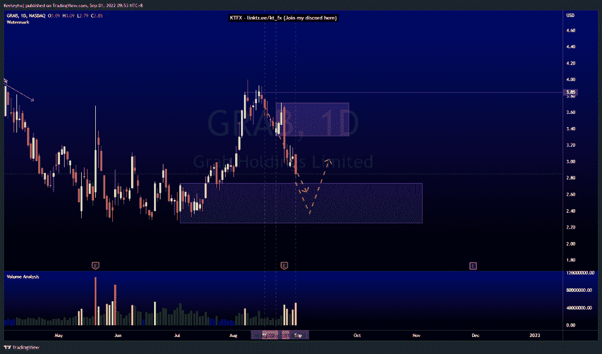
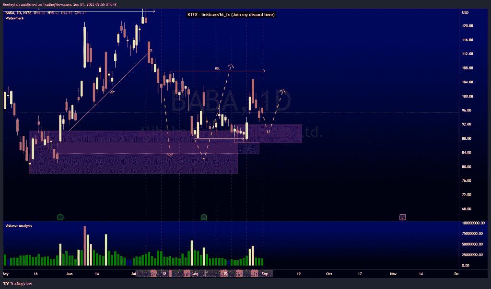
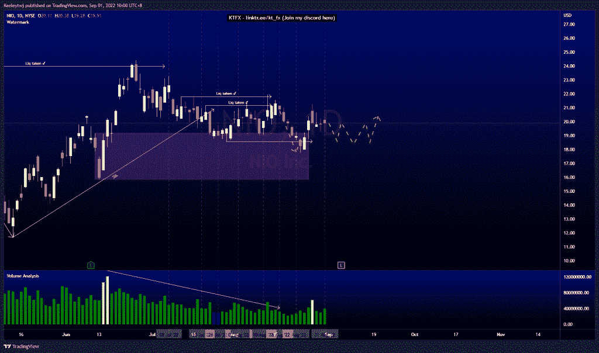

# 每周股票技术分析#NIO #GRAB #BABA

> 原文：<https://medium.com/coinmonks/weekly-stocks-technical-analysis-nio-grab-baba-7e3e38f400c8?source=collection_archive---------41----------------------->

在这里找到更多关于我的信息(YouTube/Discord/Telegram):[https://www.linktr.ee/keeleytan](https://www.linktr.ee/keeleytan)

如果你觉得我的帖子有帮助，如果你能在这个帖子上给我一个赞，并关注我以后的类似帖子，我将不胜感激。

如果你同意，请在评论中告诉我你的想法。我在考虑尝试在 discord 上提供免费信号服务。如果你有兴趣，加入我们吧！

#抓取

价格完全符合我上次的分析。目前，价格将如预期的那样在 2.74 缓解看涨 POI。我预计价格将从那里反弹，可能会在 3.72 点下跌。

#巴巴

价格完全符合我上次的分析。价格从 90.17 的看涨点反弹，并在 86.73 填补了公允价值缺口，并从那里开始反弹。我们认为价格无法达到 107.16 的高点。从这里开始，我预计在我们看到另一轮反弹之前，将回撤至 91.93 的看涨点。如果这个看涨 POI 失效，价格应该开始下跌趋势，以进一步填补 86.73 的公允价值缺口。

#NIO

根据上周的分析，价格反弹至 19.18 的看涨点。价格无法通过这种上涨打破任何市场结构。我们可以看到增加的量，但没有看到结果。价格似乎也在这里盘整。我们可能暂时看不到任何行动。

如果你持有这些公司中的任何一家，就可以点赞、分享和评论！

让我知道，如果你有任何你想让我分析的行情。

一定要在其他社交平台上看看我，我在交易、分析和心理学上发布内容。看看我这里:【https://www.linktr.ee/keeleytan】T2

*原载于 2022 年 9 月 1 日***。**

> *交易新手？尝试[加密交易机器人](/coinmonks/crypto-trading-bot-c2ffce8acb2a)或[复制交易](/coinmonks/top-10-crypto-copy-trading-platforms-for-beginners-d0c37c7d698c)*