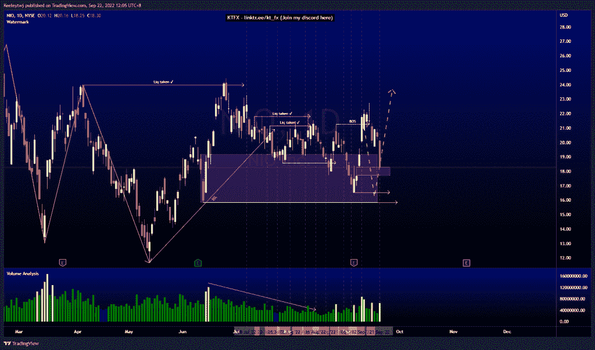
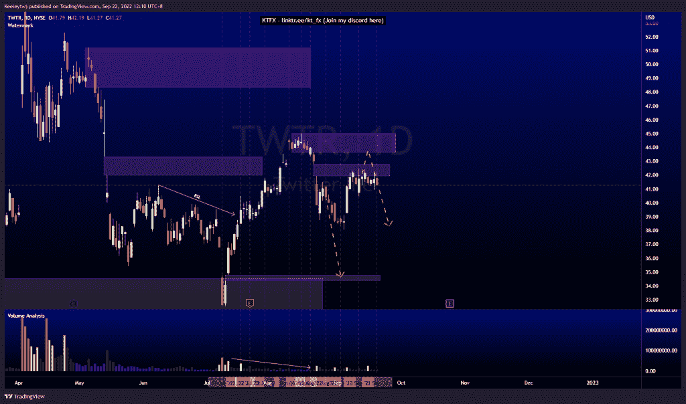
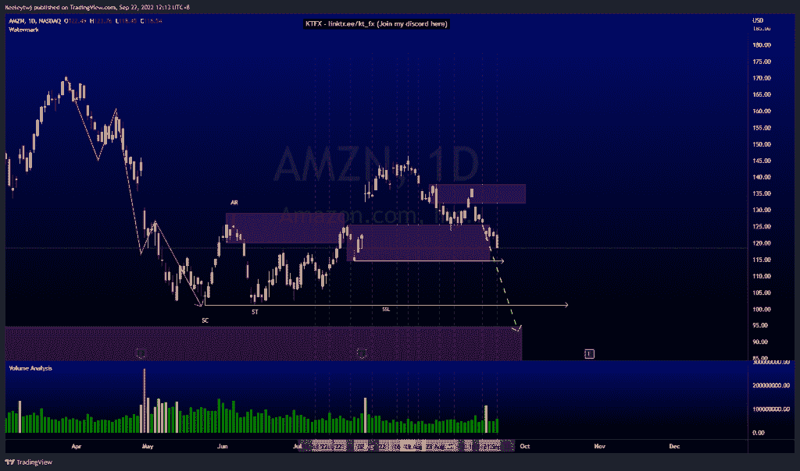

# 每周股票技术分析#NIO #TWTR #AMZN

> 原文：<https://medium.com/coinmonks/weekly-stocks-technical-analysis-nio-twtr-amzn-f456e2c1c6d2?source=collection_archive---------18----------------------->

在这里找到更多关于我的信息(YouTube/Discord/Telegram):[https://www.linktr.ee/keeleytan](https://www.linktr.ee/keeleytan)

如果你觉得我的帖子有帮助，如果你能在这个帖子上给我一个赞，并关注我以后的类似帖子，我将不胜感激。

如果你同意，请在评论中告诉我你的想法。我在考虑尝试在 discord 上提供免费信号服务。如果你有兴趣，加入我们吧！

#NIO

根据我最后的分析，价格表现良好。目前，价格已经填补了 18.29 美元的公允价值缺口。我预计在这个点会有一个看涨的回撤。然而，在当前的宏观环境下，如果你决定进入反转，一定要等待低位的确认。我将等待 16.54 的低点首先被采取，并等待确认。

#TWTR

自我上次分析以来，价格一直在巩固。价格似乎没有任何上涨的动力。我预计价格会对这一公平价值差距做出反应，并走低。当然，在价格走低之前，价格仍有可能向 43.64 前进。

#AMZN

价格与我上次的分析相符。价格目前正在缓解 125.50 的看涨点。然而，我预计 114.53 的低点将被采取。根据威科夫累积图，这次下跌的目标应该是 101.26 的低点，并可能进入 94.71 的看涨点，以实现春天。

如果你持有这些公司中的任何一家，就可以点赞、分享和评论！

让我知道，如果你有任何你想让我分析的行情。

一定要在其他社交平台上看看我，我在交易、分析和心理学上发布内容。看看我这里:【https://www.linktr.ee/keeleytan】T2

*原载于 2022 年 9 月 22 日 http://2minutesliteracy.wordpress.com***。**

> *加入 Coinmonks [电报频道](https://t.me/coincodecap)和 [Youtube 频道](https://www.youtube.com/c/coinmonks/videos)了解加密交易和投资*

# *另外，阅读*

*   *[Bookmap 评论](https://coincodecap.com/bookmap-review-2021-best-trading-software) | [美国 5 大最佳加密交易所](https://coincodecap.com/crypto-exchange-usa)*
*   *[如何在 FTX 交易所交易期货](https://coincodecap.com/ftx-futures-trading) | [OKEx vs 币安](https://coincodecap.com/okex-vs-binance)*
*   *[CoinLoan 评论](https://coincodecap.com/coinloan-review) | [YouHodler 评论](/coinmonks/youhodler-4-easy-ways-to-make-money-98969b9689f2) | [BlockFi 评论](https://coincodecap.com/blockfi-review)*
*   *[XT.COM 评论](https://coincodecap.com/profittradingapp-for-binance)币安评论 |*