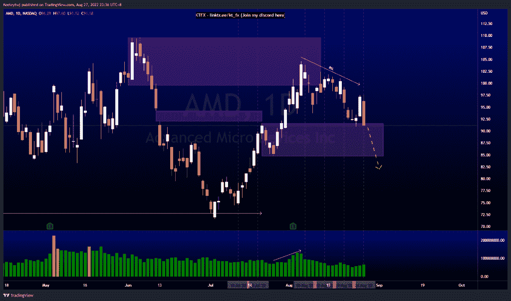
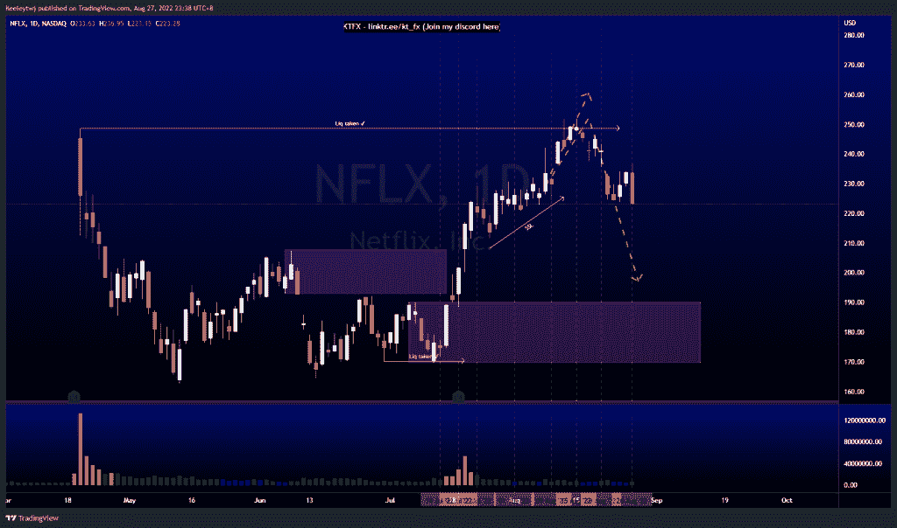

# 每周股票技术分析#PLTR #AMD #NFLX

> 原文：<https://medium.com/coinmonks/weekly-stocks-technical-analysis-pltr-amd-nflx-60ee44a16c55?source=collection_archive---------26----------------------->

每周股票技术分析#股票名称

在这里找到更多关于我的信息(YouTube/Discord/Telegram):[https://www.linktr.ee/keeleytan](https://www.linktr.ee/keeleytan)

如果你觉得我的帖子有帮助，如果你能在这个帖子上给我一个赞，并关注我以后的类似帖子，我将不胜感激。

如果你同意，请在评论中告诉我你的想法。

#PLTR

根据分析，上周价格表现良好。价格目前呈下降趋势，导致卖方流动性不足。从这里开始，我仍然预计价格会继续走低，在我们看到回撤之前，价格会在 7.50 的低点。关注 5.00 美元整数心理关口。

#AMD

正如上周所预期的，价格从看涨的 POI 反弹至 91.58。这种反应还不够强烈，不足以打破市场结构的上行趋势。从这里开始，我预计看涨 POI 会进一步缓解，或者价格会开始下跌。

#NFLX

根据上周的分析，价格表现良好。价格在 248.70 获得流动性，并打破市场结构向下。从这里开始，附近有卖方流动性，我预计价格会在继续下跌时接受它们。此次下跌的可能目标是看涨点 190.21

我在考虑尝试在 discord 上提供免费信号服务。如果你有兴趣，请给我发邮件，让我在那里扮演一个角色！

如果你持有这些公司中的任何一家，就可以点赞、分享和评论！

让我知道，如果你有任何你想让我分析的行情。

一定要在其他社交平台上看看我，我在交易、分析和心理学上发布内容。看看我这里:【https://www.linktr.ee/keeleytan】T2

*原载于 2022 年 8 月 28 日 http://2minutesliteracy.wordpress.com***。**

> *交易新手？尝试[加密交易机器人](/coinmonks/crypto-trading-bot-c2ffce8acb2a)或[复制交易](/coinmonks/top-10-crypto-copy-trading-platforms-for-beginners-d0c37c7d698c)*