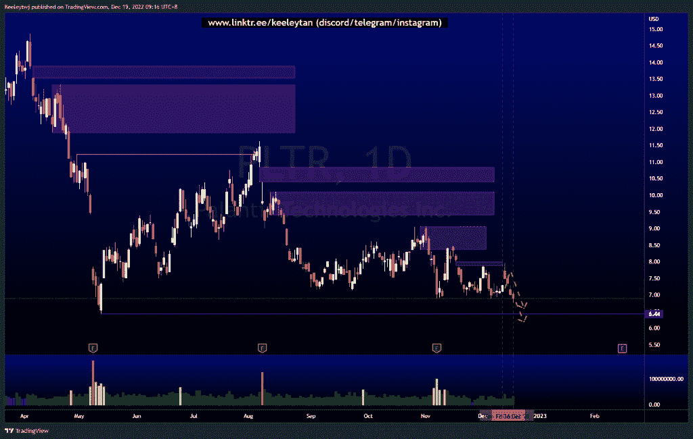
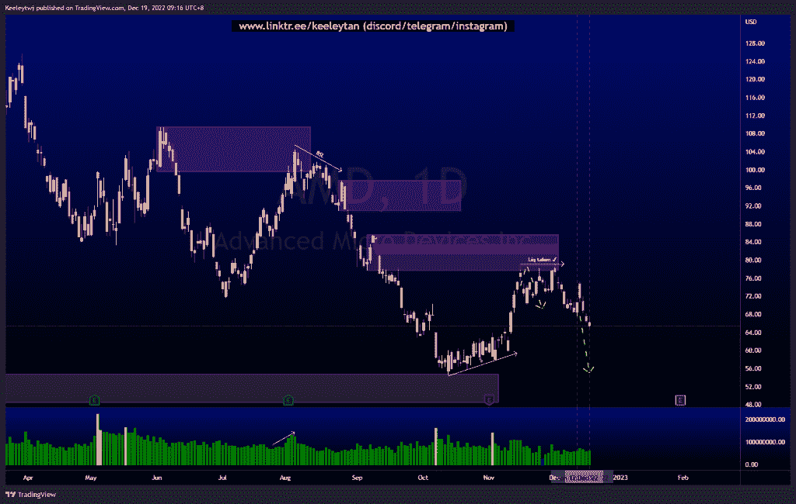
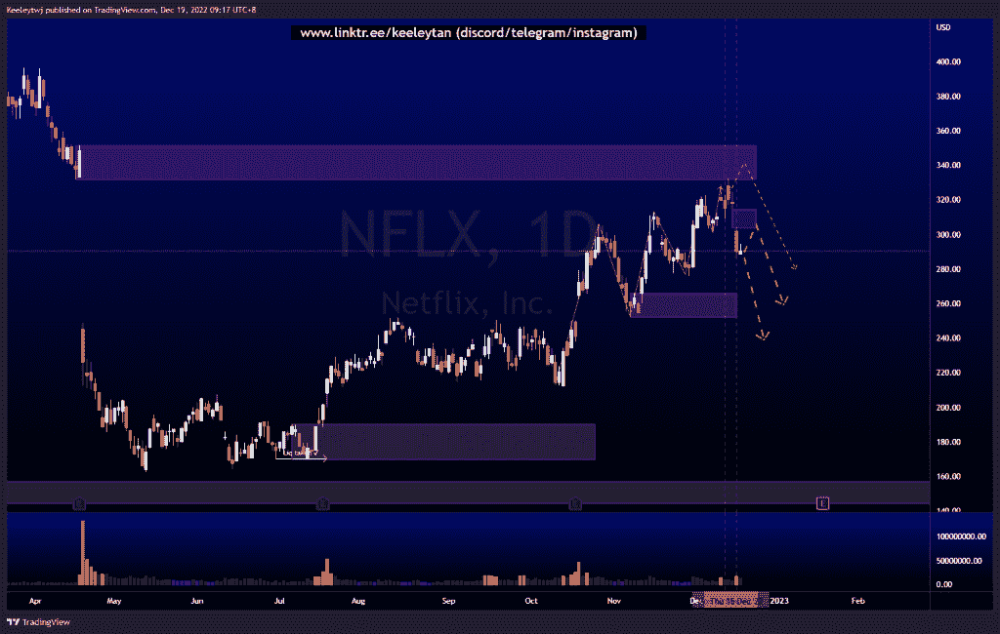

# 每周股票技术分析#PLTR #AMD #NFLX

> 原文：<https://medium.com/coinmonks/weekly-stocks-technical-analysis-pltr-amd-nflx-fd13c2aa9aa5?source=collection_archive---------33----------------------->

在这里了解更多关于我的信息(YouTube/insta gram/Telegram):[https://www.linktr.ee/keeleytan](https://www.linktr.ee/keeleytan)

如果你觉得我的帖子有帮助，如果你能在这个帖子上给我一个赞，并关注我以后的类似帖子，我将不胜感激。如果您有任何意见/反馈，请随时使用上面的谷歌表单链接。

不和谐的免费信号服务正式启动。如果你感兴趣的话，去我的不和谐看看吧！

#PLTR

根据我之前的分析，价格表现良好。在对下跌做出强烈反应之前，价格在 8.00 填补了公允价值缺口，在 6.89 消除了卖方流动性。我预计价格将继续走低，在更高的时间框架订单流之后，将打破 6.44 的历史低点。

[https://www . trading view . com/chart/PLTR/S1 uzrnb 2-PLTR-分析/](https://www.tradingview.com/chart/PLTR/s1uZrNB2-PLTR-Analysis/)

#AMD

根据上周的分析，价格下降了。价格上涨，以减轻看跌的兴趣点再次走低。这一下跌的下一个潜在目标是在 54.74 的看涨点附近获得卖方流动性。

[https://www . trading view . com/chart/AMD/PP 7 use 39-AMD-Analysis/](https://www.tradingview.com/chart/AMD/PP7uSE39-AMD-Analysis/)

#NFLX

价格的走势与上周的分析完全一致。价格在 331.62 缓解了看跌点，并对下跌做出强烈反应，打破了市场结构。价格在 314.42 留下了一个公允价值缺口，可以在价格继续下跌之前填补。

[https://www . trading view . com/chart/NFLX/XxZtaNkB-NFLX-Analysis/](https://www.tradingview.com/chart/NFLX/XxZtaNkB-NFLX-Analysis/)

如果你持有这些公司中的任何一家，就可以点赞、分享和评论！

让我知道，如果你有任何你想让我分析的行情。

一定要在其他社交平台上看看我，我在交易、分析和心理学上发布内容。看看我这里:[https://www.linktr.ee/keeleytan](https://www.linktr.ee/keeleytan)

*原载于 2022 年 12 月 19 日 http://2minutesliteracy.wordpress.com***。**

> *交易新手？试试[加密交易机器人](/coinmonks/crypto-trading-bot-c2ffce8acb2a)或者[复制交易](/coinmonks/top-10-crypto-copy-trading-platforms-for-beginners-d0c37c7d698c)*