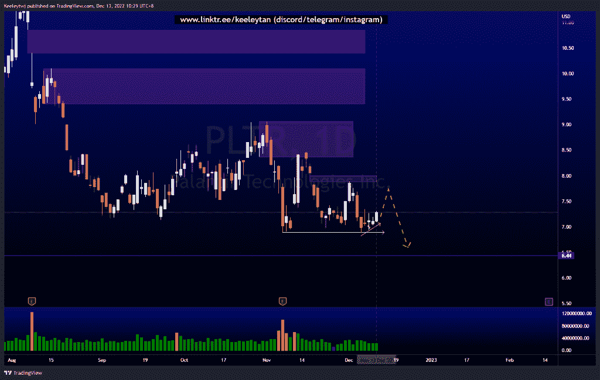
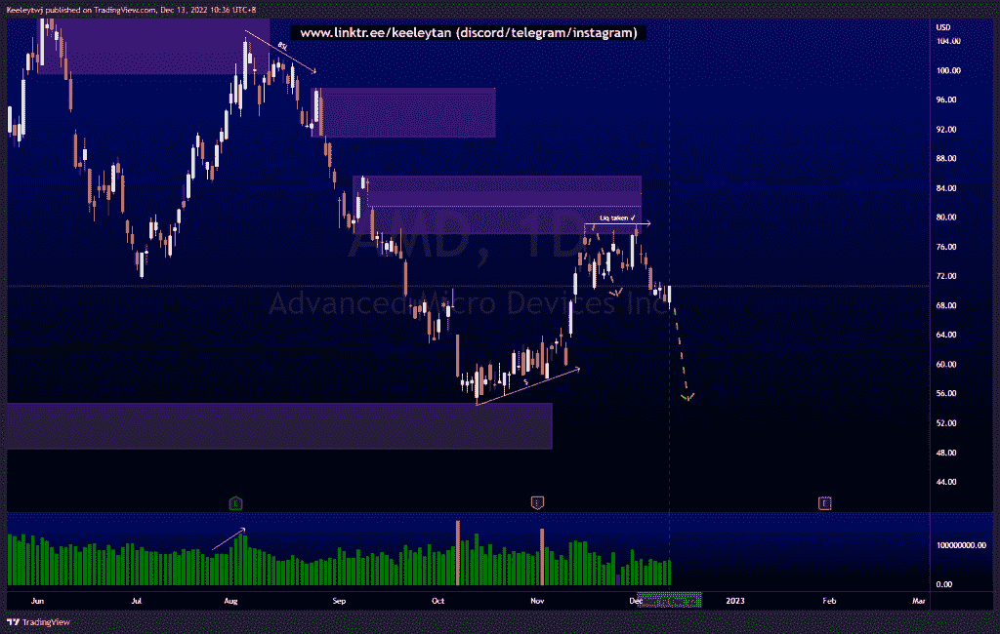
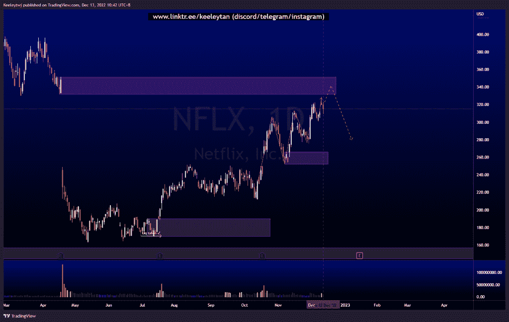

# 每周股票技术分析#PLTR #NFLX #AMD

> 原文：<https://medium.com/coinmonks/weekly-stocks-technical-analysis-pltr-nflx-amd-4ce4383add57?source=collection_archive---------55----------------------->

如果你觉得我的帖子有帮助，如果你能在这个帖子上给我一个赞，并关注我以后的类似帖子，我将不胜感激。如果您有任何意见/反馈，请随时使用上面的谷歌表单链接。

不和谐的免费信号服务正式启动。如果你感兴趣的话，去我的不和谐看看吧！

#PLTR

价格一直在 7 美元附近盘整。随着价格试图反弹，我们还可以看到卖方流动性正在积聚。此外，价格在 6.89 创造了同样的低点。价格很有可能会带走这些流动性。

[https://www . trading view . com/chart/PLTR/fgIzWBUo-PLTR-Analysis/](https://www.tradingview.com/chart/PLTR/fgIzWBUo-PLTR-Analysis/)

#AMD

价格在 79.16 处创下新高，同时在 85.68 处缓解了看跌情绪。价格未能填补 83.46 的公允价值缺口，我预计价格将向 83.46 前进。价格现在已经打破了下行的小结构，有可能朝着卖方流动性下降。

[https://www . trading view . com/chart/AMD/q 4 xwdwnk-AMD-Analysis/](https://www.tradingview.com/chart/AMD/Q4xwdWNK-AMD-Analysis/)

#NFLX

价格已经填补了 2022 年 4 月以来的大部分缺口。我们看到价格处于上升趋势，上升浪缩短，表明这一上升趋势的衰竭。我预计价格在下跌前会在 331.62 减轻看跌情绪。

[https://www . trading view . com/chart/NFLX/146 uqxta-NFLX-Analysis/](https://www.tradingview.com/chart/NFLX/146uqXtA-NFLX-Analysis/)

如果你持有这些公司中的任何一家，就可以点赞、分享和评论！

让我知道，如果你有任何你想让我分析的行情。

一定要在其他社交平台上看看我，我在交易、分析和心理学上发布内容。看看我这里:[https://www.linktr.ee/keeleytan](https://www.linktr.ee/keeleytan)

*原载于 2022 年 12 月 13 日 http://2minutesliteracy.wordpress.com**的* [*。*](https://2minutesliteracy.wordpress.com/2022/12/13/weekly-stocks-technical-analysis-pltr-nflx-amd/)