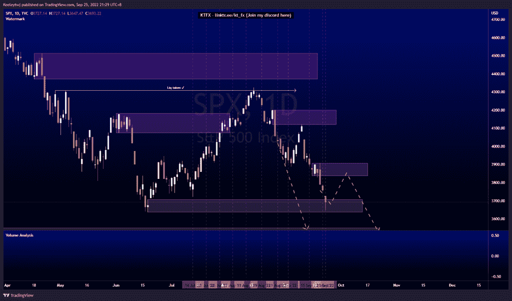
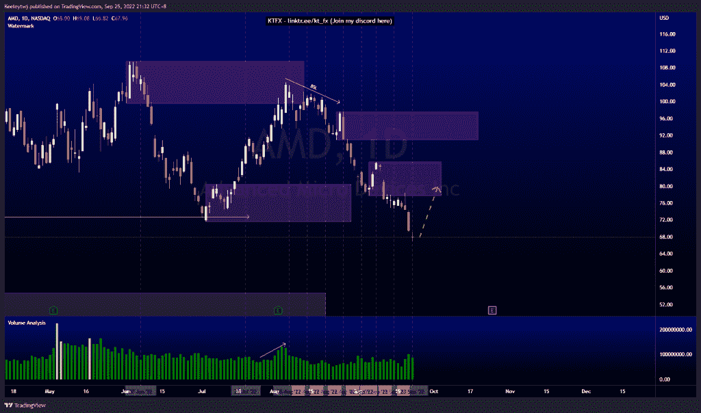
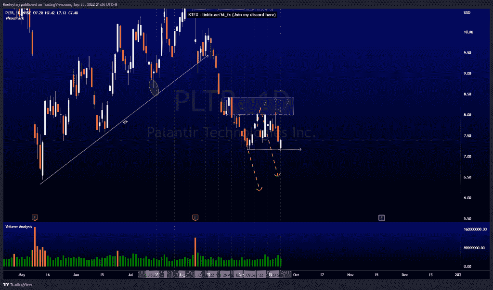

# 每周股票技术分析#PLTR #SPX #AMD

> 原文：<https://medium.com/coinmonks/weekly-stocks-technical-analysis-pltr-spx-amd-5425f8ecfd39?source=collection_archive---------49----------------------->

在这里找到更多关于我的信息(YouTube/Discord/Telegram):[https://www.linktr.ee/keeleytan](https://www.linktr.ee/keeleytan)

如果你觉得我的帖子有帮助，如果你能在这个帖子上给我一个赞，并关注我以后的类似帖子，我将不胜感激。

如果你同意，请在评论中告诉我你的想法。我在考虑尝试在 discord 上提供免费信号服务。如果你有兴趣，加入我们吧！

#SPX

根据我最后的分析，价格运行良好。价格目前在 3707.71 减轻了看涨的 POI。我预计价格将反弹至看跌点 3837.08，然后继续在较高的时间框架内下跌。

#AMD

价格没有达到预期。我原本预计牛市会反弹至 80.47。由于价格持续走低，POI 失效，继续下跌趋势。现在，我预计在 85.68 会有一个看涨回撤至看跌点。

#PLTR

根据上周的分析，价格表现良好。价格跌至 7.17 的低点，并在最后一个交易日收盘时大幅高于开盘价。现在，我仍然预计价格会走低，延续较高的下跌趋势。

如果你持有这些公司中的任何一家，就可以点赞、分享和评论！

让我知道，如果你有任何你想让我分析的行情。

一定要在其他社交平台上看看我，我在交易、分析和心理学上发布内容。看看我这里:【https://www.linktr.ee/keeleytan】T2

*原载于 2022 年 9 月 26 日 http://2minutesliteracy.wordpress.com***。**

> *交易新手？尝试[加密交易机器人](/coinmonks/crypto-trading-bot-c2ffce8acb2a)或[复制交易](/coinmonks/top-10-crypto-copy-trading-platforms-for-beginners-d0c37c7d698c)*