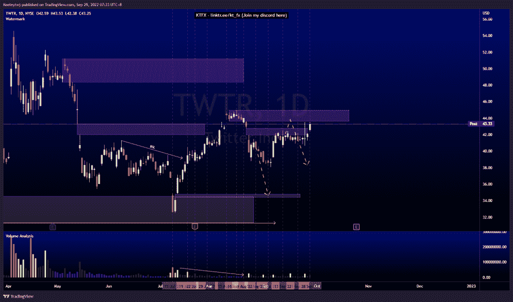
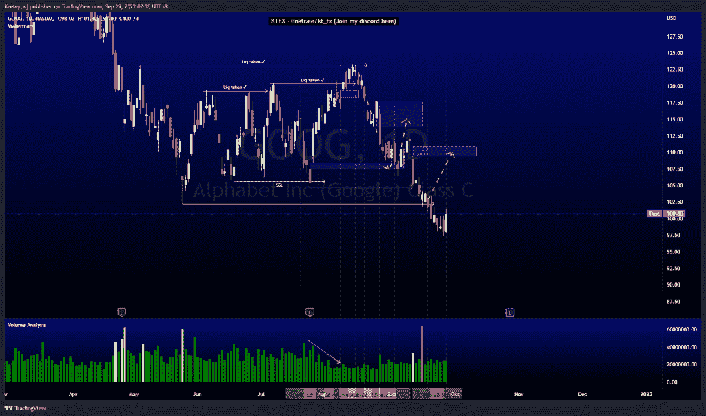
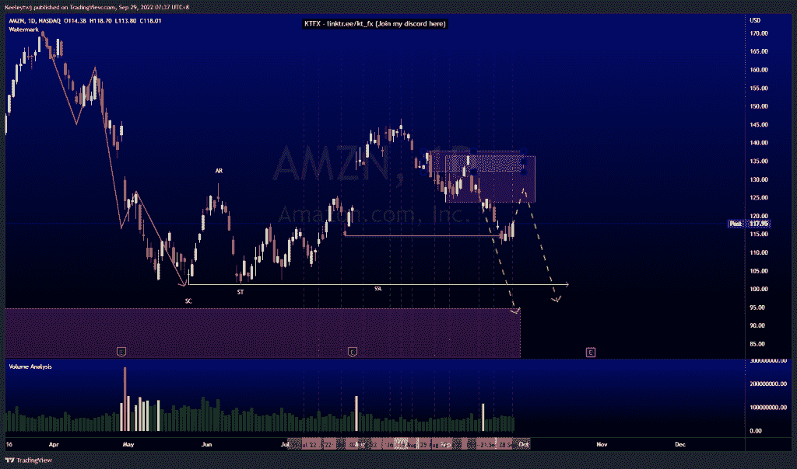

# 每周股票技术分析# TWTR #谷歌#AMZN

> 原文：<https://medium.com/coinmonks/weekly-stocks-technical-analysis-twtr-goog-amzn-6c03b75de42a?source=collection_archive---------15----------------------->

在这里找到更多关于我的信息(YouTube/Discord/Telegram):[https://www.linktr.ee/keeleytan](https://www.linktr.ee/keeleytan)

如果你觉得我的帖子有帮助，如果你能在这个帖子上给我一个赞，并关注我以后的类似帖子，我将不胜感激。

如果你同意，请在评论中告诉我你的想法。我在考虑尝试在 discord 上提供免费信号服务。如果你有兴趣，加入我们吧！

#TWTR

经过几天的盘整，价格目前表现良好。价格将在 43.64 点下跌。我的预期不变，预计当价格在 43.64 缓解看跌点时，会出现看跌回撤。

#GOOG

根据我上次的分析，价格没有发挥作用。我预计价格会做一个看涨回撤，至少填补 110.93 的公允价值缺口，但价格下跌以获取更多的流动性。现在，我最初的期望仍然没有改变。

#AMZN

根据我上次的分析，价格运行良好。价格在 114.53 获得流动性，目前正在做看涨回撤。目前，我预计价格将在 123.66 的看跌点缓解后继续走低。

如果你持有这些公司中的任何一家，就可以点赞、分享和评论！

让我知道，如果你有任何你想让我分析的行情。

一定要在其他社交平台上看看我，我在交易、分析和心理学上发布内容。看看我这里:【https://www.linktr.ee/keeleytan】T2

*原载于 2022 年 9 月 28 日 http://2minutesliteracy.wordpress.com***。**

> *交易新手？尝试[加密交易机器人](/coinmonks/crypto-trading-bot-c2ffce8acb2a)或[复制交易](/coinmonks/top-10-crypto-copy-trading-platforms-for-beginners-d0c37c7d698c)*