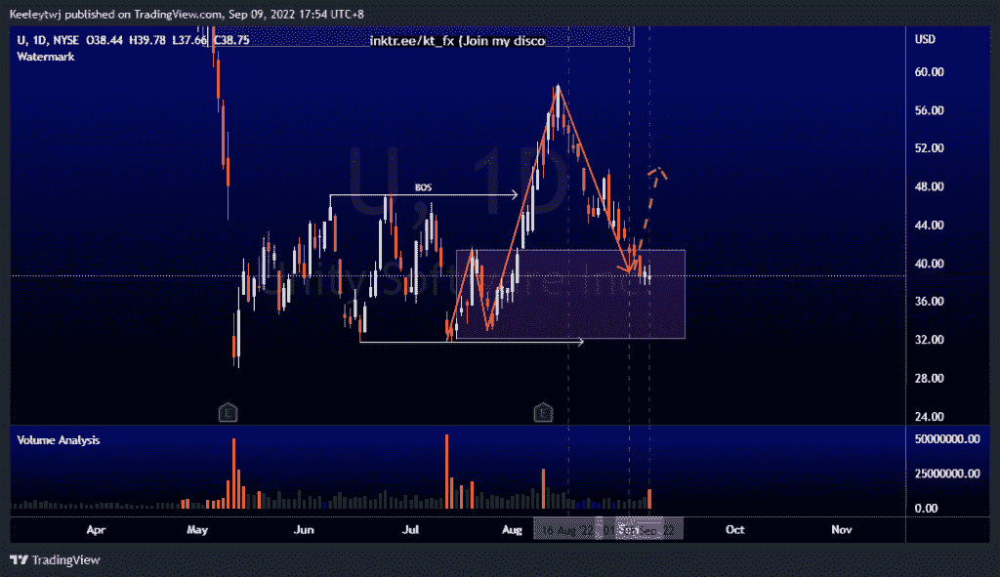
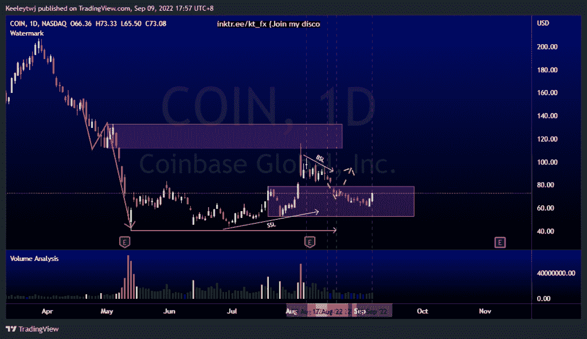
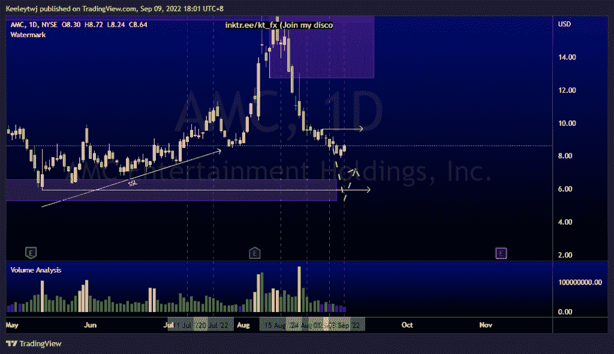

# 每周股票技术分析#U #COIN #AMC

> 原文：<https://medium.com/coinmonks/weekly-stocks-technical-analysis-u-coin-amc-5357412a35a4?source=collection_archive---------47----------------------->

附注:我现在在海外，如果可以的话，我会尽量回复所有的问题！

在这里找到更多关于我的信息(YouTube/Discord/Telegram):[https://www.linktr.ee/keeleytan](https://www.linktr.ee/keeleytan)

如果你觉得我的帖子有帮助，如果你能在这个帖子上给我一个赞，并关注我以后的类似帖子，我将不胜感激。

如果你同意，请在评论中告诉我你的想法。我在考虑尝试在 discord 上提供免费信号服务。如果你有兴趣，加入我们吧！

#U

价格目前正在缓解 41.38 的看涨点。和我上次的分析类似，我的预期没有改变。我预计价格会从这里反弹。

#硬币

价格是我最后的分析。价格目前在 79.00 缓解看涨 POI。我预计价格会从这个点反弹。

#AMC

根据我最后的分析，价格正在上涨。目前，我预计价格将继续走低至 6.59 的看涨点，可能会在继续走高之前跌至 5.96 的低点。如果价格突破 9.64，我们可以看到价格开始上升趋势。

如果你持有这些公司中的任何一家，就可以点赞、分享和评论！

让我知道，如果你有任何你想让我分析的行情。

一定要在其他社交平台上看看我，我在交易、分析和心理学上发布内容。看看我这里:【https://www.linktr.ee/keeleytan】T2

*原载于 2022 年 9 月 9 日***。**

> *交易新手？尝试[加密交易机器人](/coinmonks/crypto-trading-bot-c2ffce8acb2a)或[复制交易](/coinmonks/top-10-crypto-copy-trading-platforms-for-beginners-d0c37c7d698c)*