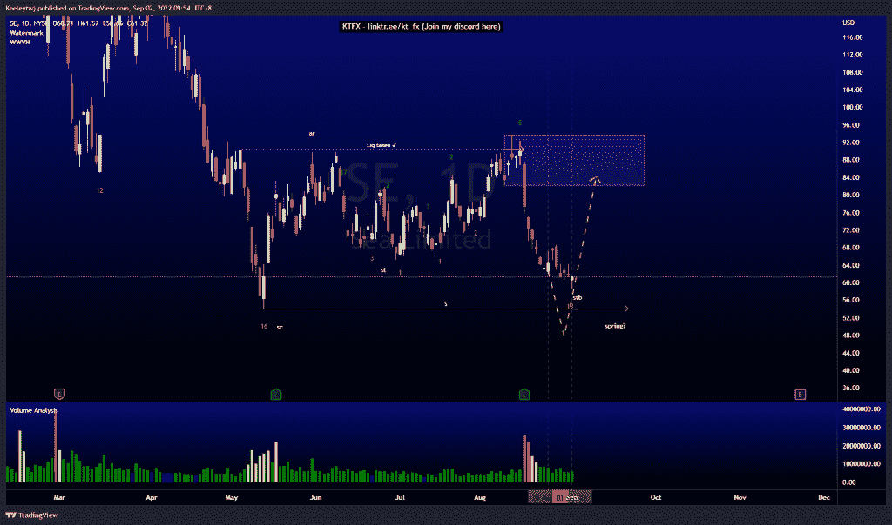
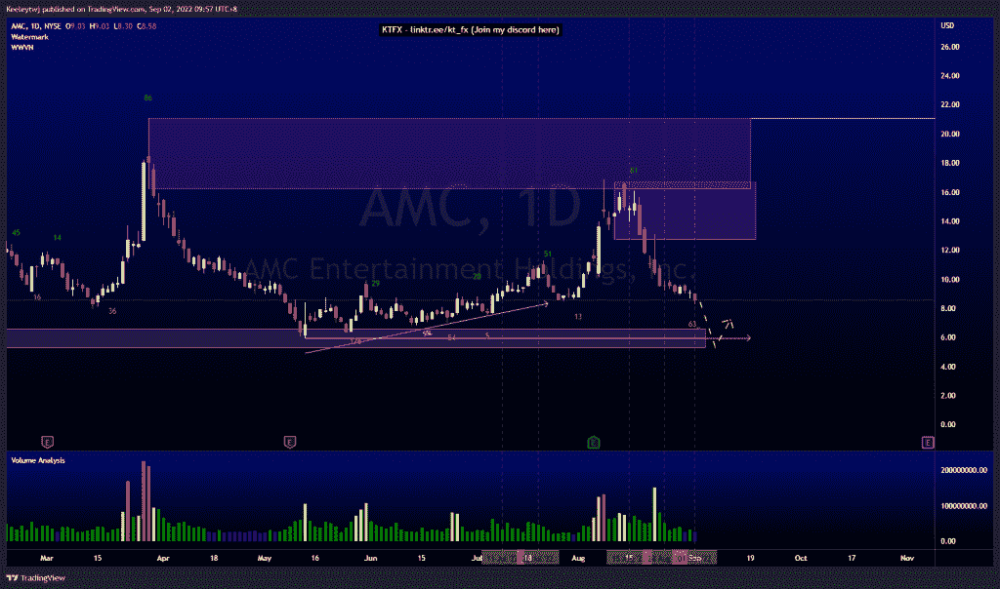
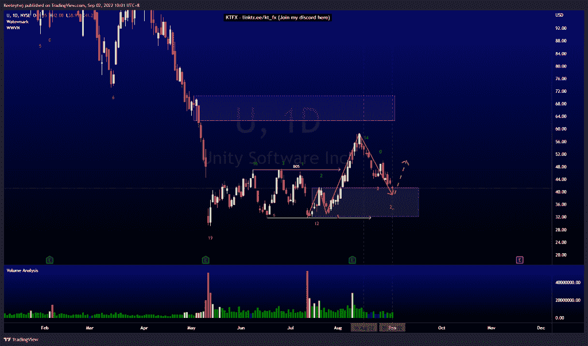

# 每周股票技术分析#U #SE #AMC

> 原文：<https://medium.com/coinmonks/weekly-stocks-technical-analysis-u-se-amc-d2267451d0ab?source=collection_archive---------46----------------------->

在这里找到更多关于我的信息(YouTube/Discord/Telegram):[https://www.linktr.ee/keeleytan](https://www.linktr.ee/keeleytan)

如果你觉得我的帖子有帮助，如果你能在这个帖子上给我一个赞，并关注我以后的类似帖子，我将不胜感激。

如果你同意，请在评论中告诉我你的想法。我在考虑尝试在 discord 上提供免费信号服务。如果你有兴趣，加入我们吧！

#SE

价格是我最后的分析。价格正在向低点 54.06 前进。普莱斯看起来像是在做威科夫累积示意图。我预计价格会在 54.06 的低点反弹，然后开始上升趋势。

#AMC

我预计价格会回撤，并在下跌前缓解 12.73 的看跌点。但是，价格先降了。此举的目标是潜在地缓解 6.59 的看涨点，并消除 5.96 的低点。

#U

我预计价格会上涨，并在下跌前缓解 62.56 的看跌情绪。然而，价格直线下跌到 41.38 的看涨点，这是我最初的目标。从这里开始，我预计价格会回撤向上，形成潜在的上涨趋势。

如果你持有这些公司中的任何一家，就可以点赞、分享和评论！

让我知道，如果你有任何你想让我分析的行情。

一定要在其他社交平台上看看我，我在交易、分析和心理学上发布内容。看看我这里:【https://www.linktr.ee/keeleytan】T2

*原载于 2022 年 9 月 2 日 http://2minutesliteracy.wordpress.com***。**

> *交易新手？尝试[加密交易机器人](/coinmonks/crypto-trading-bot-c2ffce8acb2a)或[复制交易](/coinmonks/top-10-crypto-copy-trading-platforms-for-beginners-d0c37c7d698c)*