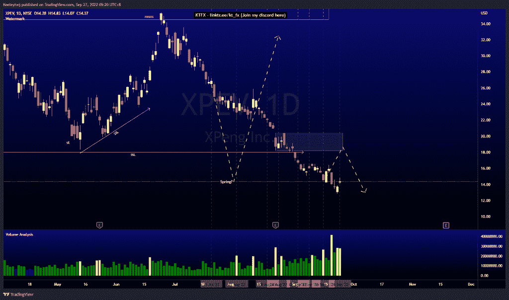
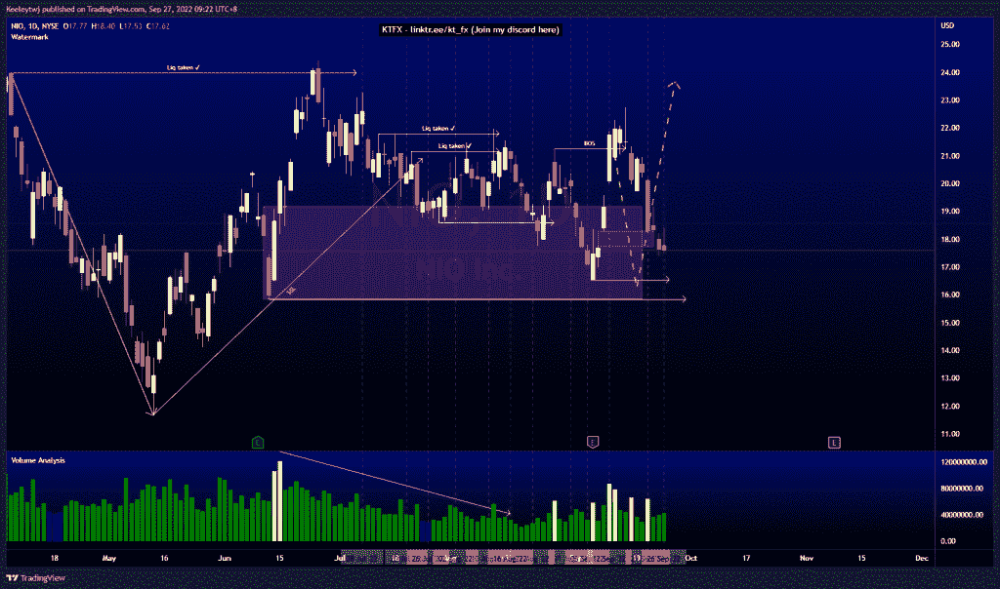
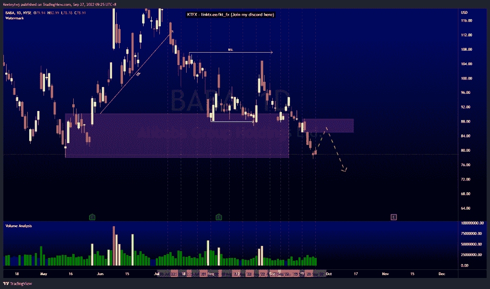

# 每周股票技术分析#XPEV #NIO #BABA

> 原文：<https://medium.com/coinmonks/weekly-stocks-technical-analysis-xpev-nio-baba-f2c4964d3b78?source=collection_archive---------36----------------------->

在这里找到更多关于我的信息(YouTube/Discord/Telegram):[https://www.linktr.ee/keeleytan](https://www.linktr.ee/keeleytan)

如果你觉得我的帖子有帮助，如果你能在这个帖子上给我一个赞，并关注我以后的类似帖子，我将不胜感激。

如果你同意，请在评论中告诉我你的想法。我在考虑尝试在 discord 上提供免费信号服务。如果你有兴趣，加入我们吧！

#XPEV

上周价格已经巩固。本周我的期望没有变化。现在，根据威科夫积累原理，价格正在上涨。从这里开始，我预计价格会向上突破市场结构。如果看跌点 18.18 保持不变，那么我们应该看到下降趋势，使威科夫累积图无效。

#NIO

根据我上次的分析，价格已经上涨了。价格已经填补了 18.29 英镑的公允价值缺口。目前，我预计当前看涨 POI 在 19.18 会有更深的缓解，可能会在我们看到看涨回撤之前触及 16.54 的低点。

#巴巴

价格并没有像上周分析的那样发挥作用。90.17 的看涨 POI 已经作废，订单流向又变了。现在，日线时间框架继续下降趋势。我预计在继续走低之前，价格将在 85.00 处做一个看涨回撤至看跌点。

如果你持有这些公司中的任何一家，就可以点赞、分享和评论！

让我知道，如果你有任何你想让我分析的行情。

一定要在其他社交平台上看看我，我在交易、分析和心理学上发布内容。看看我这里:【https://www.linktr.ee/keeleytan】T2

*原载于 2022 年 9 月 27 日 http://2minutesliteracy.wordpress.com***。**

> *交易新手？尝试[加密交易机器人](/coinmonks/crypto-trading-bot-c2ffce8acb2a)或[复制交易](/coinmonks/top-10-crypto-copy-trading-platforms-for-beginners-d0c37c7d698c)*