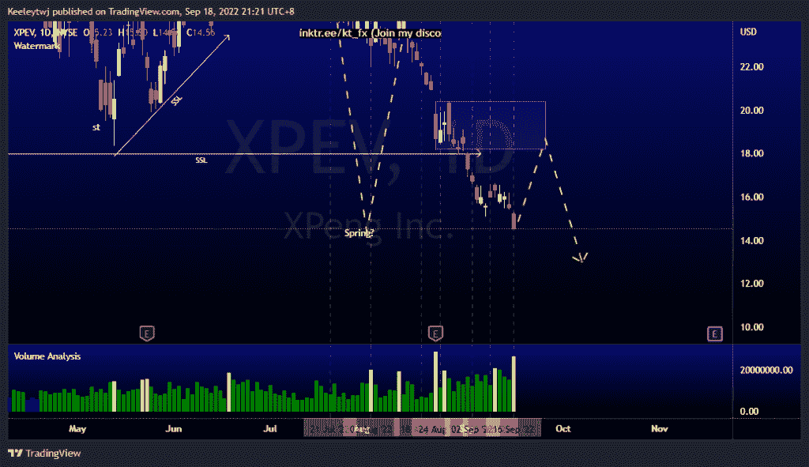
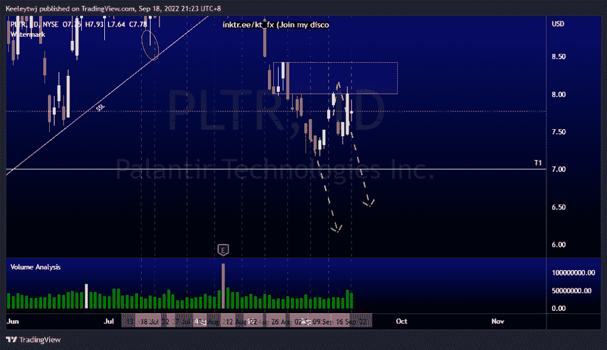
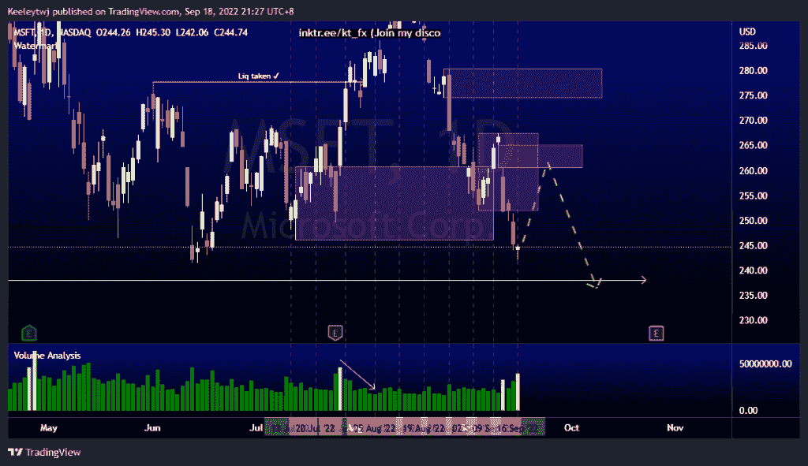

# 每周股票技术分析#XPEV #PLTR #MSFT

> 原文：<https://medium.com/coinmonks/weekly-stocks-technical-analysis-xpev-pltr-msft-3c757cb415?source=collection_archive---------54----------------------->

附注:我现在在海外，如果可以的话，我会尽量回复所有的问题！

在这里找到更多关于我的信息(YouTube/Discord/Telegram):[https://www.linktr.ee/keeleytan](https://www.linktr.ee/keeleytan)

如果你觉得我的帖子有帮助，如果你能在这个帖子上给我一个赞，并关注我以后的类似帖子，我将不胜感激。

#XPEV

根据我的分析，价格正在上涨。现在，根据威科夫积累原理，价格正在上涨。从这里开始，我预计价格会向上突破市场结构。如果看跌点 18.18 保持不变，那么我们应该看到下降趋势，使威科夫累积图无效。

#PLTR

价格对上周预期的看跌点 8.00 做出反应。然而，下降趋势没有持续。我的预期仍然不变，预计价格在 8.00 的看跌点缓解后会走低。

#MSFT

根据我上周的分析，价格并没有发挥作用。我预计价格将反弹至 260.84 的看涨点，并反弹至 274.52 的看跌点。然而，看涨势头不够强劲，在我们看到看涨点的反应后，价格继续下跌，并使上涨预期无效。现在，我预计在 260.40 的公允价值缺口处会有一个看涨回撤，这也在 251.94 的看跌点之内。向下移动的目标将是低点 238.07。

如果你持有这些公司中的任何一家，就可以点赞、分享和评论！

让我知道，如果你有任何你想让我分析的行情。

一定要在其他社交平台上看看我，我在交易、分析和心理学上发布内容。看看我这里:【https://www.linktr.ee/keeleytan】T2

*原载于 2022 年 9 月 19 日***。**

> *交易新手？尝试[加密交易机器人](/coinmonks/crypto-trading-bot-c2ffce8acb2a)或[复制交易](/coinmonks/top-10-crypto-copy-trading-platforms-for-beginners-d0c37c7d698c)*