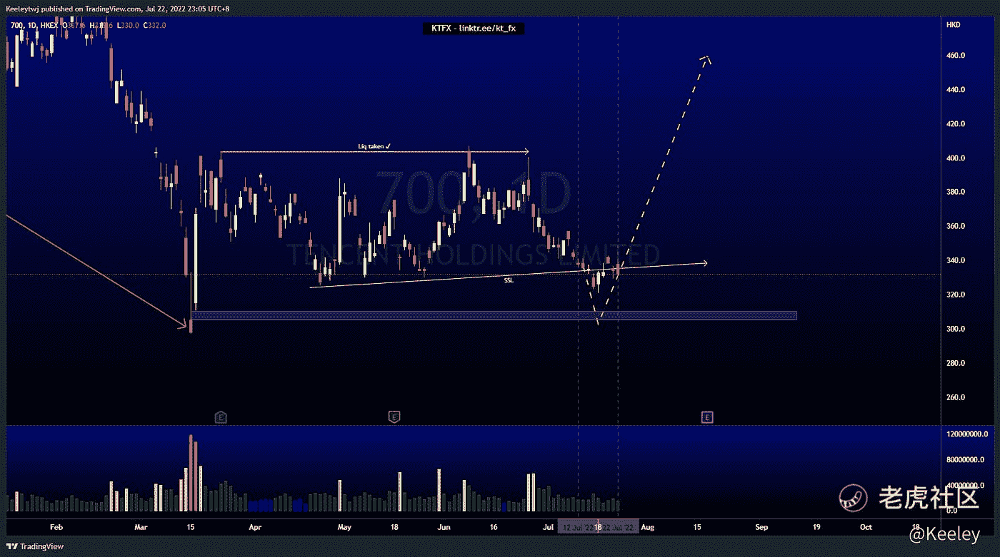
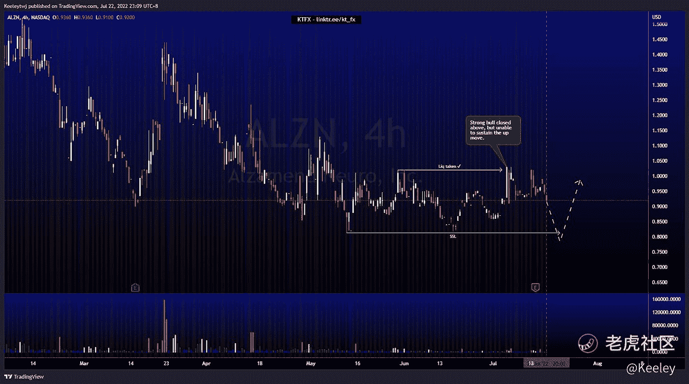
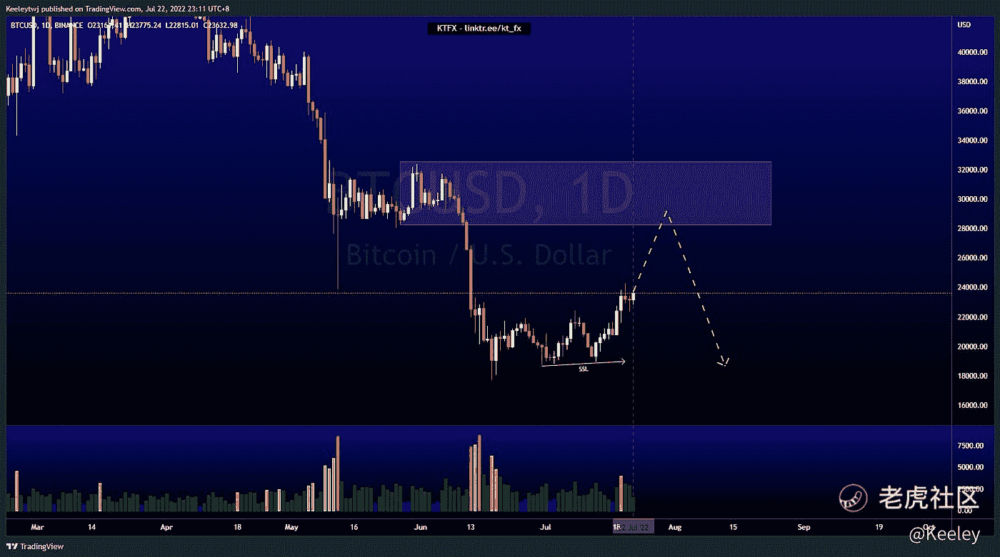

# 每周技术分析$ 00700 $阿尔津$BTC

> 原文：<https://medium.com/coinmonks/weekly-technical-analysis-00700-alzn-btc-f1caa83a2767?source=collection_archive---------57----------------------->

在这里找到更多关于我的信息:linktr.ee/kt_fx

$腾讯(00700)$

价格和上周分析的一模一样。普莱斯剔除了下方的卖方流动性，现在正决定何去何从。我倾向于价格走低，以填补 310.2 的一些价格低效，然后再走高。

[$Alzamend Neuro 公司(ALZN)$](https://ttm.financial/S/ALZN)

没有什么需要分析的，因为它主要是盘整。在 4H 时间框架上，我们可以看到价格在 0.8123 创造了一个相等的低点，这可能是一个短期回撤的目标。我们看到价格在 1.0200 的高点，并立即下降，表明强大的空头控制。我预计在我们看到任何回撤之前，0.8123 的卖方流动性将被清除。

比特币

价格在一个较高的时间框架下降趋势。价格已经建立了卖方流动性，以及一个较低的上升趋势。我预计此次上涨的目标是 28264.33 点。一旦缓解，我们可以看到价格走低，以消除 18645.04 点的卖方流动性。

让我知道你是否同意和你的想法。如果你持有这些公司中的任何一家，就可以点赞、分享和评论！让我知道，如果你有任何你想让我分析的行情。

*原载于 2022 年 7 月 22 日*[*https://TTM . financial*](https://ttm.financial/post/9077636649)*。*

> 交易新手？尝试[加密交易机器人](/coinmonks/crypto-trading-bot-c2ffce8acb2a)或[复制交易](/coinmonks/top-10-crypto-copy-trading-platforms-for-beginners-d0c37c7d698c)