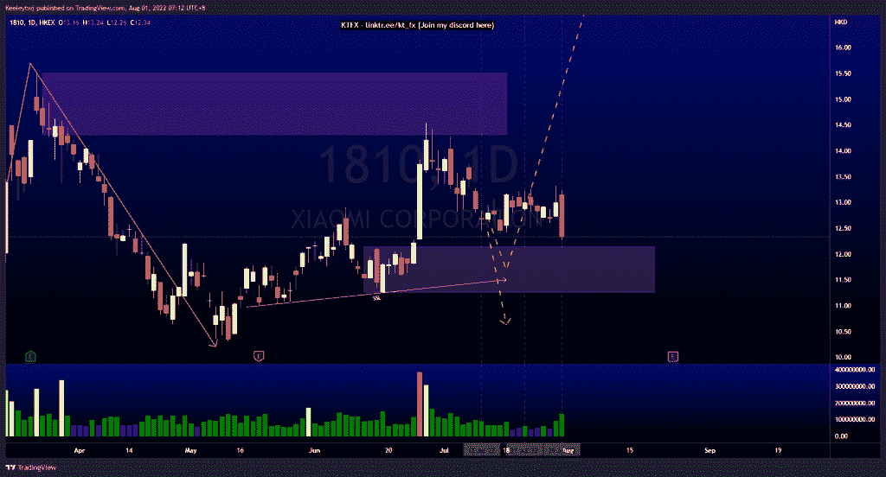
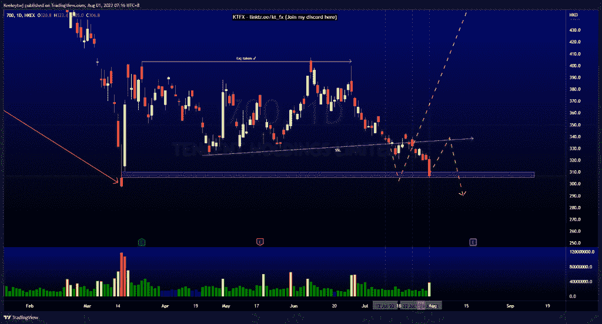
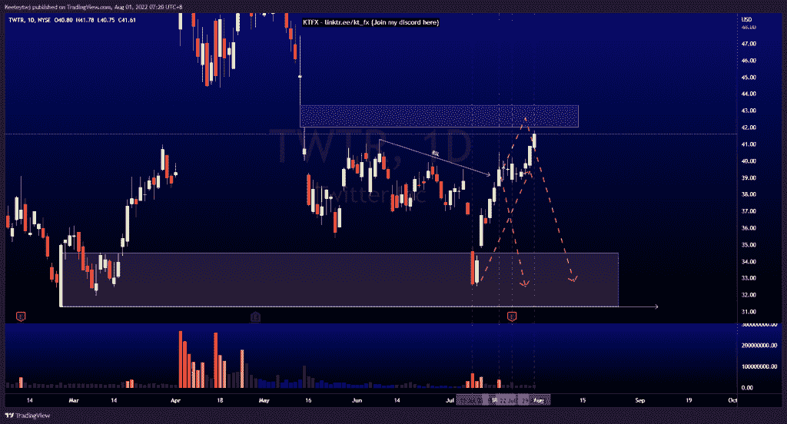

# 每周技术分析$1810 $700 $TWTR

> 原文：<https://medium.com/coinmonks/weekly-technical-analysis-1810-700-twtr-8fdd31c4b704?source=collection_archive---------30----------------------->

在这里找到更多关于我的信息(Youtube/discord):[https://www.linktr.ee/kt_fx](https://www.linktr.ee/kt_fx)

1810 美元(小米公司)

价格正如预期的那样上涨。价格到达看涨点 12.16。从这里开始，我将获得一些利润，并预计在我们看到任何持续下跌以消除卖方流动性之前，会有一些回撤。

[https://www.tradingview.com/chart/1810/BUbO17Q8-1810-Analysis/](https://www.tradingview.com/chart/1810/BUbO17Q8-1810-Analysis/)

700 美元(腾讯控股有限公司)

正如所分析的那样，价格正在发挥作用。我们现在已经填补了 310.2 的公允价值缺口，并获得了卖方流动性。从这里开始，我预计价格在继续走低之前会反弹向上。我们也可以从这里看到价格反转。

[https://www.tradingview.com/chart/700/AgrRRQNu-700-Analysis/](https://www.tradingview.com/chart/700/AgrRRQNu-700-Analysis/)

$TWTR(推特)

自从我们在 34.53 触及看涨点以来，价格一直在做分析。如果你听了我的话，到目前为止，它已经上涨了 28%。我们将在 42.00 的公允价值缺口达到第一个目标。在填补公允价值缺口后，我们将看到一个潜在的回撤。

[https://www.tradingview.com/chart/TWTR/HIYNj189-TWTR-Analysis/](https://www.tradingview.com/chart/TWTR/HIYNj189-TWTR-Analysis/)

让我知道你是否同意和你的想法。如果你持有这些公司中的任何一家，就可以点赞、分享和评论！让我知道，如果你有任何你想让我分析的行情。一定要在其他社交平台上看看我！

*原载于 2022 年 7 月 31 日*[*【http://2minutesliteracy.wordpress.com】*](https://2minutesliteracy.wordpress.com/2022/08/01/weekly-technical-analysis-1810-700-twtr/)*。*

> 交易新手？尝试[加密交易机器人](/coinmonks/crypto-trading-bot-c2ffce8acb2a)或[复制交易](/coinmonks/top-10-crypto-copy-trading-platforms-for-beginners-d0c37c7d698c)