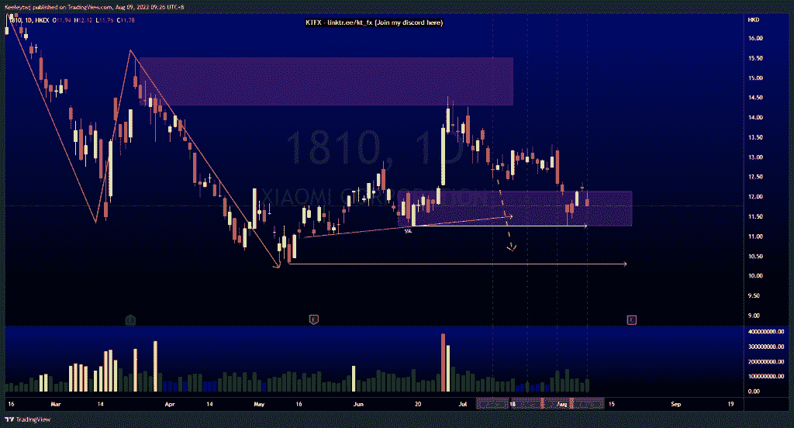
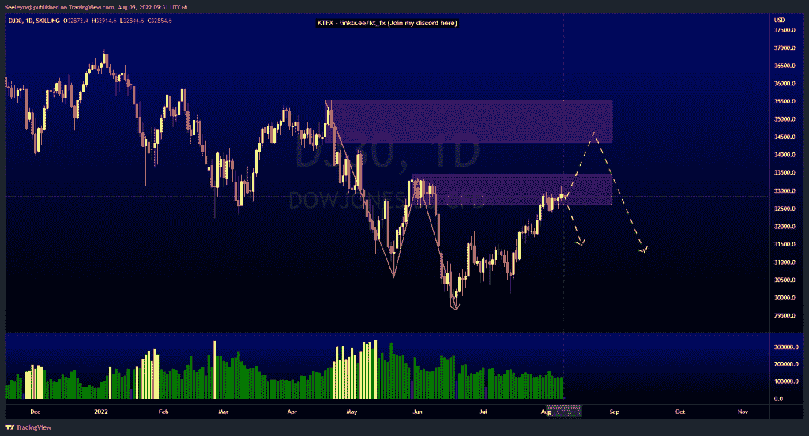
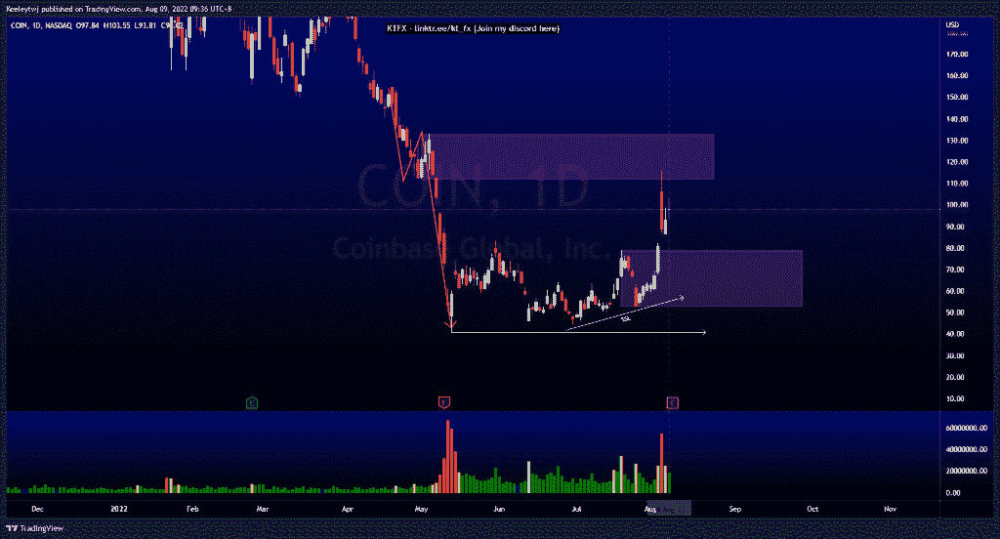

# 每周技术分析# 1810 # DJ30 #币

> 原文：<https://medium.com/coinmonks/weekly-technical-analysis-1810-dj30-coin-8dae16236027?source=collection_archive---------55----------------------->

在这里找到更多关于我的信息(Youtube/discord):[https://www.linktr.ee/kt_fx](https://www.linktr.ee/kt_fx)

#1810

价格正如预期的那样上涨。价格在 12.16 减轻了看涨的 POI，并在 11.26 创造了同样的低点。我们可能会看到价格下跌，以吸纳更多的卖方流动性。我们可以看到价格可能瞄准 10.30 的低点。

[https://www.tradingview.com/chart/1810/foez30hD-1810-Analysis/](https://www.tradingview.com/chart/1810/foez30hD-1810-Analysis/)

#DJ30

价格在一个较高的时间框架下降趋势。价格目前在 32617.9 减轻看跌点。从这里开始，我预计会有一个向下的回撤。也就是说，在我们看到回撤之前，价格可以走高，并缓解 34343.2 的主要看跌点。

[https://www.tradingview.com/chart/DJ30/eVoT1Dev-DJ30-Analysis/](https://www.tradingview.com/chart/DJ30/eVoT1Dev-DJ30-Analysis/)

#硬币

价格处于高位下跌趋势。价格已经在 2022 年 8 月 4 日缓解了 111.80 的看跌点，并强烈推动下跌。需要注意的是，我们将在 2022 年 8 月 10 日获得收益。根据图表，我预计价格将回撤至下行，至少在 79.00 进入看涨点。如果空头势头强劲，我们可以看到价格带走卖方流动性，目标低点在 40.83。

[https://www.tradingview.com/chart/COIN/58GZMJ9b-COIN-Analysis/](https://www.tradingview.com/chart/COIN/58GZMJ9b-COIN-Analysis/)

让我知道你是否同意和你的想法。如果你持有这些公司中的任何一家，就可以点赞、分享和评论！让我知道，如果你有任何你想让我分析的行情。一定要在其他社交平台上看看我！

*原载于 2022 年 8 月 9 日*[*【http://2minutesliteracy.wordpress.com】*](https://2minutesliteracy.wordpress.com/2022/08/09/weekly-technical-analysis-1810-dj30-coin/)*。*

> 加入 Coinmonks [电报频道](https://t.me/coincodecap)和 [Youtube 频道](https://www.youtube.com/c/coinmonks/videos)了解加密交易和投资

# 另外，阅读

*   [AscendEx Staking](https://coincodecap.com/ascendex-staking)|[Bot Ocean Review](https://coincodecap.com/bot-ocean-review)|[最佳比特币钱包](https://coincodecap.com/bitcoin-wallets-india)
*   [霍比评论](https://coincodecap.com/huobi-review) | [OKEx 保证金交易](https://coincodecap.com/okex-margin-trading) | [期货交易](https://coincodecap.com/futures-trading)
*   [电网交易机器人](https://coincodecap.com/grid-trading) | [Cryptohopper 审核](/coinmonks/cryptohopper-review-a388ff5bae88) | [Bexplus 审核](https://coincodecap.com/bexplus-review)
*   [7 个最佳零费用加密交易平台](https://coincodecap.com/zero-fee-crypto-exchanges)
*   [氹欞侊贸易评论](https://coincodecap.com/anny-trade-review) | [霍比融资融券交易](/coinmonks/huobi-margin-trading-b3b06cdc1519)