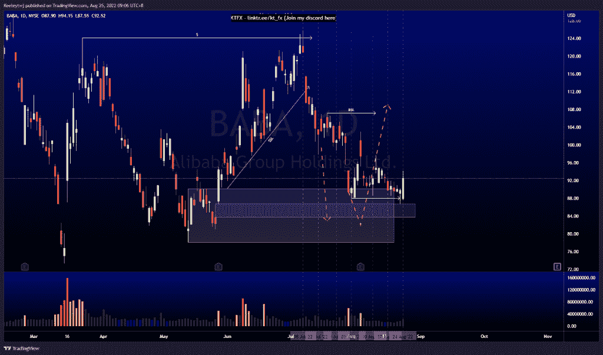
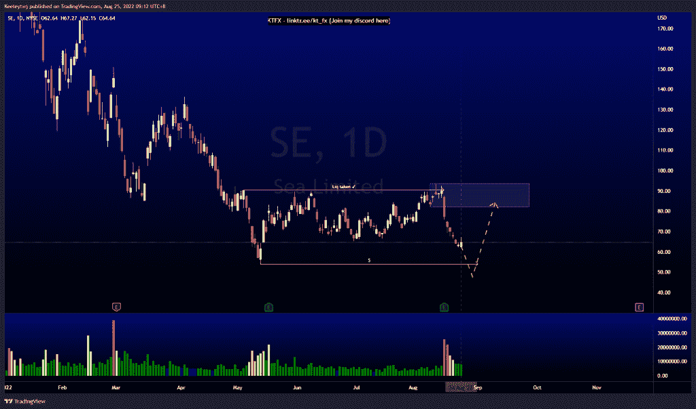
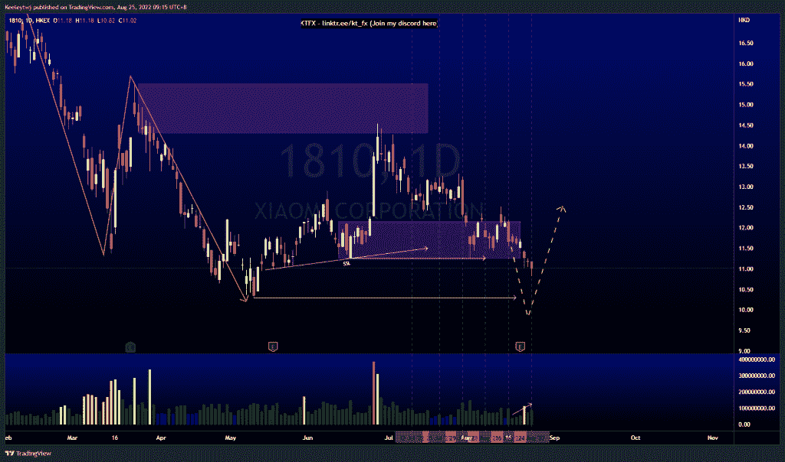

# 每周技术分析#1810 #SE #BABA

> 原文：<https://medium.com/coinmonks/weekly-technical-analysis-1810-se-baba-5387345c2511?source=collection_archive---------36----------------------->

在这里找到更多关于我的信息(YouTube/Discord/Telegram):[https://www.linktr.ee/keeleytan](https://www.linktr.ee/keeleytan)

如果你觉得我的帖子有帮助，如果你能在这个帖子上给我一个赞，并关注我以后的类似帖子，我将不胜感激。

#巴巴

价格的走势与上周的分析完全一致。价格完美地从 86.73 的公允价值缺口反弹，在获得流动性后以强劲的牛市收盘。从现在开始，我预计牛市的势头将会出现。

#SE

价格在一个较高的时间框架下降趋势。目前，价格处于盘整之中。在打破市场结构向下之前，价格最近在 90.38 获得流动性。流动性已从卖方转移，可能的目标是 54.06 的低点，然后我们将回到 82.07 的熊市点

#1810

自 7 月 12 日以来，价格一直在发挥作用。成交量在向下移动中增加。现在，在我们看到价格开始上升趋势之前，我仍然预计价格会在 10.30 低点

让我知道你是否同意和你的想法。

如果你持有这些公司中的任何一家，就可以点赞、分享和评论！

让我知道，如果你有任何你想让我分析的行情。

一定要在其他社交平台上看看我，我在交易、分析和心理学上发布内容。看看我这里:【https://www.linktr.ee/keeleytan】T2

*原载于 2022 年 8 月 25 日 http://2minutesliteracy.wordpress.com***。**

> *交易新手？尝试[加密交易机器人](/coinmonks/crypto-trading-bot-c2ffce8acb2a)或[复制交易](/coinmonks/top-10-crypto-copy-trading-platforms-for-beginners-d0c37c7d698c)*