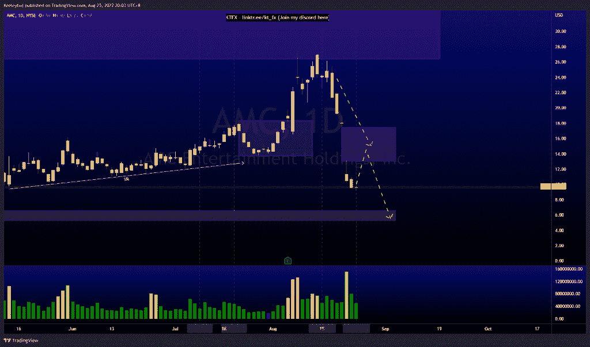
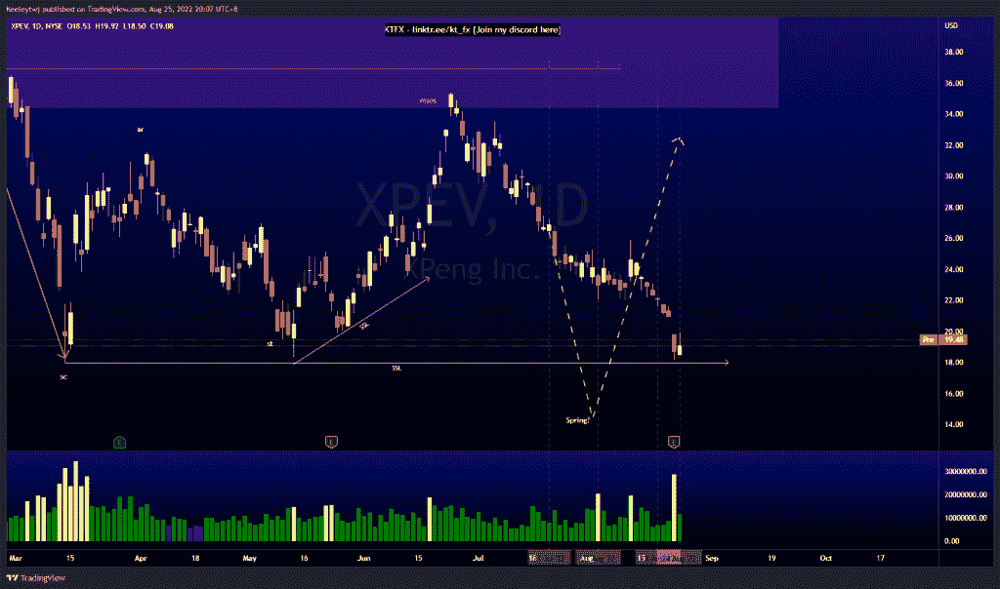
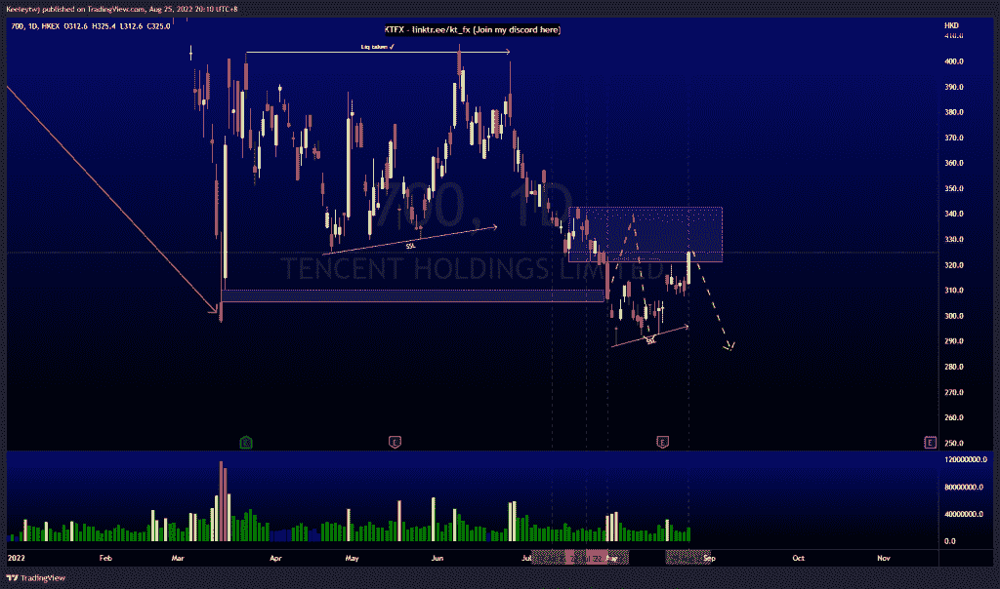

# 每周技术分析# 700 #腾讯#XPEV #AMC

> 原文：<https://medium.com/coinmonks/weekly-technical-analysis-700-tencent-xpev-amc-86dd9a8cd2e8?source=collection_archive---------30----------------------->

在这里找到更多关于我的信息(YouTube/Discord/Telegram):[https://www.linktr.ee/keeleytan](https://www.linktr.ee/keeleytan)

如果你觉得我的帖子有帮助，如果你能在这个帖子上给我一个赞，并关注我以后的类似帖子，我将不胜感激。

#AMC

根据上周的分析，价格表现很好，自从我上次发帖以来，价格下降了 60%。价格在 13.05 留下了一个巨大的缺口，我预计在我们看到下行趋势继续之前，会有一个看涨的回撤。

#XPEV

正如前几周分析的那样，价格表现良好。我在 7 月 21 日的第一次分析呼吁价格下跌，以 18.01 点为抛售高潮，目前价格下跌了 30%。目前价格非常接近 18.01 的卖出顶点。然而，值得注意的是，价格已经抓住了卖方流动性。在我们触及 18.01 的低点之前，我们可能会看到一个潜在的回撤。

# 700 #腾讯

价格已经证明了我最后的分析。价格目前正在 321.0 减轻看跌点。在上涨过程中，它创造了卖方流动性。现在，我们应该关注确认的较低时间框架，看看价格是否想继续上涨。从这里开始，最有可能的举措将是一个看跌回撤，以消除卖方流动性。

让我知道你是否同意和你的想法。

如果你持有这些公司中的任何一家，就可以点赞、分享和评论！

让我知道，如果你有任何你想让我分析的行情。

一定要在其他社交平台上看看我，我在交易、分析和心理学上发布内容。看看我这里:【https://www.linktr.ee/keeleytan】T2

*原载于 2022 年 8 月 25 日 http://2minutesliteracy.wordpress.com***。**

> ***交易新手？试试** [**密码交易机器人**](/coinmonks/crypto-trading-bot-c2ffce8acb2a) **或** [**复制交易**](/coinmonks/top-10-crypto-copy-trading-platforms-for-beginners-d0c37c7d698c)*