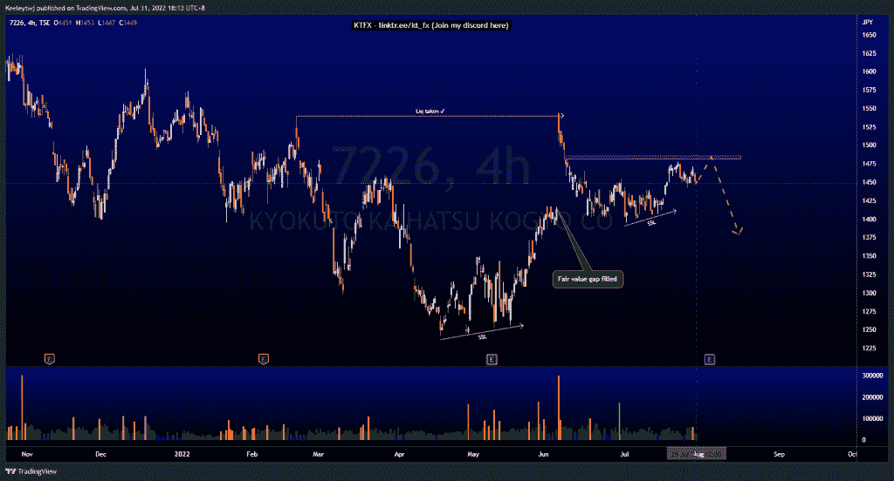
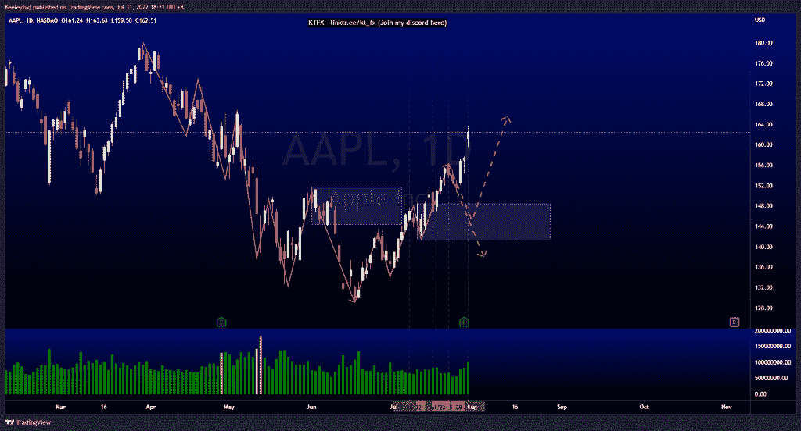
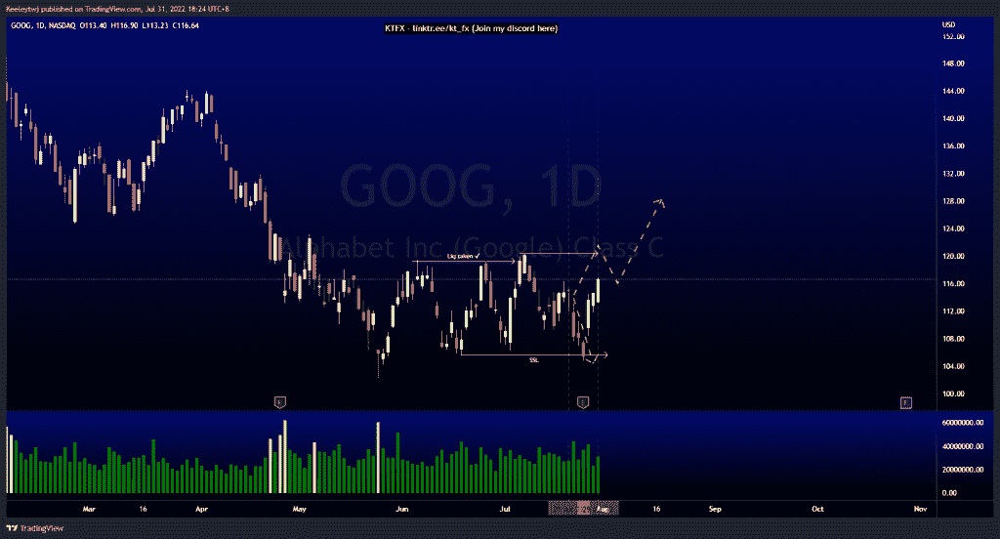

# 每周技术分析$ 7226 $ AAPL $谷歌

> 原文：<https://medium.com/coinmonks/weekly-technical-analysis-7226-aapl-goog-5b4b60c47bba?source=collection_archive---------22----------------------->

在这里找到更多关于我的信息(Youtube/discord):[https://www.linktr.ee/kt_fx](https://www.linktr.ee/kt_fx)

7226 美元

价格已经连续几个月保持稳定。价格最近在上方跳空，并在 1540 点获得流动性，但无法收于上方。从那以后，价格一直呈下降趋势。现在，我们看到价格建立了卖方流动性。这可能是一个短期看跌目标，价格可能会进一步向 1242 点的低点移动。但首先，在我们看到任何下跌反应之前，价格更有可能填补 1481 点的公允价值缺口。

[https://www.tradingview.com/chart/7226/fKPTWtbb-7226-Analysis/](https://www.tradingview.com/chart/7226/fKPTWtbb-7226-Analysis/)

$AAPL

价格没有回撤至我上周分析的看涨点 148.45。我们现在已经打破了结构向上。目前，我仍预计看涨 POI 将回撤至 148.45。尽管如此，随着收益的增加，价格很可能会继续上涨。

[https://www.tradingview.com/chart/AAPL/UfUfRHkq-AAPL-Analysis/](https://www.tradingview.com/chart/AAPL/UfUfRHkq-AAPL-Analysis/)

$GOOG

价格的走势与上周的分析完全一致。价格下跌以消除 105.63 的卖方流动性，并立即从那里上涨。从这里，我们的下一个预期目标是高点 120.37。

[https://www.tradingview.com/chart/GOOG/QkMICwZC-GOOG-Analysis/](https://www.tradingview.com/chart/GOOG/QkMICwZC-GOOG-Analysis/)

让我知道你是否同意和你的想法。如果你持有这些公司中的任何一家，就可以点赞、分享和评论！让我知道，如果你有任何你想让我分析的行情。一定要在其他社交平台上看看我！

*原载于 2022 年 7 月 31 日*[*【http://2minutesliteracy.wordpress.com】*](https://2minutesliteracy.wordpress.com/2022/07/31/weekly-technical-analysis-7226-aapl-goog/)*。*

> 交易新手？尝试[加密交易机器人](/coinmonks/crypto-trading-bot-c2ffce8acb2a)或[复制交易](/coinmonks/top-10-crypto-copy-trading-platforms-for-beginners-d0c37c7d698c)