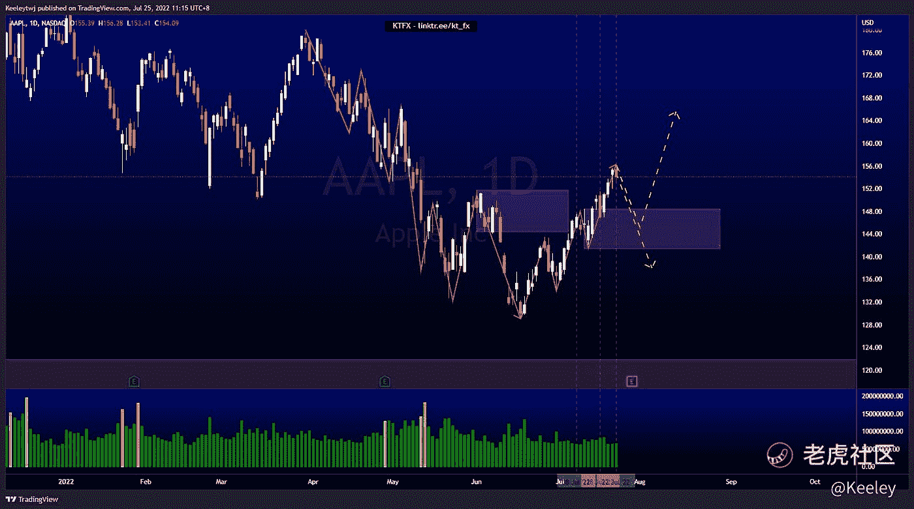
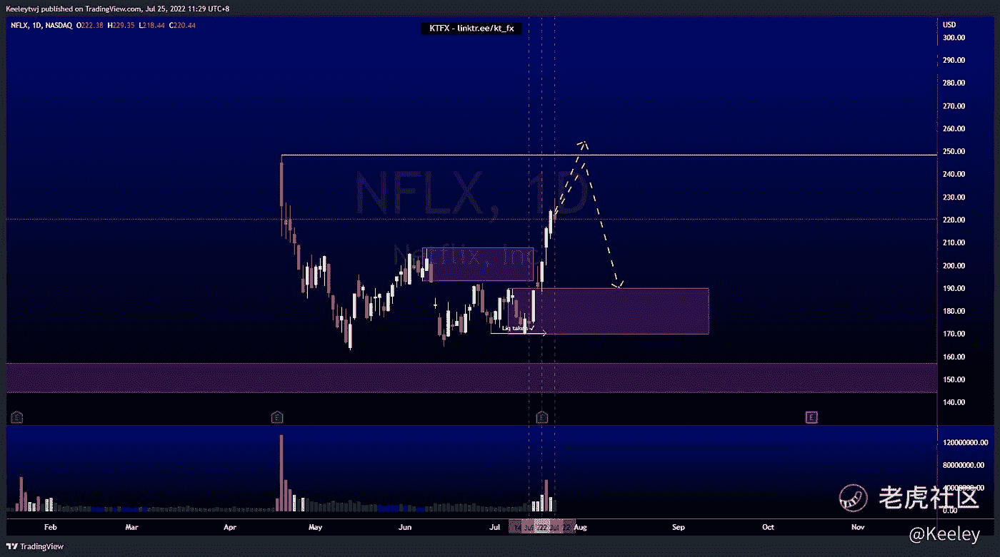
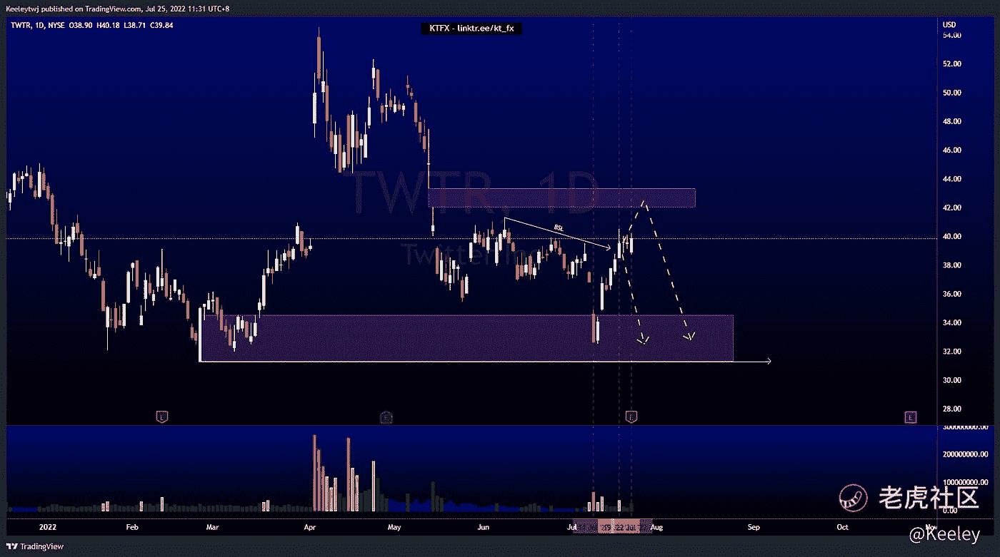

# 每周技术分析$AAPL $NFLX $TWTR

> 原文：<https://medium.com/coinmonks/weekly-technical-analysis-aapl-nflx-twtr-1022c3fae9f7?source=collection_archive---------45----------------------->

你可以在这里找到更多关于我的信息:[www.linktr.ee/kt_fx](http://www.linktr.ee/kt_fx)

$AAPL

价格没有从我上周分析的看跌点回撤。我们现在已经打破了结构向上。在我们看到继续上涨之前，价格更有可能在 148.45 做一个回撤来缓解看涨的 POI。另一种情况可能是多头陷阱。如果价格决定下跌，我们也可以看到价格下跌至 121.94 的看涨点。从短期来看，我预计价格会下跌。

$NFLX

价格在 170.30 处获得了流动性，并突破了 193.00 处的 thebearish POI。价格处于短期上升趋势，预计此次上升趋势的目标为 248.70。由于我们处于此次上涨的溢价水平，我们可能会看到一个回撤。

$TWTR

与我之前的分析没有变化。过去几周，普莱斯一直在玩我分析的游戏。就我的分析而言，没有什么大的变化。价格现在在这个水平盘整。价格从看涨的 34.53 点反弹，并如预期的那样带走了一些买方流动性。此次上涨的最终目标可能是在我们走低之前填补 42.00 的公允价值缺口。我们也可以从现在开始继续走低。

让我知道你是否同意和你的想法。喜欢，分享，评论如果你觉得这个分析有用。

*原载于 2022 年 7 月 25 日*[*https://TTM . financial*](https://ttm.financial/post/9900279636)*。*

> 交易新手？尝试[加密交易机器人](/coinmonks/crypto-trading-bot-c2ffce8acb2a)或[复制交易](/coinmonks/top-10-crypto-copy-trading-platforms-for-beginners-d0c37c7d698c)