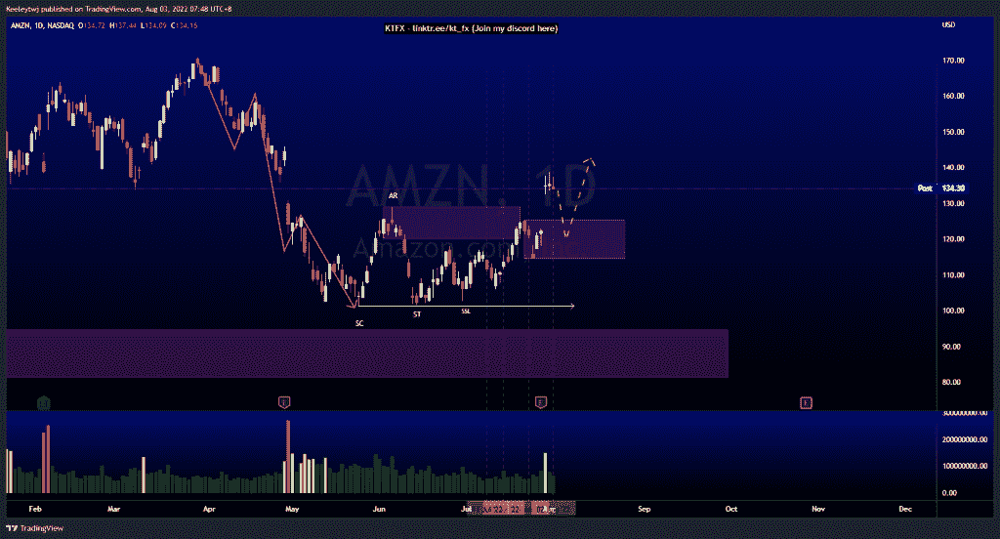
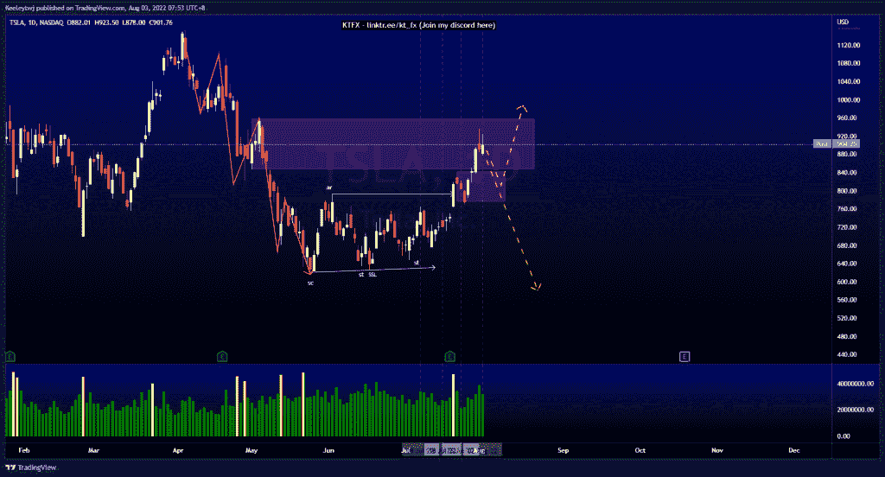
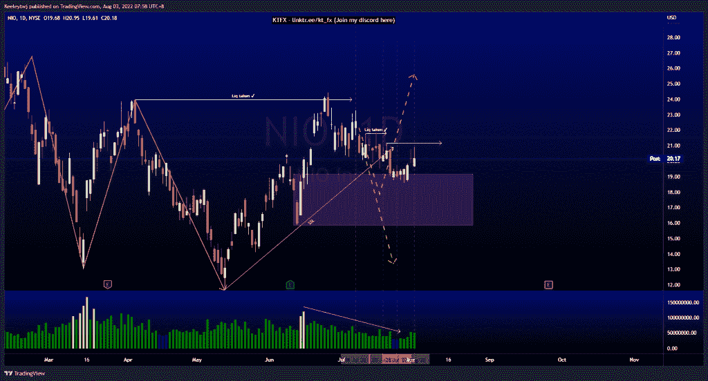

# 每周技术分析$AMZN $TSLA $NIO

> 原文：<https://medium.com/coinmonks/weekly-technical-analysis-amzn-tsla-nio-12ea326d816a?source=collection_archive---------9----------------------->

在这里找到更多关于我的信息(Youtube/discord):[https://www.linktr.ee/kt_fx](https://www.linktr.ee/kt_fx)

美元 AMZN

价格没有达到预期。我原本预计价格会从看跌点 120.05 反弹。然而，价格跳空并使看跌的观点无效。现在，我们以 130.76 填补了公允价值缺口。鉴于有一个公允价值缺口需要填补，以及看涨 POI 的创建，我预计下行将出现回撤。

[https://www.tradingview.com/chart/AMZN/32EY8f5Q-AMZN-Analysis/](https://www.tradingview.com/chart/AMZN/32EY8f5Q-AMZN-Analysis/)

$TSLA

价格仍然发挥了分析。我们目前处于看跌点 848.03。我预计价格会向下做一个熊市回撤。即使这不是威科夫累积图，我们仍处于短期上升趋势，在我们继续向上之前，预计会有一个熊市回撤。

[https://www.tradingview.com/chart/TSLA/nKTHLab3-TSLA-Analysis/](https://www.tradingview.com/chart/TSLA/nKTHLab3-TSLA-Analysis/)

$NIO

价格正如预期的那样上涨。价格从看涨点反弹至 19.18。随着牛市的反弹，我们的交易量略有增加。然而，价格似乎无法收高，导致目前价格走势粗略。如果价格仍然像分析的那样运行，我们可以看到价格开始上升趋势，至少在 21.17 达到高点。

[https://www.tradingview.com/chart/NIO/9loP5xHW-NIO-Analysis/](https://www.tradingview.com/chart/NIO/9loP5xHW-NIO-Analysis/)

让我知道你是否同意和你的想法。如果你持有这些公司中的任何一家，就可以点赞、分享和评论！让我知道，如果你有任何你想让我分析的行情。一定要在其他社交平台上看看我！

*原载于 2022 年 8 月 3 日*[*【http://2minutesliteracy.wordpress.com】*](https://2minutesliteracy.wordpress.com/2022/08/03/weekly-technical-analysis-amzn-tsla-nio/)*。*

> 交易新手？尝试[加密交易机器人](/coinmonks/crypto-trading-bot-c2ffce8acb2a)或[复制交易](/coinmonks/top-10-crypto-copy-trading-platforms-for-beginners-d0c37c7d698c)