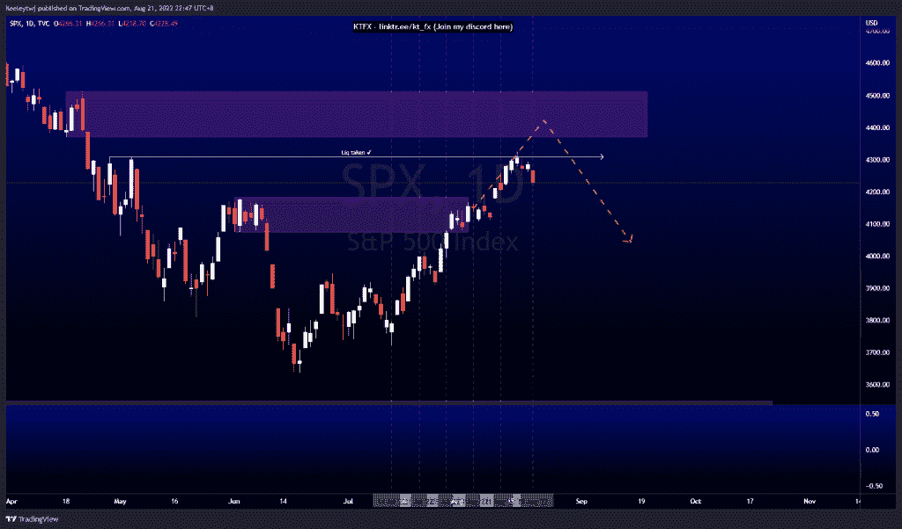
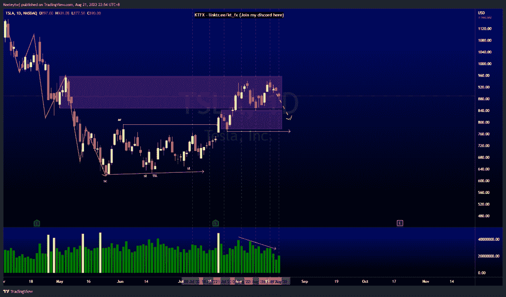
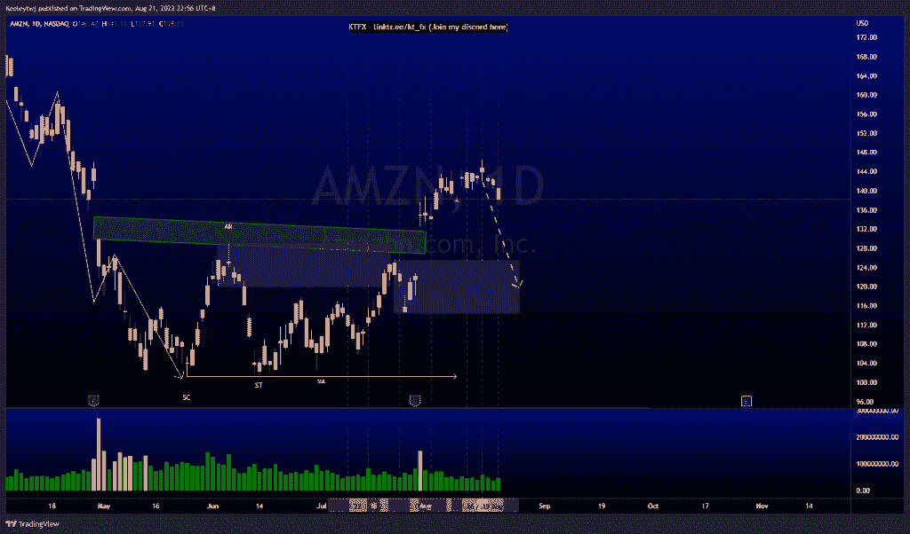

# 每周技术分析#AMZN #TSLA #SPX

> 原文：<https://medium.com/coinmonks/weekly-technical-analysis-amzn-tsla-spx-79da649f15e?source=collection_archive---------55----------------------->

在这里找到更多关于我的信息(YouTube/Discord/Telegram):[https://www.linktr.ee/keeleytan](https://www.linktr.ee/keeleytan)

如果你觉得我的帖子有帮助，如果你能在这个帖子上给我一个赞，并关注我以后的类似帖子，我将不胜感激。

#SPX

根据上周的分析，价格已经发挥作用，但不足以减轻 4370.30 的看跌点。价格在 4308.45 获得流动性，并获得下行动力。如果我们看到市场结构向下突破，我们可以看到下降趋势正在形成。

#TSLA

根据上周的分析，价格表现良好。我们看到看涨的 POI 在 842.36 反弹，价格无法突破更高。我们也看到交易量在上升。我预计价格将从这里走低，可能会使 842.36 的看涨点失效，从而在 768.79 获得流动性。

#AMZN

价格根据上周的分析而定。我们有一个岛屿缺口(绿框)，价格可能会从这里反弹。然而，我预计价格将回撤至 125.50 的看涨点，并在价格上涨前填补公允价值缺口。

让我知道你是否同意和你的想法。

如果你持有这些公司中的任何一家，就可以点赞、分享和评论！

让我知道，如果你有任何你想让我分析的行情。

一定要在其他社交平台上看看我，我在交易、分析和心理学上发布内容。看看我这里:【https://www.linktr.ee/keeleytan】T2

种类

贴在[技术分析](https://2minutesliteracy.wordpress.com/tag/technical-analysis/)

*原载于 2022 年 8 月 22 日 http://2minutesliteracy.wordpress.com**[*。*](https://2minutesliteracy.wordpress.com/2022/08/22/weekly-technical-analysis-amzn-tsla-spx/)*

> *交易新手？尝试[加密交易机器人](/coinmonks/crypto-trading-bot-c2ffce8acb2a)或[复制交易](/coinmonks/top-10-crypto-copy-trading-platforms-for-beginners-d0c37c7d698c)*