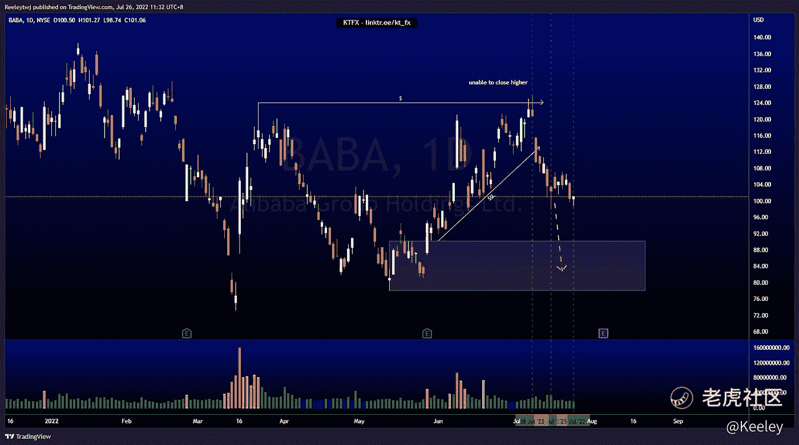
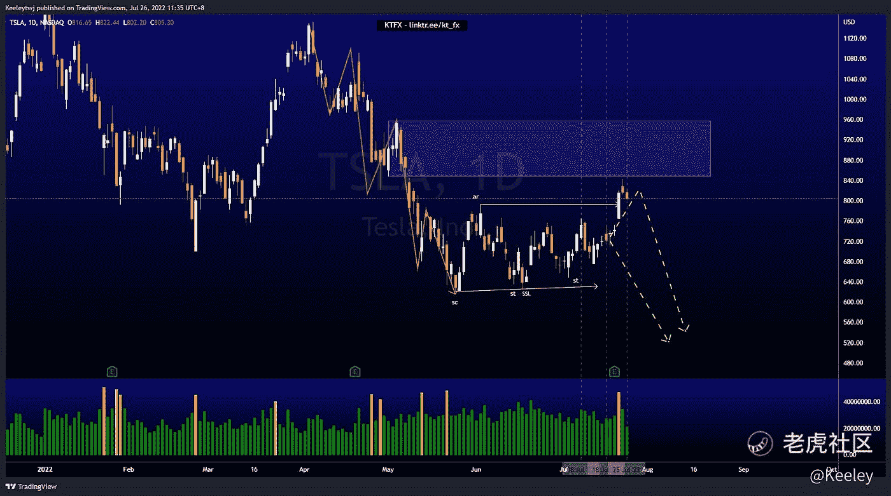

# 每周技术分析$BABA $AMZN $TSLA

> 原文：<https://medium.com/coinmonks/weekly-technical-analysis-baba-amzn-tsla-3cc42641dbe1?source=collection_archive---------40----------------------->

在这里找到更多关于我的信息:linktr.ee/kt_fx

$巴巴

上周我的分析没有变化。价格呈下降趋势。根据我上周的分析，价格已经发挥了作用。价格无法收于 124.11 上方，带走了流动性，向下走带走了卖方流动性。我预计在我们看到任何回撤之前，价格将触及 90.17 的看涨点。

[https://www.tradingview.com/chart/BABA/0oaQW9E7-BABA-Analysis/](https://www.tradingview.com/chart/BABA/0oaQW9E7-BABA-Analysis/)

美元 AMZN

根据上周的分析，价格表现完美。普莱斯在威科夫聚集示意图上。价格处于溢价水平，缓解了 ar 附近的看跌点。我预计价格将下跌，并在 101.26 取出卖方流动性，并在 94.71 进入看涨点。

[https://www.tradingview.com/chart/AMZN/5x3pudDC-AMZN-Analysis/](https://www.tradingview.com/chart/AMZN/5x3pudDC-AMZN-Analysis/)

$TSLA

没有改变我以前的分析和价格是完全一样的分析。我们目前处于威科夫聚集示意图中。价格在 792.63 的 AR 取出流动性，几乎进入 848.03 的看跌点。现在，我预计价格会走低，并在 620.57 取出卖方流动性。

[https://www.tradingview.com/chart/TSLA/Z2P3Fbw5-TSLA-Analysis/](https://www.tradingview.com/chart/TSLA/Z2P3Fbw5-TSLA-Analysis/)

让我知道你是否同意和你的想法。如果你持有这些公司中的任何一家，就可以点赞、分享和评论！让我知道，如果你有任何你想让我分析的行情。

*原载于 2055 年 7 月 26 日*[*https://TTM . financial*](https://ttm.financial/post/9909339804)*。*

> 交易新手？尝试[加密交易机器人](/coinmonks/crypto-trading-bot-c2ffce8acb2a)或[复制交易](/coinmonks/top-10-crypto-copy-trading-platforms-for-beginners-d0c37c7d698c)