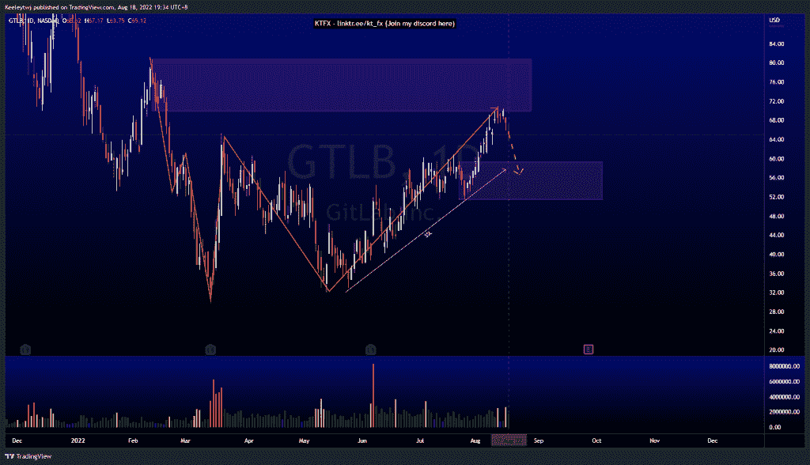
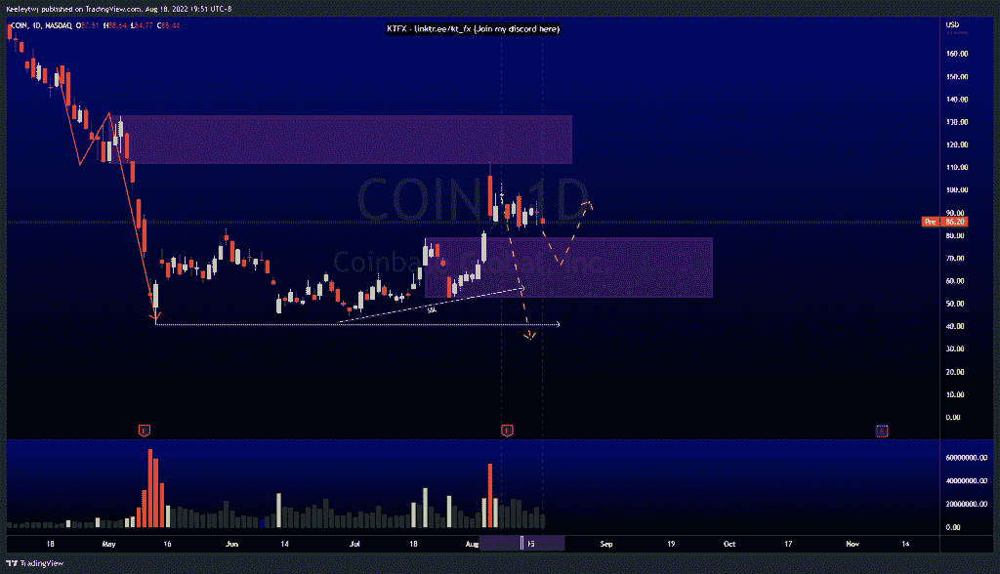
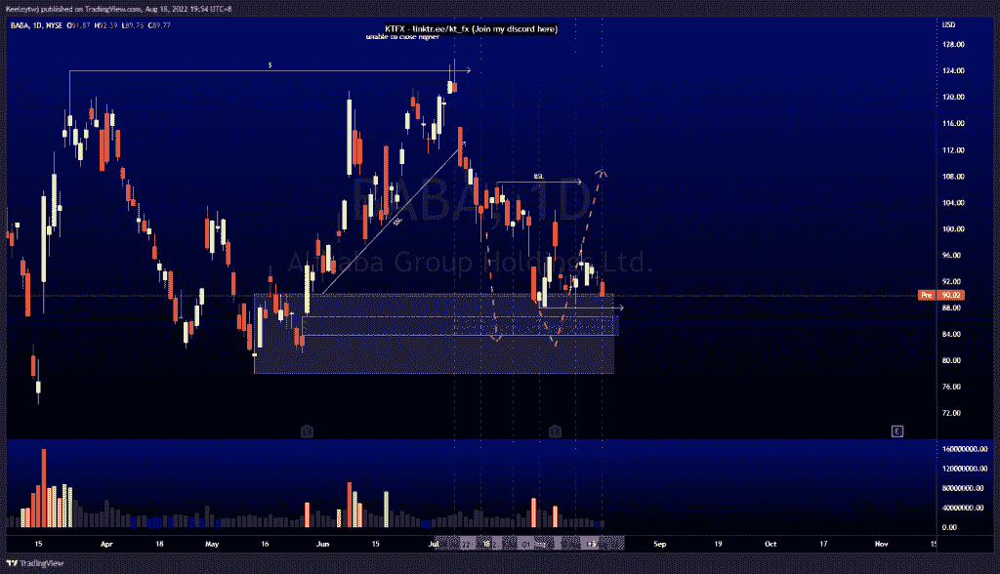

# 每周技术分析#巴巴#英镑#硬币

> 原文：<https://medium.com/coinmonks/weekly-technical-analysis-baba-gtlb-coin-354eef209368?source=collection_archive---------46----------------------->

在这里找到更多关于我的信息(YouTube/Discord/Telegram):[https://www.linktr.ee/keeleytan](https://www.linktr.ee/keeleytan)

如果你觉得我的帖子有帮助，如果你能在这个帖子上给我一个赞，并关注我以后的类似帖子，我将不胜感激。

#GTLB

价格目前处于上升趋势，并缓解了 69.99 的看跌点。现在，我预计价格将回撤至看涨点 59.39。请注意，卖方正在积累大量流动性。在我们看到进一步上涨之前，价格很可能会下跌。

#硬币

价格目前处于盘整状态。我对价格的预期没有变化。我预计价格将从这里走低，带走卖方建立的流动性。或者，我们可以看到价格从看涨点反弹至 79.00。

#巴巴

根据上周的分析，价格正在上涨。在未能创造更高的高点后，价格目前正在缓解 90.17 的看涨 POI。现在，我预计价格将在 88.00 的低点，并可能在 86.73 填补公允价值缺口。

让我知道你是否同意和你的想法。如果你持有这些公司中的任何一家，就可以点赞、分享和评论！让我知道，如果你有任何你想让我分析的行情。一定要在其他社交平台上看看我！

种类

贴在[技术分析](https://2minutesliteracy.wordpress.com/category/technical-analysis/)

*原载于 2022 年 8 月 18 日 http://2minutesliteracy.wordpress.com***。**

> *交易新手？尝试[加密交易机器人](/coinmonks/crypto-trading-bot-c2ffce8acb2a)或[复制交易](/coinmonks/top-10-crypto-copy-trading-platforms-for-beginners-d0c37c7d698c)*