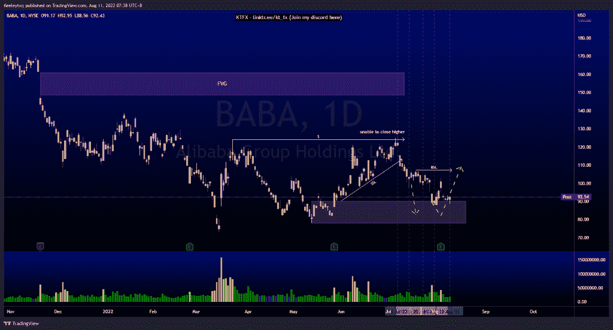
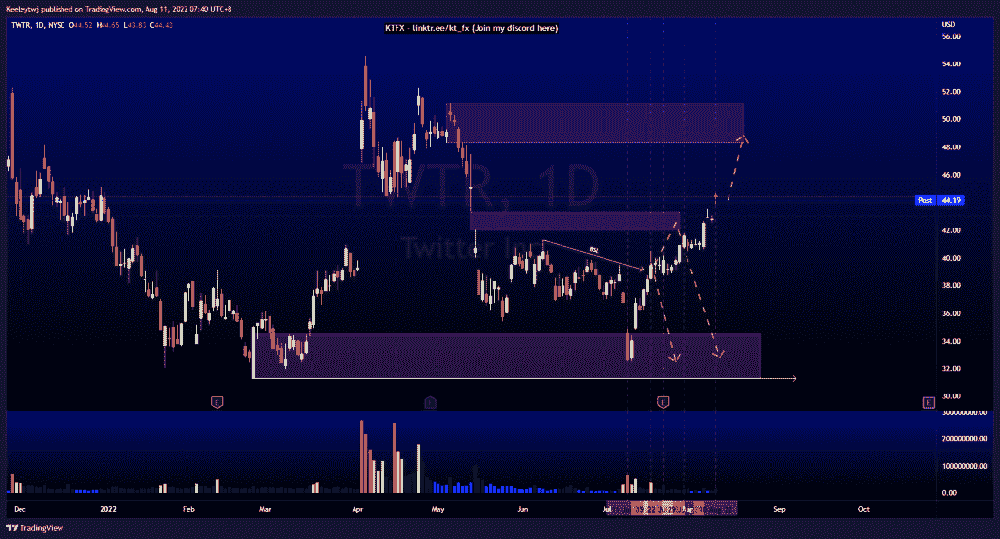
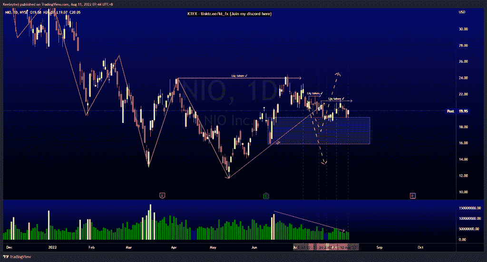

# 每周技术分析#巴巴#TWTR #NIO

> 原文：<https://medium.com/coinmonks/weekly-technical-analysis-baba-twtr-nio-5f4e17c4c824?source=collection_archive---------35----------------------->

在这里找到更多关于我的信息(Youtube/discord):[https://www.linktr.ee/kt_fx](https://www.linktr.ee/kt_fx)

#巴巴

价格一直在 90.17 这个看涨点盘整。什么都没有改变。我预计价格将在 88.0 的低点，然后在 107.16 看到一个向上的移动，以消除买方流动性。

[https://www.tradingview.com/chart/BABA/jeWydsA1-BABA-Analysis/](https://www.tradingview.com/chart/BABA/jeWydsA1-BABA-Analysis/)

$TWTR

普莱斯没有发挥预期。我预计价格会在 42.00 的公允价值缺口反弹。现在，我们可能会看到价格向 48.34 的熊市方向发展。

[https://www.tradingview.com/chart/TWTR/EpgibXj2-TWTR-Analysis/](https://www.tradingview.com/chart/TWTR/EpgibXj2-TWTR-Analysis/)

$NIO

价格一直在 19.18 这个看涨点盘整。价格似乎处于积累阶段，等待走高。我们有一个下降的趋势。我预计在我们看到上涨之前，价格会在看涨点进一步下跌。

[https://www.tradingview.com/chart/NIO/SmRCyeCs-NIO-Analysis/](https://www.tradingview.com/chart/NIO/SmRCyeCs-NIO-Analysis/)

让我知道你是否同意和你的想法。如果你持有这些公司中的任何一家，就可以点赞、分享和评论！让我知道，如果你有任何你想让我分析的行情。一定要在其他社交平台上看看我！

*原载于 2022 年 8 月 10 日*[*【http://2minutesliteracy.wordpress.com】*](https://2minutesliteracy.wordpress.com/2022/08/11/weekly-technical-analysis-baba-twtr-nio/)*。*