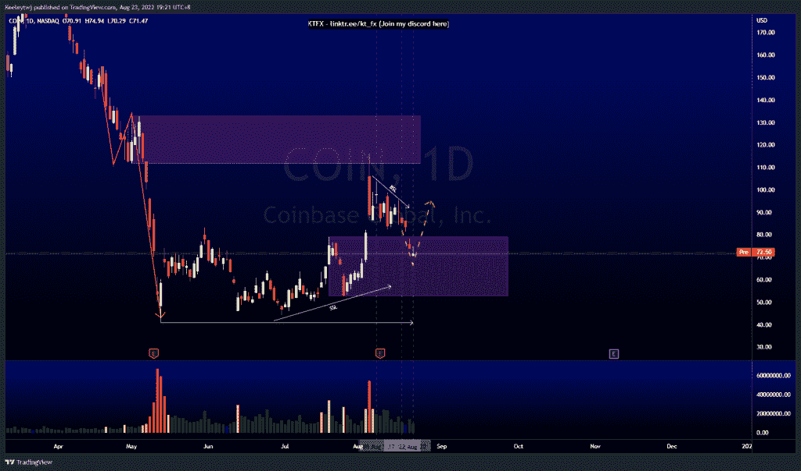
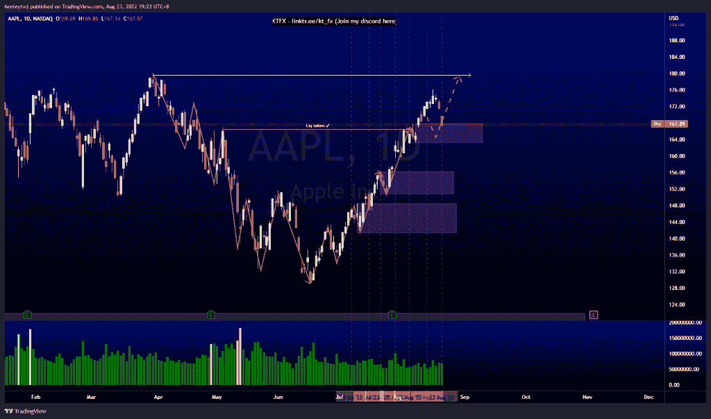
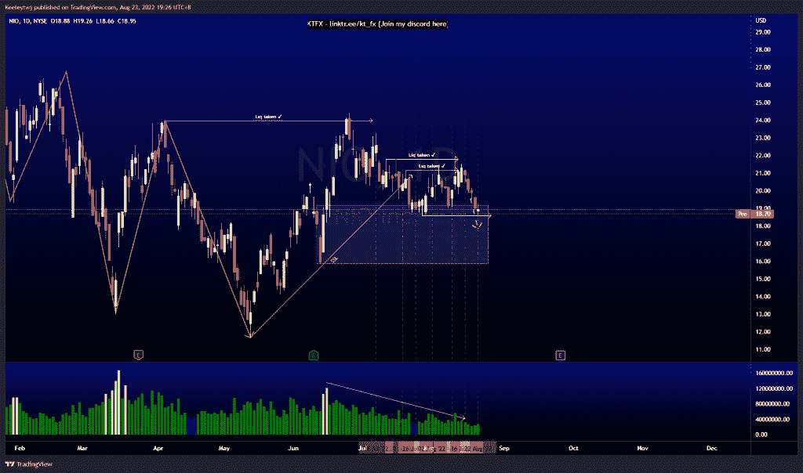

# 每周技术分析#硬币#AAPL #NIO

> 原文：<https://medium.com/coinmonks/weekly-technical-analysis-coin-aapl-nio-d5e496880c54?source=collection_archive---------45----------------------->

在这里找到更多关于我的信息(YouTube/Discord/Telegram):[https://www.linktr.ee/keeleytan](https://www.linktr.ee/keeleytan)

如果你觉得我的帖子有帮助，如果你能在这个帖子上给我一个赞，并关注我以后的类似帖子，我将不胜感激。

#硬币

根据上周的分析，价格已经上涨。价格目前处于 79.00 的看涨点，我预计价格将反弹向上。我们已经建立了买方流动性。价格可能会从这里开始上涨，接下来会带来流动性。或者，价格可能继续下跌，以吸收卖方流动性。我倾向于更高。

#AAPL

根据上周的分析，价格已经上涨。价格目前处于 167.81 的看涨点，我预计价格将反弹向上。我预计 179.61 的高点将是这次上升趋势的最终目标。

#NIO

根据上周的分析，价格已经上涨。价格目前处于 19.18 的看涨点，我预计会反弹向上。然而，这一看涨举措只是在我们收于流动性池下方时对流动性的攫取。价格现在已经打破市场结构下行。我预计价格会继续下跌。

让我知道你是否同意和你的想法。

如果你持有这些公司中的任何一家，就可以点赞、分享和评论！

让我知道，如果你有任何你想让我分析的行情。

一定要在其他社交平台上看看我，我在交易、分析和心理学上发布内容。看看我这里:【https://www.linktr.ee/keeleytan】T2

种类

贴在[技术分析](https://2minutesliteracy.wordpress.com/category/technical-analysis/)

*原载于 2022 年 8 月 23 日 http://2minutesliteracy.wordpress.com**[*。*](https://2minutesliteracy.wordpress.com/2022/08/23/weekly-technical-analysis-coin-aapl-nio/)*

> *交易新手？尝试[加密交易机器人](/coinmonks/crypto-trading-bot-c2ffce8acb2a)或[复制交易](/coinmonks/top-10-crypto-copy-trading-platforms-for-beginners-d0c37c7d698c)*