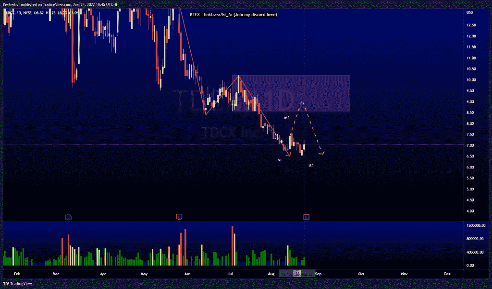
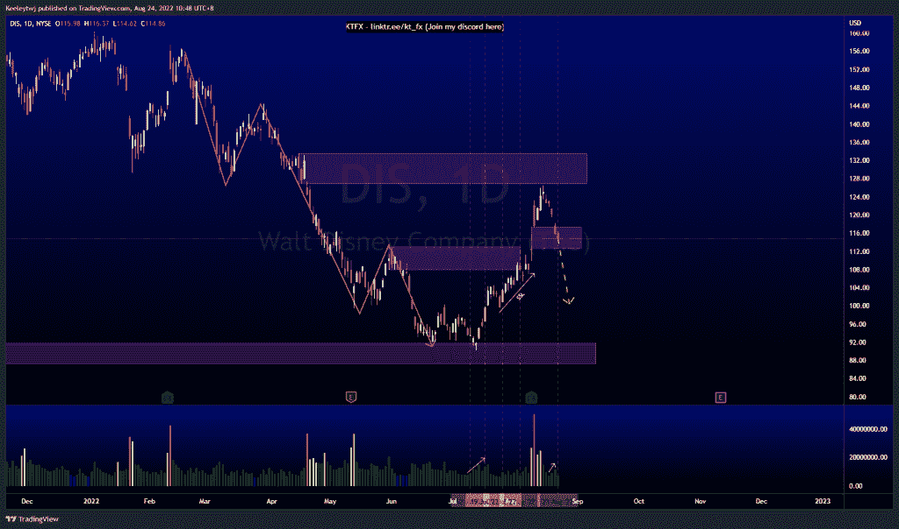
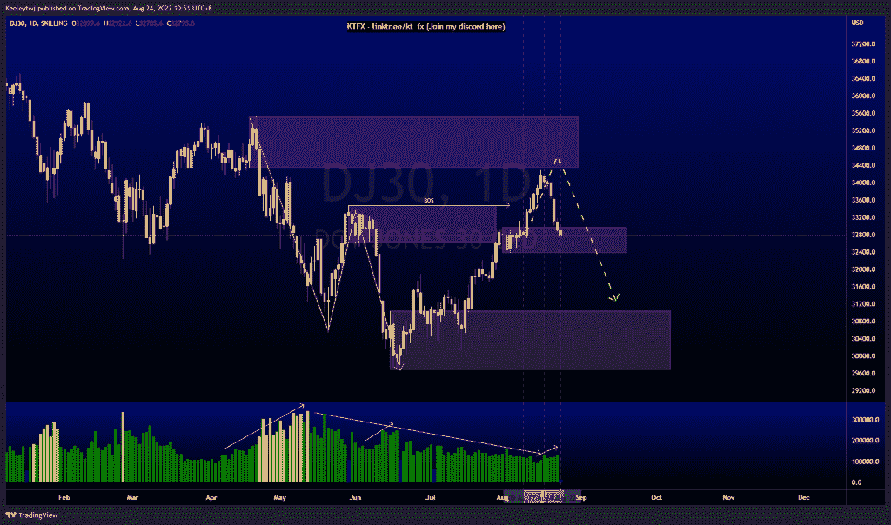

# 每周技术分析#DJ30 #DIS #TDCX

> 原文：<https://medium.com/coinmonks/weekly-technical-analysis-dj30-dis-tdcx-b93562ac860f?source=collection_archive---------46----------------------->

在这里找到更多关于我的信息(YouTube/Discord/Telegram):[https://www.linktr.ee/keeleytan](https://www.linktr.ee/keeleytan)

如果你觉得我的帖子有帮助，如果你能在这个帖子上给我一个赞，并关注我以后的类似帖子，我将不胜感激。

#TDCX

普莱斯的性格正显示出变化的迹象。有了威科夫积累的示意图，普莱斯应该已经做了第二次测试。我预计价格将上涨，并在下跌前缓解 8.56 的看跌点，以显示力量的迹象，从而创造一个春天，启动一个上升趋势。

#DIS

价格的走势与上周的分析完全一致。价格目前填补了 117.33 的公允价值缺口。随着价格填补缺口，我们看到交易量在下降。我预计价格会走低，并从这里获得更多的卖方流动性。

#DJ30

价格的走势与上周的分析完全一致。随着价格下降，交易量也在增加。价格目前在 32969.6 减轻了看涨的 POI。然而，我们可以看到价格下降到 31037.1 的起点。

让我知道你是否同意和你的想法。

如果你持有这些公司中的任何一家，就可以点赞、分享和评论！

让我知道，如果你有任何你想让我分析的行情。

一定要在其他社交平台上看看我，我在交易、分析和心理学上发布内容。看看我这里:【https://www.linktr.ee/keeleytan】T2

种类

贴在[技术分析](https://2minutesliteracy.wordpress.com/category/technical-analysis/)

*原载于 2022 年 8 月 24 日 http://2minutesliteracy.wordpress.com**[*。*](https://2minutesliteracy.wordpress.com/2022/08/24/weekly-technical-analysis-dj30-dis-tdcx/)*

> *交易新手？尝试[加密交易机器人](/coinmonks/crypto-trading-bot-c2ffce8acb2a)或[复制交易](/coinmonks/top-10-crypto-copy-trading-platforms-for-beginners-d0c37c7d698c)*