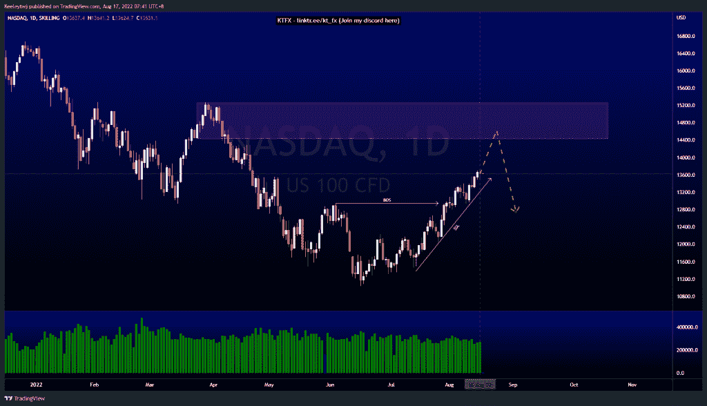

# 每周技术分析# DJ30 #纳斯达克#U

> 原文：<https://medium.com/coinmonks/weekly-technical-analysis-dj30-nasdaq-u-c8ed975bfa40?source=collection_archive---------47----------------------->

在这里找到更多关于我的信息(YouTube/Discord/Telegram):[https://www.linktr.ee/keeleytan](https://www.linktr.ee/keeleytan)

如果你觉得我的帖子有帮助，如果你能在这个帖子上给我一个赞，并关注我以后的类似帖子，我将不胜感激。

#DJ30

根据上周的分析，价格目前正在发挥作用。目前价格处于上升趋势，并已打破结构向上。然而，这种结构向上突破并不伴随着高成交量。我们可以看到所有下跌时成交量都在增加。我们正在到达看跌点 34343.2，预计价格将从这里向下回撤。

#纳斯达克

价格目前处于上升趋势，并已打破结构向上。体积在这里没有任何意义。我们确实在下方构建了良好的卖方流动性。这一上升趋势的目标是 14433.8 点的熊市点，我预计将从这里开始回撤。从那里，我们将看到价格如何反应和想要去。

#U
价格在日线 TF 上过度伸展。价格向上突破了市场结构，并在 47.12 的同等高点抓住了流动性。此次上涨的目标可能是 62.56 的熊市点。从那里开始，我预计会有一个向下的回撤。

让我知道你是否同意和你的想法。如果你持有这些公司中的任何一家，就可以点赞、分享和评论！让我知道，如果你有任何你想让我分析的行情。一定要在其他社交平台上看看我！

种类

发布于[技术分析](https://2minutesliteracy.wordpress.com/category/technical-analysis/)

*原载于 2022 年 8 月 16 日***。**

> *交易新手？尝试[加密交易机器人](/coinmonks/crypto-trading-bot-c2ffce8acb2a)或[复制交易](/coinmonks/top-10-crypto-copy-trading-platforms-for-beginners-d0c37c7d698c)*