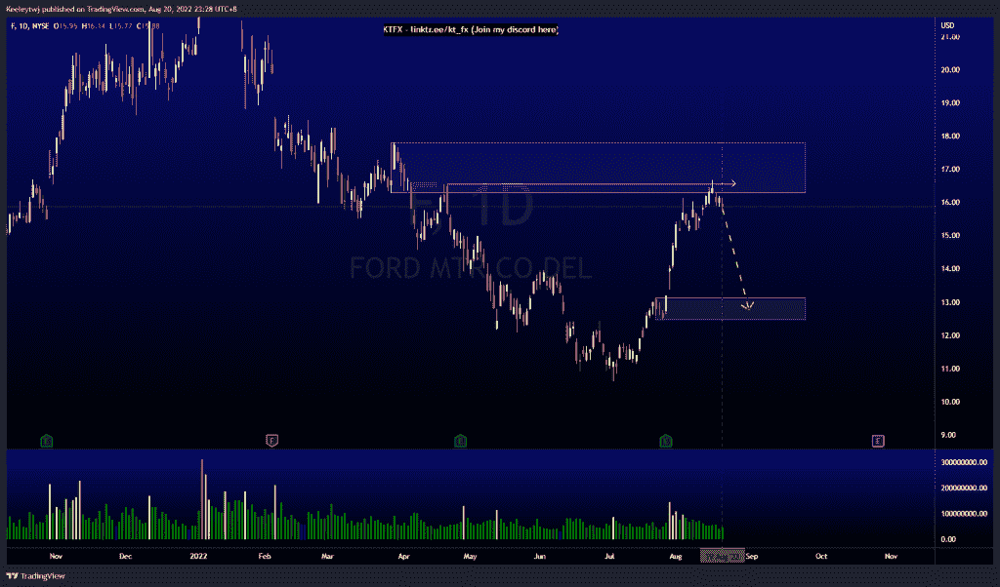
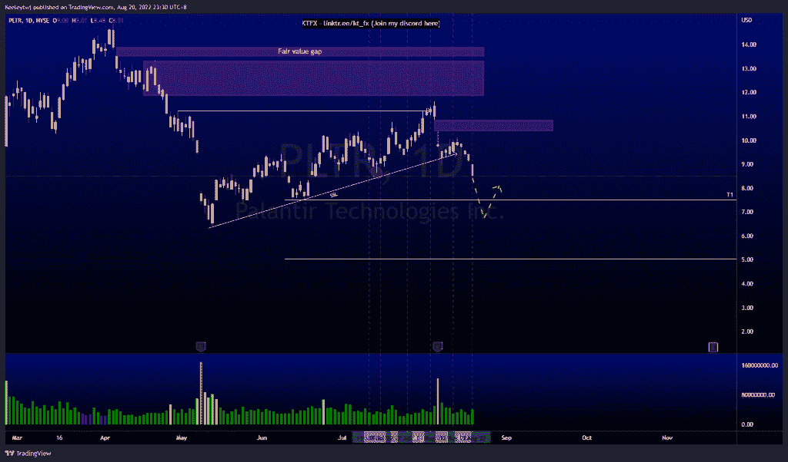
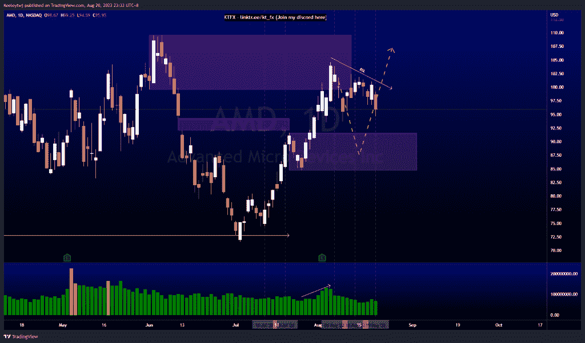

# 每周技术分析#F #AMD #PLTR

> 原文：<https://medium.com/coinmonks/weekly-technical-analysis-f-amd-pltr-c33e7d5a3247?source=collection_archive---------8----------------------->

在这里找到更多关于我的信息(YouTube/Discord/Telegram):[https://www.linktr.ee/keeleytan](https://www.linktr.ee/keeleytan)

如果你觉得我的帖子有帮助，如果你能在这个帖子上给我一个赞，并关注我以后的类似帖子，我将不胜感激。

#F

价格缓解了 16.28 的看跌点，并在 16.57 获得了流动性，但收盘时没有超过 16.57。我们看到成交量在上升。从这里，我预计价格将下降到 13.14 的看涨点。

#PLTR

价格目前呈下降趋势。与上周类似，我预计价格将继续走低，在我们看到回撤之前，卖方流动性将位于 7.50。我目前正在等待价格下跌，并加载我的立场。

#AMD

与我上周的分析没有变化。价格缓解了 99.55 的看跌点。我预计价格将回撤至看涨点 91.58。然而，我们必须注意到，买方流动性正在增加，价格可能会在下周飙升并获得流动性。

让我知道你是否同意和你的想法。

如果你持有这些公司中的任何一家，就可以点赞、分享和评论！

让我知道，如果你有任何你想让我分析的行情。

一定要在其他社交平台上看看我，我在交易、分析和心理学上发布内容。看看我这里:【https://www.linktr.ee/keeleytan】T2

*原载于 2022 年 8 月 21 日 http://2minutesliteracy.wordpress.com***。**

> *交易新手？尝试[加密交易机器人](/coinmonks/crypto-trading-bot-c2ffce8acb2a)或[复制交易](/coinmonks/top-10-crypto-copy-trading-platforms-for-beginners-d0c37c7d698c)*