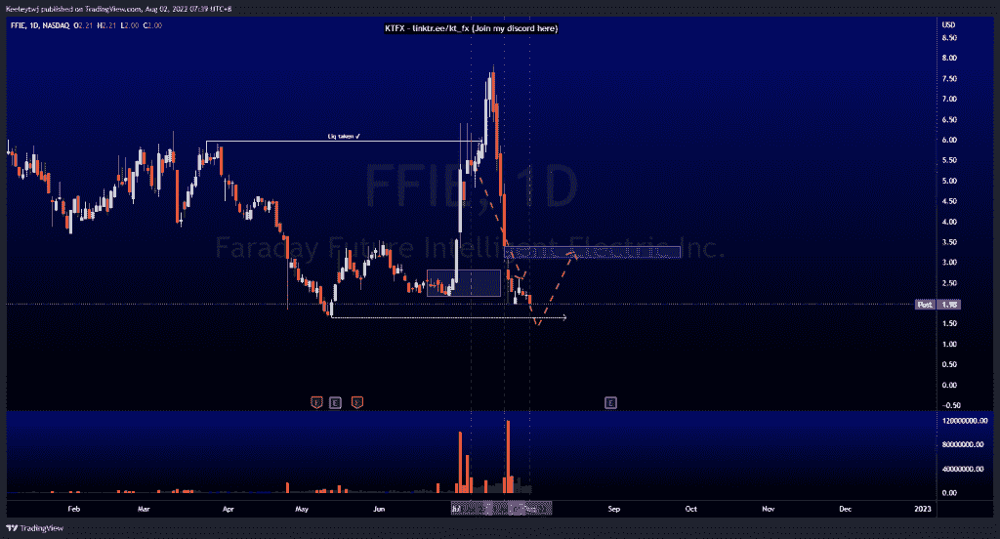
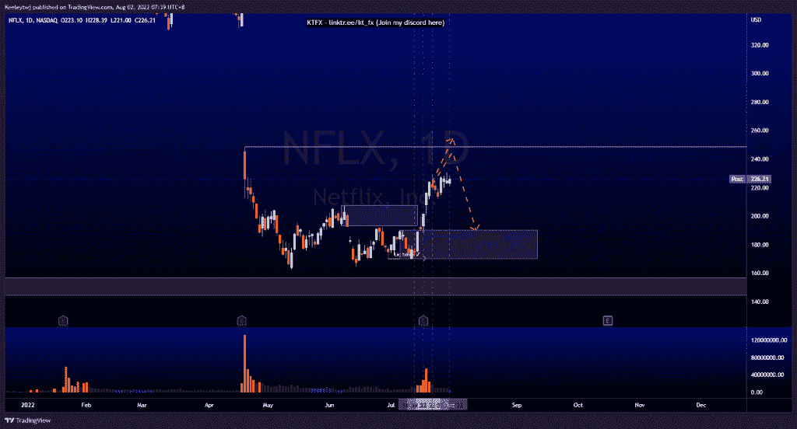
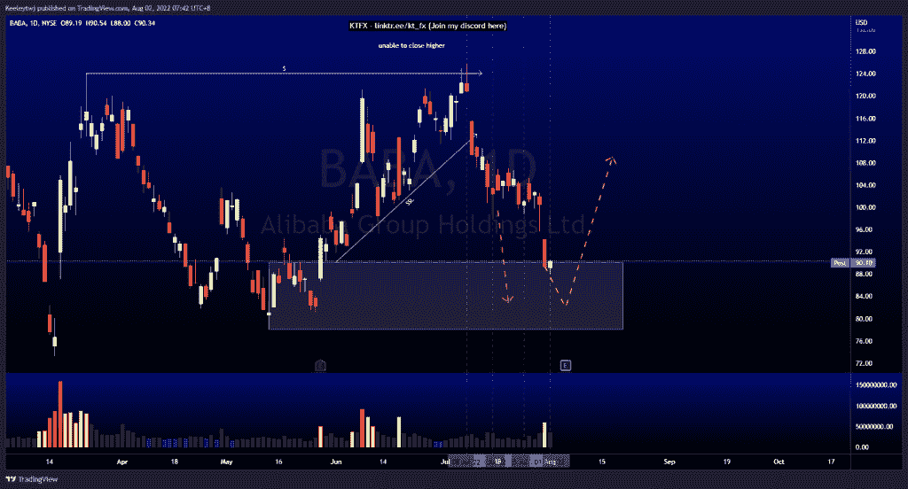

# 每周技术分析$ FFIE $ NFLX $巴巴

> 原文：<https://medium.com/coinmonks/weekly-technical-analysis-ffie-nflx-baba-16d9e44e9a7?source=collection_archive---------29----------------------->

在这里找到更多关于我的信息(Youtube/discord):[https://www.linktr.ee/kt_fx](https://www.linktr.ee/kt_fx)

$FFIE

价格正如预期的那样上涨。现在，价格已经在 2.81 的位置排除了看涨的 POI。我预计价格下一步将目标定在 1.65 的低点。我们可能会看到一个潜在的上升趋势，以填补随后 3.10 的公允价值差距。
在另一种情况下，由于过去几天的大幅波动，我们可能会看到价格在这里盘整。

[https://www.tradingview.com/chart/FFIE/dv1zawOh-FFIE-Analysis/](https://www.tradingview.com/chart/FFIE/dv1zawOh-FFIE-Analysis/)

$NFLX

与我之前的分析没有变化。在我们看到价格下跌以填补 190.21 的看涨点之前，我仍然预计价格将获得流动性并填补 248.70 的公允价值缺口

[https://www.tradingview.com/chart/NFLX/l6iXRPcd-NFLX-Analysis/](https://www.tradingview.com/chart/NFLX/l6iXRPcd-NFLX-Analysis/)

$巴巴

自从我在 2022 年 7 月 8 日打电话以来，价格一直完全按照我的分析运行。我们在看涨点 90.17。我们可能会看到一个看涨回撤，从这里带走买方流动性。

[https://www.tradingview.com/chart/BABA/hHOVqjQv-BABA-Analysis/](https://www.tradingview.com/chart/BABA/hHOVqjQv-BABA-Analysis/)

让我知道你是否同意和你的想法。如果你持有这些公司中的任何一家，就可以点赞、分享和评论！让我知道，如果你有任何你想让我分析的行情。一定要在其他社交平台上看看我！

*最初发表于 2022 年 8 月 1 日 http://2minutesliteracy.wordpress.com**的* [*。*](https://2minutesliteracy.wordpress.com/2022/08/02/weekly-technical-analysis-ffie-nflx-baba/)

> 交易新手？尝试[加密交易机器人](/coinmonks/crypto-trading-bot-c2ffce8acb2a)或[复制交易](/coinmonks/top-10-crypto-copy-trading-platforms-for-beginners-d0c37c7d698c)