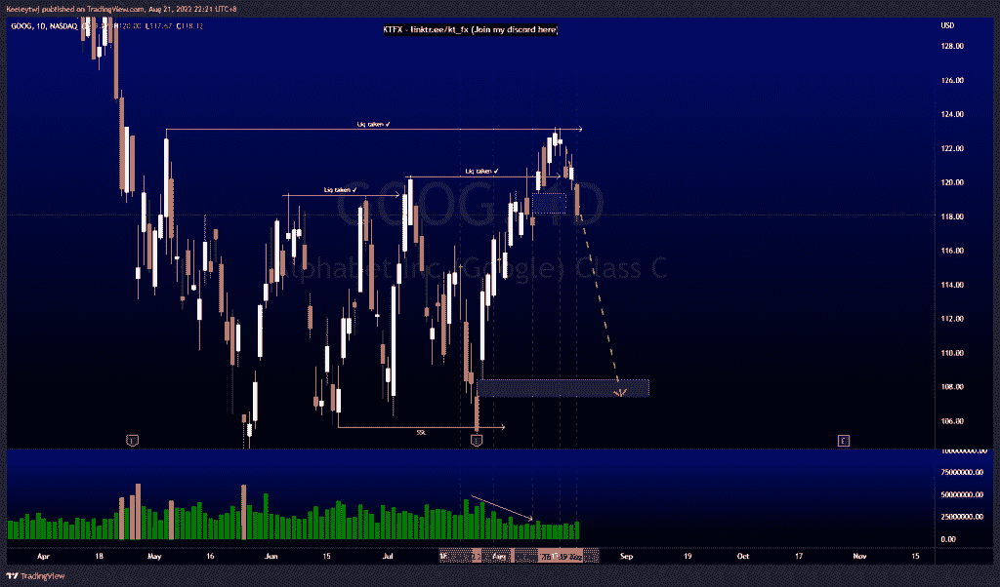
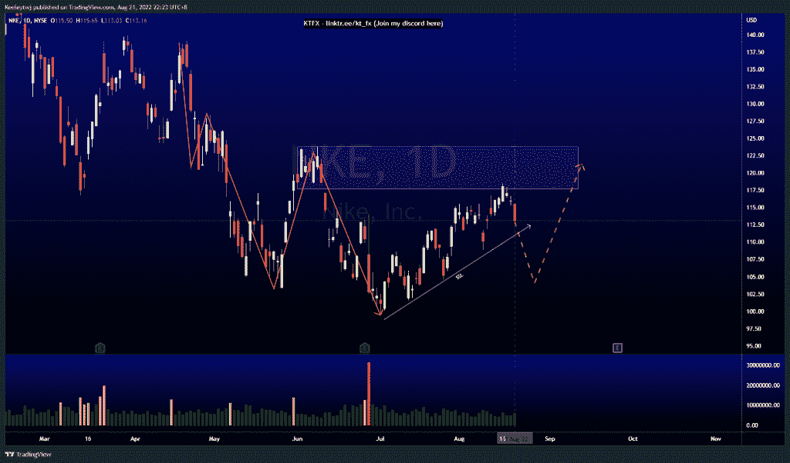
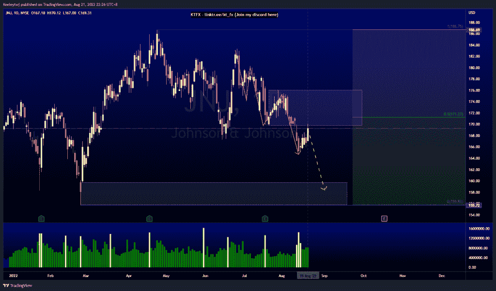

# 每周技术分析#谷歌#JNJ #NKE

> 原文：<https://medium.com/coinmonks/weekly-technical-analysis-goog-jnj-nke-cd56b5b7653b?source=collection_archive---------63----------------------->

在这里找到更多关于我的信息(YouTube/Discord/Telegram):[https://www.linktr.ee/keeleytan](https://www.linktr.ee/keeleytan)

如果你觉得我的帖子有帮助，如果你能在这个帖子上给我一个赞，并关注我以后的类似帖子，我将不胜感激。

#GOOG

正如上周分析的那样，价格表现良好，我预计价格会下跌。价格在 123.14 点有流动性，无法收高。目前，我们正在走低，可能是为了填补 108.42 的公允价值缺口。

#NKE

价格呈上升趋势，创造了卖方流动性。价格已经缓解了 117.61 的看跌点，目前正在向下回调。我们仍然处在一个更高的下跌趋势中。我预计价格会下跌，并在上涨前消除卖方流动性。

#JNJ

价格目前在 155.72 和 186.69 之间盘整。价格来自溢价，目前处于均衡状态。我们每天都在下跌。在我们看到价格走高之前，我预计 159.78 的 4H 公允价值缺口将成为此次下跌趋势的目标。

让我知道你是否同意和你的想法。

如果你持有这些公司中的任何一家，就可以点赞、分享和评论！

让我知道，如果你有任何你想让我分析的行情。

一定要在其他社交平台上看看我，我在交易、分析和心理学上发布内容。看看我这里:【https://www.linktr.ee/keeleytan】T2

*原载于 2022 年 8 月 22 日 http://2minutesliteracy.wordpress.com***。**

> *交易新手？尝试[加密交易机器人](/coinmonks/crypto-trading-bot-c2ffce8acb2a)或[复制交易](/coinmonks/top-10-crypto-copy-trading-platforms-for-beginners-d0c37c7d698c)*