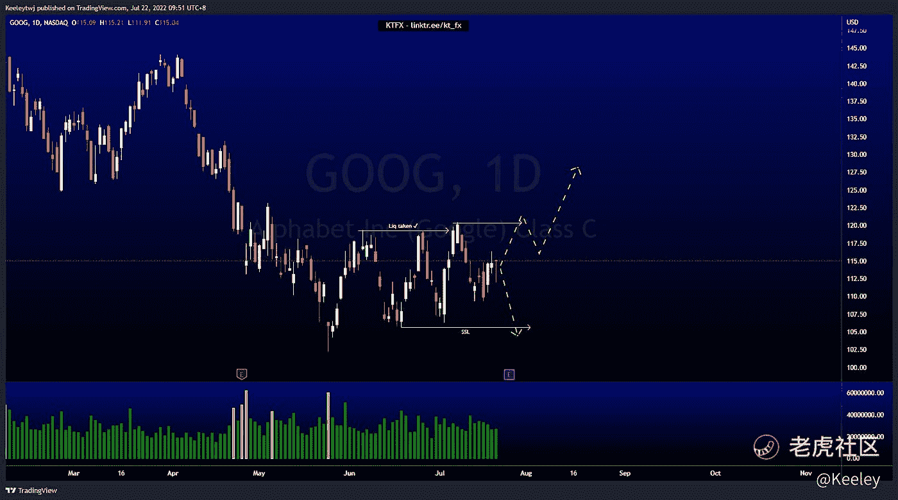
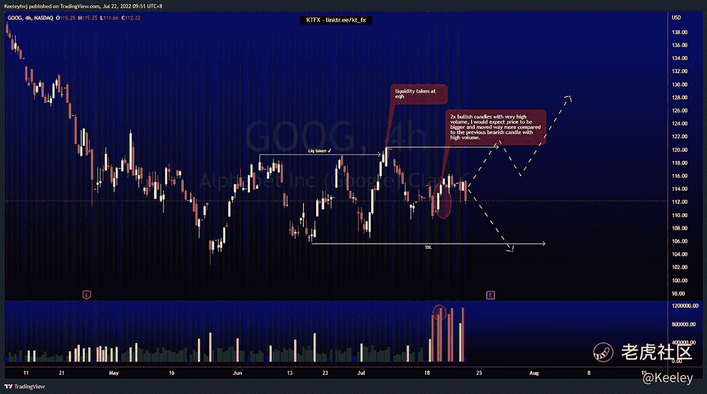
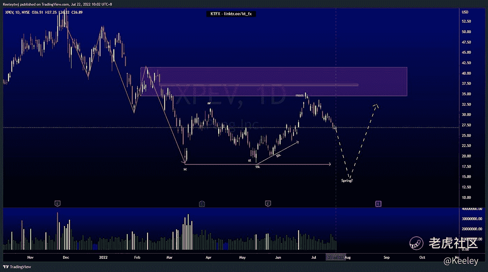
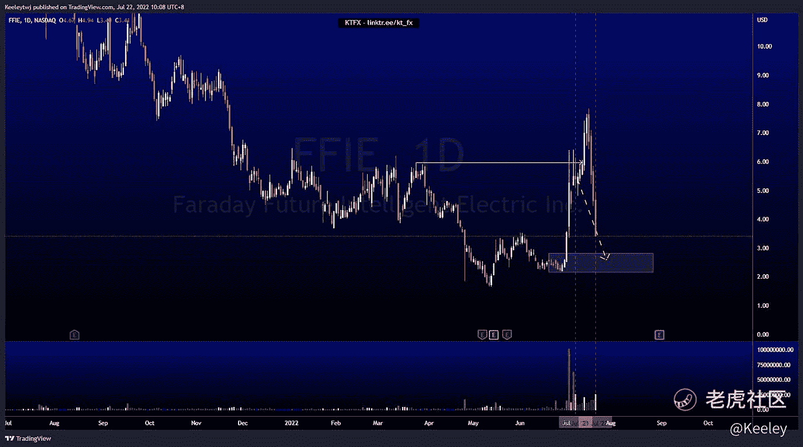

# 每周技术分析$谷歌$XPEV $FFIE

> 原文：<https://medium.com/coinmonks/weekly-technical-analysis-goog-xpev-ffie-c8bbc9aed1a?source=collection_archive---------46----------------------->

在这里找到更多关于我的信息:linktr.ee/kt_fx

$GOOG

每日 TF

价格呈短期上涨趋势。价格不断制造更高的低点和更高的高点。然而，这看起来像是做空的诱因。我们在 105.63 有一个相对相等的低点，这可能是短期熊市的一个可能目标。

4H TF

4H 时间框架内的价格走势看起来更加清晰。最近在 119.27 的同等高点被拿下。本周早些时候，我们有 2 根高交易量的看涨蜡烛，我预计价格会比之前高交易量的看跌蜡烛更大，移动更多。然而，我们可以看到，我圈起来的第二根看涨蜡烛线虽然体积较大，但体积较小。这表明，聪明的投资者要么获利了结，要么开始做空。目前，人们的预期是价格会下跌。如果我们设法突破 120.37，这将使我的看跌分析无效，我会寻找多头。

[$XPeng 公司(XPEV)$](https://ttm.financial/S/XPEV)

价格呈下降趋势，目前对 34.46 的看跌点做出反应。我们确实有一个 36.92 英镑的小公平价值差距可以填补。

价格也在威科夫积累示意图的 B 阶段。价格更有可能下跌，带走卖方建立的流动性。我预计价格将在 18.01 抓住流动性，并为可能的上涨创造一个春天。

[$法拉第未来智能电气公司(FFIE)$](https://ttm.financial/S/FFIE)

根据上周的分析，价格确实表现得相当不错。我预计价格会下跌到 2.81 的看涨点，而不会突破更高。然而，价格打破了向上的结构，在下跌前获得了更多的流动性。这一熊市的目标是看涨点，我们必须从那里看价格想要做什么。

让我知道你是否同意和你的想法。

如果你持有这些公司中的任何一家，就可以点赞、分享和评论！

让我知道，如果你有任何你想让我分析的行情。

*原载于 2022 年 7 月 22 日*[*https://TTM . financial*](https://ttm.financial/post/9077329210)*。*

> 交易新手？尝试[加密交易机器人](/coinmonks/crypto-trading-bot-c2ffce8acb2a)或[复制交易](/coinmonks/top-10-crypto-copy-trading-platforms-for-beginners-d0c37c7d698c)