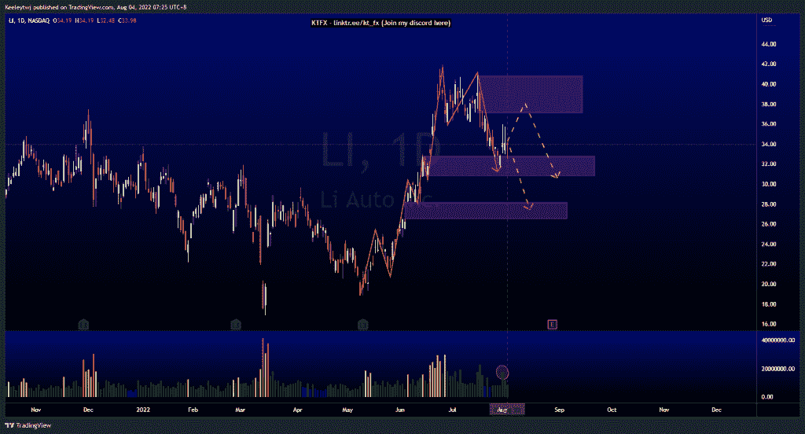
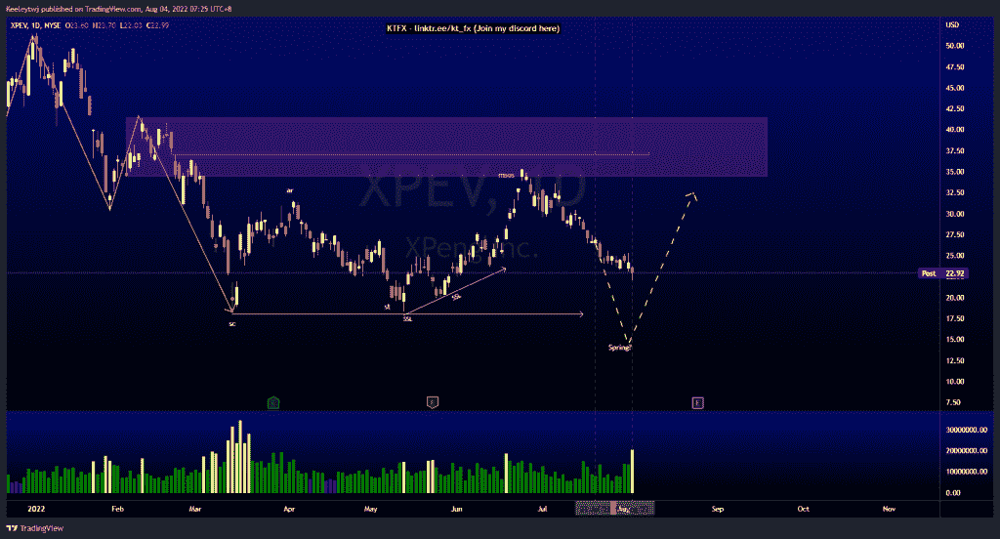
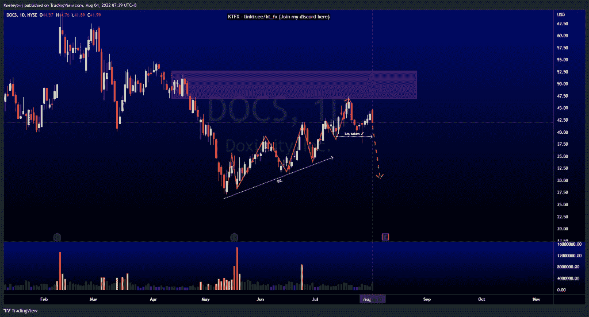

# 每周技术分析$LI $XPEV $DOCS

> 原文：<https://medium.com/coinmonks/weekly-technical-analysis-li-xpev-docs-574da0a5a16?source=collection_archive---------58----------------------->

在这里找到更多关于我的信息(Youtube/discord):[https://www.linktr.ee/kt_fx](https://www.linktr.ee/kt_fx)

$李

价格呈上升趋势，目前有一个向下的短期回撤，以缓解 32.78 的看涨点。我们看到从这个看涨的 POI 反弹，但价格无法在一天内收高，尽管 2022 年 8 月 1 日交易量相对较高。我们可以看到价格继续上涨，在我们看到下跌之前，缓解 37.13 的看跌点。然而，我倾向于在价格走高之前，将这一看涨点剔除，并在 28.22 填补公允价值缺口。

[https://www.tradingview.com/chart/LI/q2RsXt4W-LI-Analysis/](https://www.tradingview.com/chart/LI/q2RsXt4W-LI-Analysis/)

$XPEV

价格正如之前分析的那样。我对价格的预期不变。价格呈下降趋势，目前对 34.46 的看跌点做出反应。价格也在威科夫积累示意图的 B 阶段。价格目前处于下降趋势，带走了卖方建立的流动性。我预计价格将在 18.01 抓住流动性，并为可能的上涨创造一个春天。

[https://www.tradingview.com/chart/XPEV/bdxIF2GE-XPEV-Analysis/](https://www.tradingview.com/chart/XPEV/bdxIF2GE-XPEV-Analysis/)

$DOCS

价格呈上升趋势。价格最近缓解了 46.94 的看跌点，并在 39.09 获得了流动性。自上次财报电话会议以来，卖方流动性也在不断增加。价格在 39.09 抓住流动性，无法产生持续的上升趋势，打破市场结构向上。2022 年 8 月 3 日的成交量也在增加。我预计价格会在上涨前走低，以获取更多的流动性。

[https://www.tradingview.com/chart/DOCS/SLJiC7Pd-DOCS-Analysis/](https://www.tradingview.com/chart/DOCS/SLJiC7Pd-DOCS-Analysis/)

让我知道你是否同意和你的想法。如果你持有这些公司中的任何一家，就可以点赞、分享和评论！让我知道，如果你有任何你想让我分析的行情。一定要在其他社交平台上看看我！

*原载于 2022 年 8 月 3 日*[*【http://2minutesliteracy.wordpress.com】*](https://2minutesliteracy.wordpress.com/2022/08/04/weekly-technical-analysis-li-xpev-docs/)*。*

> 交易新手？尝试[加密交易机器人](/coinmonks/crypto-trading-bot-c2ffce8acb2a)或[复制交易](/coinmonks/top-10-crypto-copy-trading-platforms-for-beginners-d0c37c7d698c)