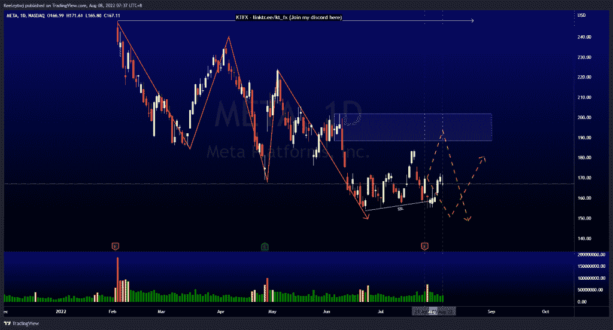
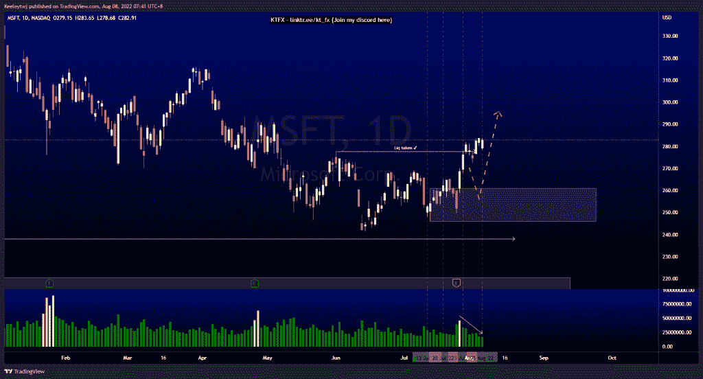
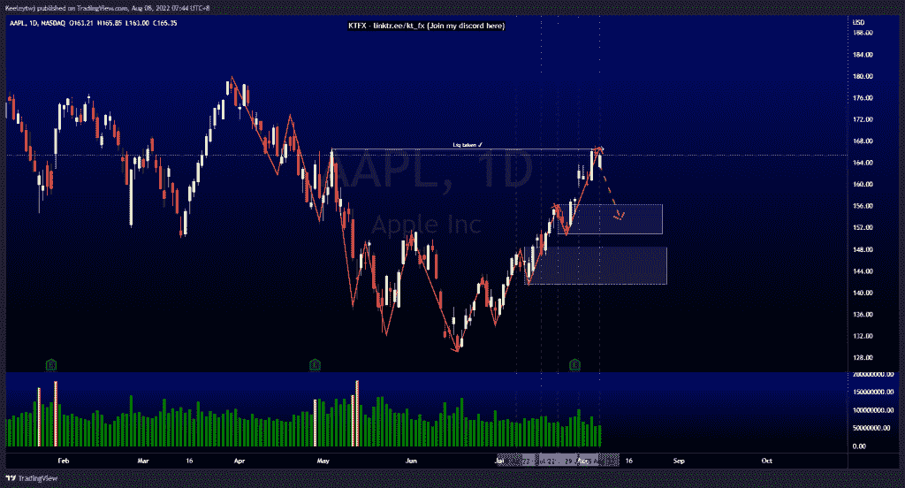

# 每周技术分析#META #MSFT #AAPL

> 原文：<https://medium.com/coinmonks/weekly-technical-analysis-meta-msft-aapl-c459de07b77f?source=collection_archive---------22----------------------->

在这里找到更多关于我的信息(Youtube/discord):[https://www.linktr.ee/kt_fx](https://www.linktr.ee/kt_fx)

#META

根据上周的分析，价格上涨了。价格吸收了卖方的流动性，并强劲收于上行。从这里，我预计价格将回撤至 188.40 的看涨点。

[https://www.tradingview.com/chart/META/hltdr82w-META-Analysis/](https://www.tradingview.com/chart/META/hltdr82w-META-Analysis/)

#MSFT

自上周以来，价格一直在流动性池上方盘整。在 277.69 获得流动性后，我预计价格将下跌，以缓解 260.84 的看涨点。从这里开始，我仍然预计价格会回撤至看涨点，然后随着交易量的减少，我们会看到任何上行运动。

[https://www.tradingview.com/chart/MSFT/muuIHGW9-MSFT-Analysis/](https://www.tradingview.com/chart/MSFT/muuIHGW9-MSFT-Analysis/)

#AAPL

普莱斯没有发挥预期。我预计价格将回撤至 156.28 的看涨点，但价格上涨至 166.48 的流动性。价格目前处于上升趋势和溢价水平。在我们看到任何上行趋势之前，我仍然预计价格会回撤至看涨点。

[https://www.tradingview.com/chart/AAPL/MaFkoxAn-AAPL-Analysis/](https://www.tradingview.com/chart/AAPL/MaFkoxAn-AAPL-Analysis/)

让我知道你是否同意和你的想法。如果你持有这些公司中的任何一家，就可以点赞、分享和评论！让我知道，如果你有任何你想让我分析的行情。一定要在其他社交平台上看看我！

*原载于 2022 年 8 月 7 日*[*【http://2minutesliteracy.wordpress.com】*](https://2minutesliteracy.wordpress.com/2022/08/08/weekly-technical-analysis-meta-msft-aapl/)*。*

> 加入 Coinmonks [电报频道](https://t.me/coincodecap)和 [Youtube 频道](https://www.youtube.com/c/coinmonks/videos)了解加密交易和投资

# 另外，阅读

*   [OKEx vs KuCoin](https://coincodecap.com/okex-kucoin) | [摄氏替代品](https://coincodecap.com/celsius-alternatives) | [如何购买 VeChain](https://coincodecap.com/buy-vechain)
*   [ProfitFarmers 点评](https://coincodecap.com/profitfarmers-review) | [如何使用 Cornix 交易机器人](https://coincodecap.com/cornix-trading-bot)
*   [如何匿名购买比特币](https://coincodecap.com/buy-bitcoin-anonymously) | [比特币现金钱包](https://coincodecap.com/bitcoin-cash-wallets)
*   [瓦济里克斯 NFT 评论](https://coincodecap.com/wazirx-nft-review) | [比茨盖普 vs 皮奥克斯](https://coincodecap.com/bitsgap-vs-pionex) | [坦吉姆评论](https://coincodecap.com/tangem-wallet-review)
*   [如何使用 Solidity 在以太坊上创建 DApp？](https://coincodecap.com/create-a-dapp-on-ethereum-using-solidity)