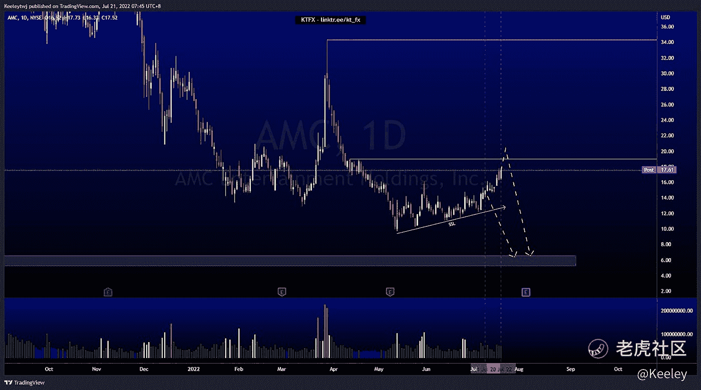

# 每周技术分析$ MSFT $ AMC $索尼

> 原文：<https://medium.com/coinmonks/weekly-technical-analysis-msft-amc-sony-3bd1af71bed8?source=collection_archive---------47----------------------->

在这里找到更多关于我的信息:linktr.ee/kt_fx

$MSFT

价格呈下降趋势。上周，我预计价格将在 238.07 的同等低点下跌，并在上涨前进入 220.58 的看涨点。然而，价格反而上涨了。我们还没有打破市场结构向上，仍然尊重看跌的 POI。本周我的期望没有变化。

资产管理公司

我对 AMC 的分析是错的。上周，我预计价格会走低，以消除卖方流动性。然而，价格上涨了。看涨的目标可能是 19.01 的同等高点。从这里，我们仍然可以看到价格从这里下降。或者，我们可以看到一个上升趋势的开始，以摆脱 34.33 的干净的高点。

索尼

价格呈下降趋势，可能是怀科夫累积图的开始。价格目前正在填补公允价值缺口，因此我预计短期内将回撤至 82.08 的看涨点。如果价格尊重看涨 POI，我们可以看到价格目标 AR 在 95.70。如果我们不能尊重看涨的 POI，我们可能会看到一个开始上升趋势的春天的形成。

让我知道你是否同意和你的想法。如果你持有这些公司中的任何一家，就可以点赞、分享和评论！

*原载于 2022 年 7 月 21 日*[*https://TTM . financial*](https://ttm.financial/post/9074679308)*。*

> 交易新手？尝试[加密交易机器人](/coinmonks/crypto-trading-bot-c2ffce8acb2a)或[复制交易](/coinmonks/top-10-crypto-copy-trading-platforms-for-beginners-d0c37c7d698c)