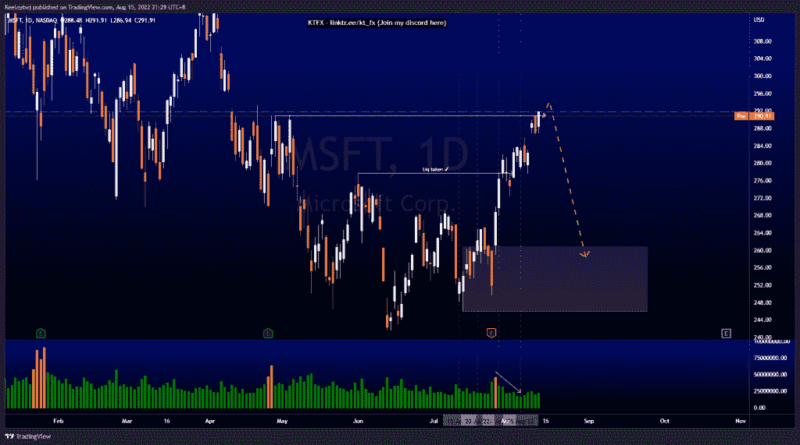
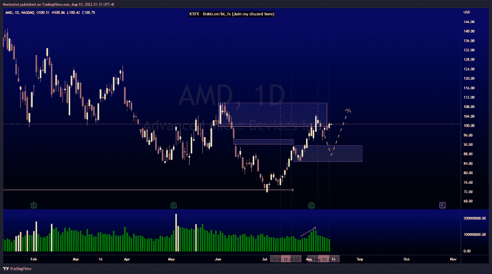
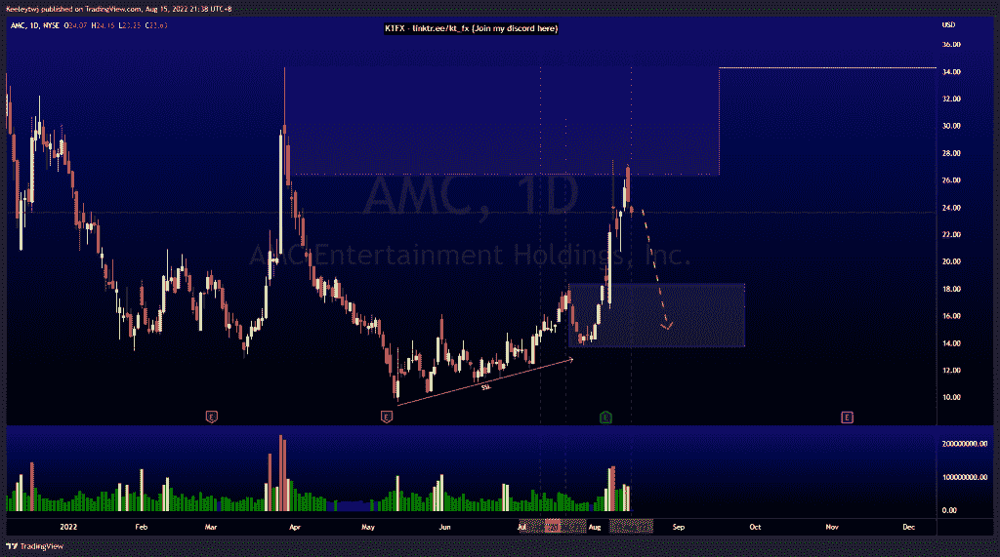

# 每周技术分析#MSFT #AMD #AMC

> 原文：<https://medium.com/coinmonks/weekly-technical-analysis-msft-amd-amc-7d5de329d286?source=collection_archive---------13----------------------->

在这里找到更多关于我的信息(Youtube/discord):[https://www.linktr.ee/kt_fx](https://www.linktr.ee/kt_fx)

如果你觉得我的帖子有帮助，如果你能在这个帖子上给我一个赞，并关注我以后的类似帖子，我将不胜感激。

#MSFT

普莱斯没有发挥预期。价格走高，达到 290.98 的高点。随着我们在日线 TF 上的延伸，我预计会有一个向下的回撤。

#AMD

价格对看跌点的反应是 99.55。我预计在我们看到上涨之前，价格会回撤至 91.58 的看涨点。

#AMC

价格与前几周的分析结果并不一致。目前，价格在 26.41 缓解了看跌点，反应强烈。我预计价格将回撤至看涨点 18.37。

让我知道你是否同意和你的想法。如果你持有这些公司中的任何一家，就可以点赞、分享和评论！让我知道，如果你有任何你想让我分析的行情。一定要在其他社交平台上看看我！

种类

贴在[技术分析](https://2minutesliteracy.wordpress.com/category/technical-analysis/)

*原载于 2022 年 8 月 15 日 http://2minutesliteracy.wordpress.com***。**

> *交易新手？尝试[加密交易机器人](/coinmonks/crypto-trading-bot-c2ffce8acb2a)或[复制交易](/coinmonks/top-10-crypto-copy-trading-platforms-for-beginners-d0c37c7d698c)*